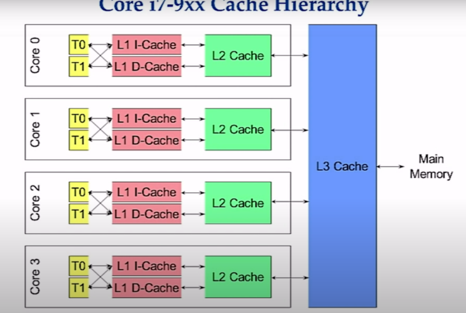
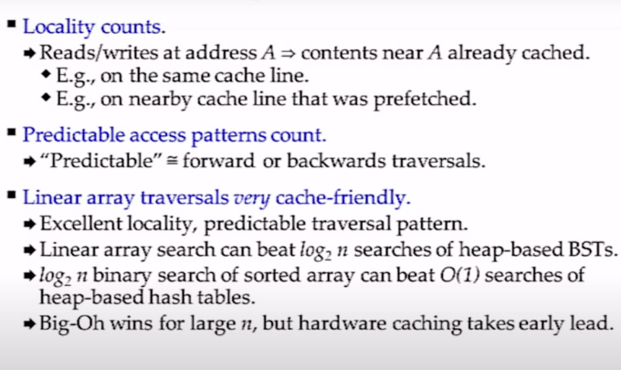
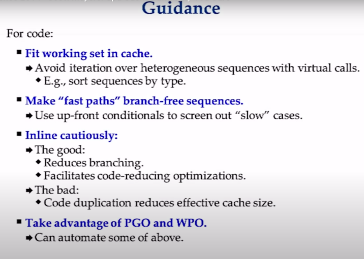

- {{youtube https //www.youtube.com/watch?v=WDIkqP4JbkE&ab_channel=NOKIATechnologyCenterWroc%C5%82aw}}
	 - 00:16:18
		 - Cache hirerachy
			 - Four Cores share the same L3 cache
			 - Each core have two threads sharing the same L2 cache
			 - Each thread share the same L1 instruction cache and L1 data cache
		 - 
	 - 00:20:33
		 - small is fast
			 - Instructions well localized run fast
				 - small codes without many function calls
			 - data structures fit in cache run fast
			 - data structure traversal touching only cached data run fast (row major or column major)
		 - slow if you need to go to main memory for instructions or data
	 - 00:21:40
		 - Cache line
			 - 
			 - main memory is read/written in terms of cache lines
			 - cache line pre-fetch, it can fetch both directions, hw will decide the direction according to the pattern
		 - Implications
			 - 
	 - 00:27:46
		 - data coherency across different cores
			 - for programmer, there is only one address and one value for a, even though a might be cached to one of the L2 cache of one core.
			 - hardware invalidates core 1's cached value when core 0 writes
			 - avoid races (write the same address simultaneously)
				 - atomic, mutex
				 - have overhead. write to one cache line, the whole cache line would be invalid for other cores. the other cores writing to the cache line would need retrieve it from the memory again
	 - 00:37:22
		 - False sharing
			 - Different cores want to access different data, but stored next to each other in memory so they lay on the same cache line.
			 - If you create different variables for different cores. The variable would lie on the thread stack separately.
			 - Global variables declared apart might be close to each other in memory
			 - Allocate variables in Heap in different places of code
	 - 00:50:25
		 - data oriented programming
		 - 
	 - 00:59:50
		 - * cache associativity
		 - further reading materials