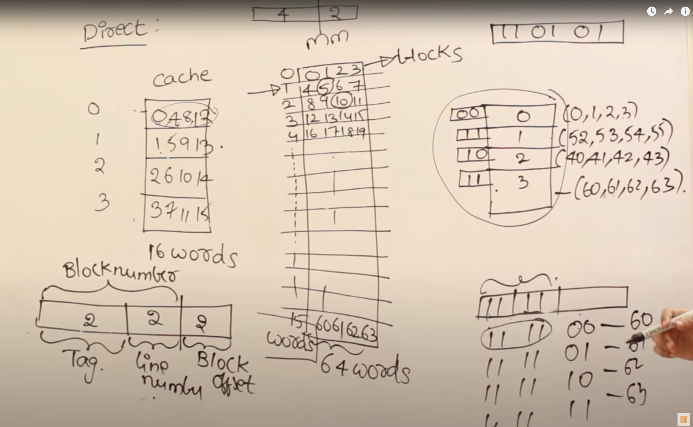
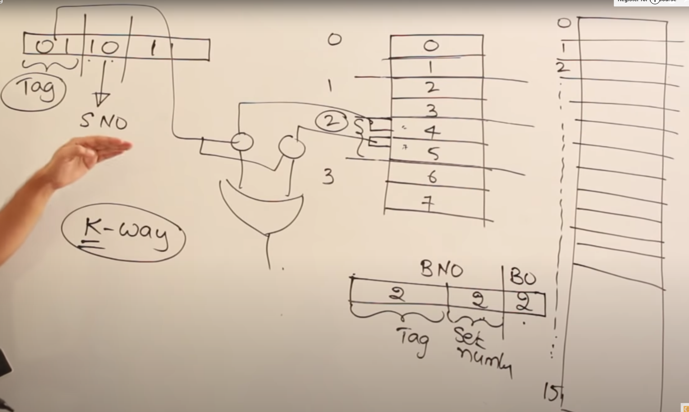

- Memory hierarchical
	 - From CPU address request to DRAM
		 - direct mapping
			 - 
				 - The address is divided to Tag | Line number | block offset. Where line number corresponds to the number of the cache, block offset refer to the certain number of element within the certain addressed cache line. Once we find the corresponding line, we need to check if the tag number of that cache matches our address. If not that triggers a cache miss, else it is a hit.
				 - Drawback, some lines of cache might be used far less for example, suppose the block idxes the cpu requests are 0, 4, 8, 12. Then the cache would be cache in and cache out the first cache line constantly without using the idle 1, 2, 3.
		 - Set associative mapping
			 - 
				 - The address is divided into Tag| Set number| block offset. Where the set number is used to index the set the requested block is in. Then we use comparator to determine if the requested block is in one of the blocks within the set. This is the same as direct mapping when the set number is the same as line number. This is the same as associate mapping when the set number is 0.
	 - Inclusion property:
		 - Main memory-->DRAM
		 - The further away the memory is, the lower the memory level is
		 - > In most cases (but not all), the data contained in a lower level are a superset of the next higher level. This property, called the __inclusion property__, is always required for the lowest level of the hierarchy, which consists of main memory in the case of caches and disk memory in the case of virtual memory.
		 - > When a word is not found in the cache, the word must be fetched from a lower level in the hierarchy (which may be another cache or the main memory) and placed in the cache before continuing. Multiple words, called a __block__ (or __line__), are moved for efficiency reasons, and because they are likely to be needed soon due to spatial locality. Each cache block includes a __tag__ to indicate which memory address it corresponds to.
	 - set associative
		 - > A key design decision is where blocks (or lines) can be placed in a cache. The most popular scheme is __set associative__, where a __set__ is a group of blocks in the cache. A block is first mapped onto a set, and then the block can be placed anywhere within that set. Finding a block consists of first mapping the block address to the set and then searching the set—usually in parallel—to find the block.
	 - Miss rate
		 - To gain insights into the causes of high miss rates, which can inspire better cache designs, the three Cs model sorts all misses into three simple categories:
			 - __Compulsory__—The very first access to a block __cannot__ be in the cache, so the block must be brought into the cache. Compulsory misses are those that occur even if you had an infinite sized cache.
			 - __Capacity__—If the cache cannot contain all the blocks needed during execution of a program, capacity misses (in addition to compulsory misses) will occur because of blocks being discarded and later retrieved.
			 - __Conflict__—If the block placement strategy is not fully associative, conflict misses (in addition to compulsory and capacity misses) will occur because a block may be discarded and later retrieved if multiple blocks map to its set and accesses to the different blocks are intermingled.