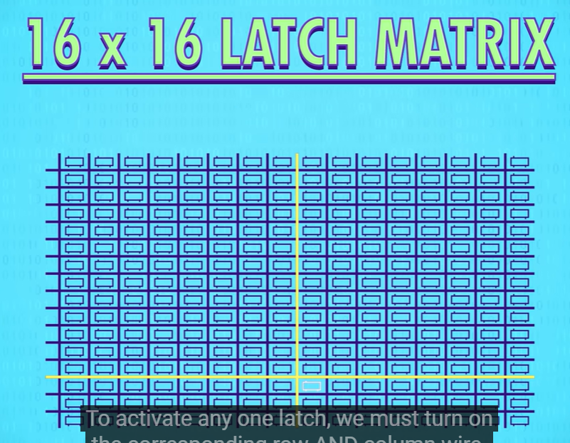

- Transistor:
	- ON and OFF means the current can get through or not
	- {:height 202, :width 218}
- Use transistors to build NOT gate:
	- {:height 388, :width 729}
- Use transistors to build AND gate:
	- {:height 320, :width 736}
- Use transistors to build
	- {:height 414, :width 741}
- Floating point:
	- fixed point:
		- {:height 146, :width 739}
	- floating point: {{video https://www.youtube.com/watch?v=dQhj5RGtag0&ab_channel=janMisali}}
		- free to float around for the point
		- 5 points for representing the point location, other bits called mantissa
			- {:height 167, :width 668}
		- 5 points is larger than the remaining bits, which is 27. We can use the extra values to represent the position outside of the mantissa
			- 3 in front and 3 in end, always 0
			- {:height 148, :width 732}
			- The more bits you use for point index, the wider range you can represent. But less accurate you are.
		- sign + exp + mantissa:
			- {:height 174, :width 748}
	- {:height 253, :width 745}
- ALU:
	- half adder:
		- {:height 405, :width 428}
	- Full Adder:
		- {:height 350, :width 756}
	- 8-bit adder:
		- {:height 460, :width 796}
	- Carry look ahead adder:
		- {{video https://www.youtube.com/watch?v=yj6wo5SCObY&ab_channel=SpanningTree}}
	- Operation:
		- {:height 458, :width 721}
- Registers and RAM
	- Latch:
		- 
	- Gated latch
		- 
	- group of latch can be used to form a register
	- Latch matrix:
		- {:height 470, :width 582}
		- {:height 402, :width 761}
	- Multiplexer (MUX)
		- {:height 535, :width 609}
		- 8-bit address corresponding to one latch, that can store 1 bit
			- {:height 266, :width 560}
		- 8 in a row that can store 1 byte of memory with a 8-bit address
			- {:height 354, :width 870}
			- {:height 514, :width 540}
- CPU:
	- {:height 300, :width 452}
	- Fetch instruction according to the instruction address register and fetch that to the instruction register.
	- Decode the opcode from the instruction and ram address from the instruction
	- Control unit recognize the instruction from the opcode and execute the instruction
	- {:height 403, :width 665}
	- pack the control unit:
		- {:height 415, :width 676}
	- Add ALU for execution
		- {:height 424, :width 816}
	- Instructions and Programs:
		- {:height 429, :width 581}
		- Immediate value, if a opcode need address or something else, the next value in memory would be the intermediate value
- Advanced CPU design
	- advanced instructions:
		- AMX/SSE/AVX
	- {:height 399, :width 495}
	- Add more memory hierarchical, send a block of data to cache
		- {:height 368, :width 526}
		- Cache hit/miss
		- Cache can also be used as a scratchpad, store intermediate data from ALU
		- Cache have dirty bit, if have new data coming in and overwrites the original data, it need to write the dirty data back to RAM for synchronize purpose
	- Instruction pipeline
		- pipeline fetch decode and execute because use different parts of CPU
			- {:height 304, :width 478}
		- look ahead for less stalls in pipeline
		- out of order execution
	- Conditional jump
		- speculative execution
	- pipeline flush
	- branch prediction
	-