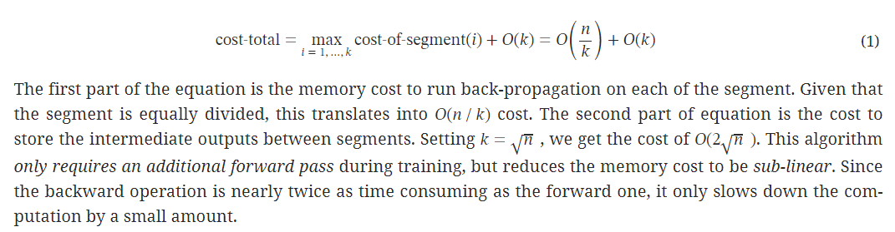

- Summary:
	- 简单的说，梯度检查点的工作原理是**在反向传播时重新计算深度神经网络的中间值（而通常情况是在前向传播时存储的)**。这个策略是用时间（重新计算这些值两次的时间成本）来换空间（提前存储这些值的内存成本）。
- Intermediate activation:
	- 模型的计算图所占用的**动态内存**。在训练模式下，每次通过神经网络的**前向传播**都为网络中的每个神经元计算一个**激活值**，这个值随后**被存储在所谓的计算图**中。必须为批次中的每个单个训练样本存储一个值，因此数量会迅速的累积起来。**总成本取决于模型大小和批处理大小**，并设置适用于您的GPU内存的最大批处理大小的限制。一开始存储激活的原因是，**在反向传播期间计算梯度时需要用到激活**。
- Training deep nets with sublinear memory cost:
	- 省略一些激活层的存储，并且在反向传播时再动态计算，这些可能时一些activation intensive的层，这样能够节省一些内存。
	- 
- [[Training Deep Nets with Sublinear Memory Cost]]
	- Assume we divide the n network into k segments the memory cost to train this network is given as follows.
		- 
	- 如果设置k，也就是segment的数量为$$sqrt(n)$$, 那么可以减少存储到原来的1/2次方。
	- 在backward时候，需要额外的一次forward。因为后向时间一般是前向的两倍，所以可以认为增加了1/3的时间，也就是33%。（1forward/(1forward+1backward)）。
	- 