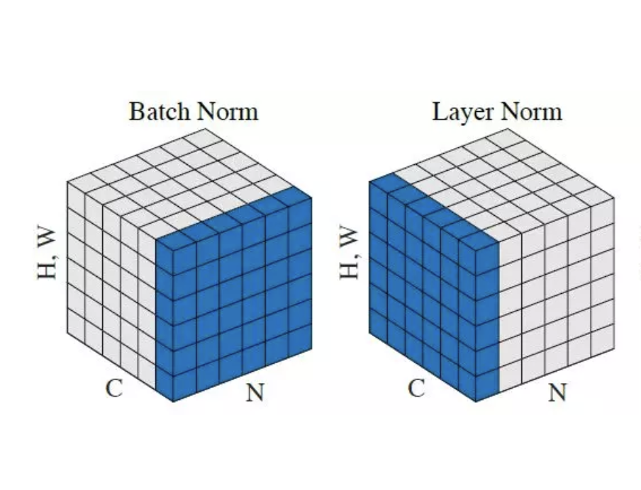

- equation:
- $$\mu_i=\tfrac{1}{K}\sum_{k=1}^{K}x_{i,k}$$
  $$\sigma_i^2=\tfrac{1}{K}\sum_{k=1}^{K}(x_{i,k}-\gamma_i)^2$$
- $$\hat{x_{i,k}}=\tfrac{x_{i,k}-\mu_i}{\sqrt{\sigma_i^2+\varepsilon}}$$
- $$y_i=\gamma\hat{x_i}+\beta$$
- γ and β are learnable parameters.
- {:height 392, :width 489}