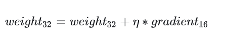

- fp16 parameter and gradients
	- Benefit:
		- accelerating training computation
		- accelerate communication
		- smaller model size
	- Drawback:
		- rounding error
		- overflow error
- Mixed precision training
	- 在实现混合精度训练时，通常会遵循以下步骤：
		- 使用FP16进行大部分的前向和后向计算以提高速度和减少内存使用。
		- 在计算完FP16的梯度后，将它们转换为FP32，并应用损失缩放来防止数值下溢。
		- 使用这些FP32梯度来更新模型的FP32权重副本。
		- 如果需要，将更新后的FP32权重转换回FP16以进行下一轮的计算。
	- https://zhuanlan.zhihu.com/p/441591808
	- weight backup
		- {:height 385, :width 720}
		- 如图所示，计算过程中的weight和activation还有gradient全都是fp16。但是在做weight更新的时候，learning rate* gradient可能会比较小，有rounding error的风险，所以需要额外保存一份fp32的weights。然后在进行更新的时候，保证weight是在fp32的精度下面更新：
			- 
		- 
	- Loss scaling
		- 由于gradient分布是钟形分布，并且很多gradient的数值都比较接近于0，所以gradient变成fp16会有under flow的问题。
		- 在inference完成之后，计算loss的时候把loss scale up，也就是乘上一个大于1的数值。这样能够保证，反向传播计算gradient的时候没有下溢出的问题。然后用gradient更新权重的时候，在加上这个scale down。
		- 此外，在进行更新之前，需要**先将缩放后的梯度转化为 FP32，再将梯度反缩放 (unscale) 回去**。
			- > 注意这里一定要先转成 FP32，不然 unscale 的时候还是会下溢出。
		- 所以解决思路是: 将**模型权重**、**激活值**、**梯度**等数据用 **FP16** 来存储，同时维护一份 **FP32** 的**模型权重副本**用于更新。在反向传播得到 FP16 的梯度以后，**将其转化成 FP32 并 unscale**，最后更新 FP32 的模型权重。因为整个更新过程是在 FP32 的环境中进行的，所以不会出现舍入误差。
	- fp32 accumulator
		- fp16 for multiply and fp32 as accumulator
	- Black list
		- Black list for operators like batchnorm or softmax...
	- AMP
		- 
		- 第一种是全fp32，最后一种是全fp16
		- 上面的内容是`o2`，除了 BN 层的权重和输入使用 FP32，模型的其余权重和输入都会转化为 FP16。此外还会创建一个 FP32 的权重副本来执行更新操作。对于`o1`，`o1` 不再需要 FP32 权重备份，因为 `o1` 的模型一直都是 FP32。 可能有些读者会好奇，既然模型参数是 FP32，那怎么在训练过程中使用 FP16 呢？答案是 `o1` 建立了一个 PyTorch 函数的黑白名单，对于白名单上的函数，强制要求其用 FP16，即会将函数的参数先转化为 FP16，再执行函数本身。黑名单则强制要求 FP32。白名单中的操作在前向的过程中会强制转换成fp16进行运算，像是linear或者conv等对于精度特别不敏感的操作可以加到白名单中。
		- `o1` 还有一个细节: 虽然白名单上的 PyTorch 函数是以 FP16 运行的，但是产生的梯度是 FP32，所以不需要手动将其转成 FP32 再 unscale，直接 unscale 即可。