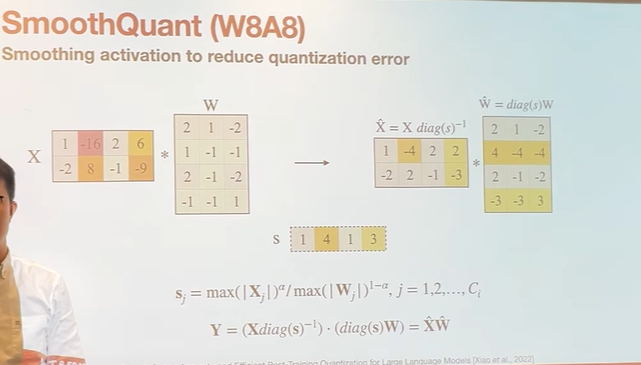

- [[SmoothQuant]]
	- 用于解决input的outlier的问题，
	- 
	- 韩松团队提供将input的动态范围除上scale(该scale > 1即可以实现动态范围减小, 从而改善量化结果), 并将该scale吸到下一层的weight内, 利用weight的细粒度量化来承担该量化困难(因为input往往使用token-wise quantization, 而weight通常使用channel-wise quantization或group-wise quantization).
	- 
	- S的计算，用squre root of max(activation)/max(weight)来计算出一个scaling factor，这个scaling factor是在input channel的维度上的。对于同一个channel，所有的sequence length的activation都除以一个scaling factor拿到smooth的activation。然后所有的weight的对应的input channel乘以一个scaling factor。
- [[GPTQ]]
- GGUF
	- ...
- AWQ
	- activation aware weight only quantization
	- motivation:
		- LLM decoder的模式下面，activation比较小，weight比较大，重复loading带来的开销很高。所以需要量化weight，直接量化成4-bit的话，模型精度掉的很高。
		- 所以比较直接的思路是把一部分的weight保留成fp16，选择的方法就是对应的activation如果是outlier，那说明对应的weight比较重要，所以那些weight应该用更高的bit。
		- 然后对于outlier的activation用Smooth quant的方式去加scaling factor。
		-