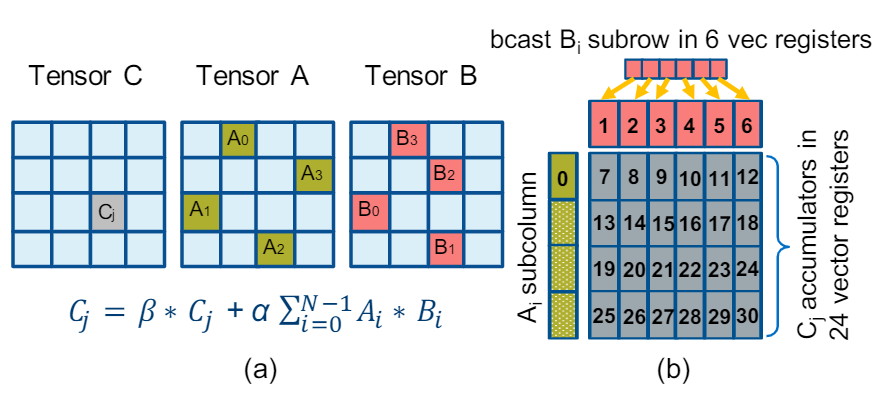
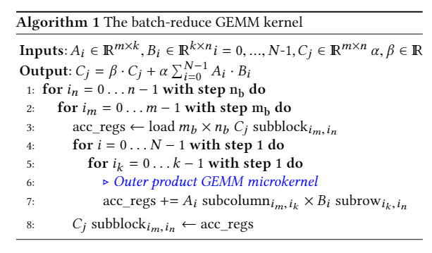
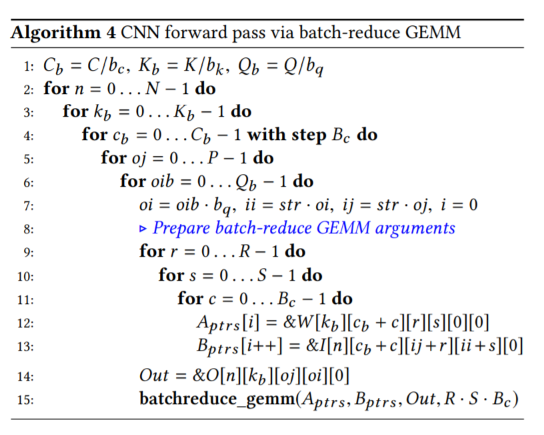
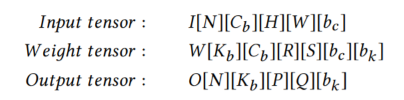
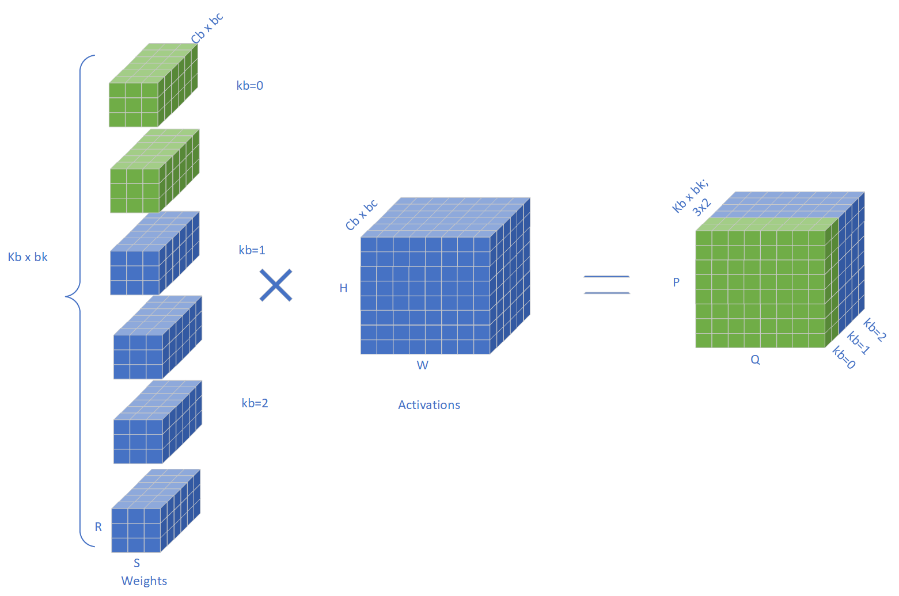
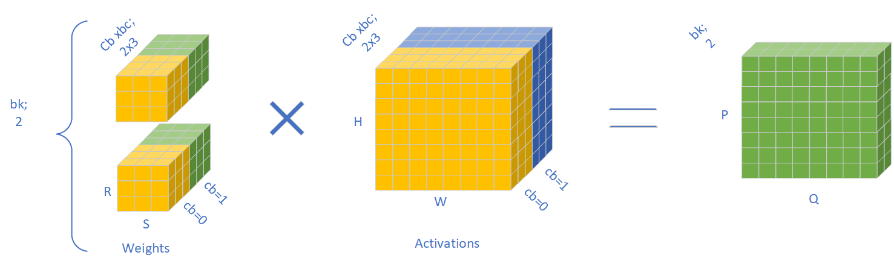
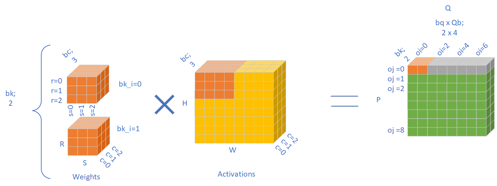
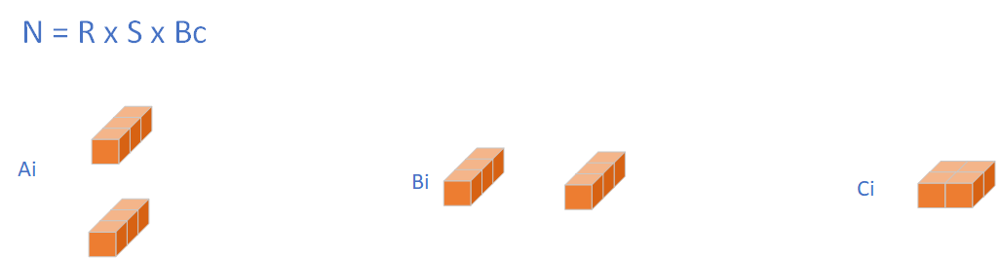
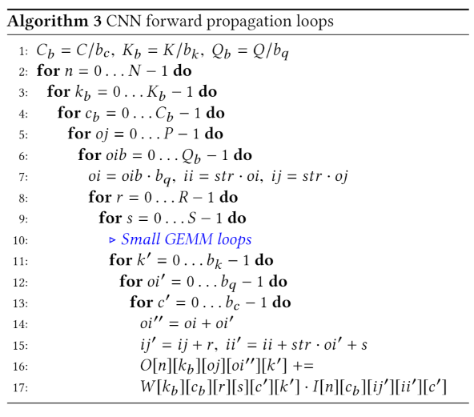

- Reference notes: #[[GEMM in qnnpack]] #[[专栏：GEMM optimization]] #gemmlowp  #Im2col #[[Convolution optimization]] #[[small GEMM kernels]]
- https://arxiv.org/pdf/1906.06440.pdf
id:: ad20a0f8-ee52-4160-bc90-ff810bd9a0ab
	 - In this work, we introduce thebatch-reduce GEMM kern eland show how the most popular DL algorithms can be formulated with this kernel as the basic building-block.  {{1  3Cv0JIY2t}} [📑](((ad20a0f8-ee52-4160-bc90-ff810bd9a0ab)))
	 - Consequently, the DL library-developmentdegenerates to mere (potentially automatic) tuning of loops around this sole optimized kernel.  {{1  E3GYpTFFP}} [📑](((ad20a0f8-ee52-4160-bc90-ff810bd9a0ab)))
	 - The development of such DL libraries typically embraces one of the following strategies: (i) the specific workload kernel leveragescoarse-grained, linear algebra library calls, e.g. LSTM cell via large GEneral Matrix Multiply (GEMM) calls in mkl-dnn [15], convolu-tions via image-to-column tensor transformations and subsequent large GEMM calls [16,17], or (ii) for each workload and use-case(training/inference) the kernel employs a specialized implementa-tion that targets the specific algorithm/workload and architecture at hand, e.g. convolution kernels in mkl-dnn and cuDNN [18]. {{1  UXvnlpVfy}} [📑](((ad20a0f8-ee52-4160-bc90-ff810bd9a0ab)))
	 - The former approach of deploying coarse-grained, linear algebra library calls provides ease in the DL library development process since no special kernel development is involved. However it may result in suboptimal data reuse (e.g. redundant data movements to for-mat underlying tensor/matrices in the required layout that enablesGEMM calls), and also it is not flexible enough to allow efficient,fine-grained fusion of other operators. The latter approach of im-plementing specialized kernels for each DL workload/use-case andplatform/architecture strives for performance but naturally result sin numerous, complex code-bases that are hard to maintain and do not generalize. For example, the code-baseonly for convolutions onCPUswithin mkl-dnn consists of∼36,000 lines of code.  {{1  x_82k08Mp}} [📑](((ad20a0f8-ee52-4160-bc90-ff810bd9a0ab)))
- 
	 - A: MxK, B: KxN, C: MxN
	 - This gemm kernel take the following arguments
		 - two arrays of pointers to Ai and Bi to be multiplied #[[GEMM in qnnpack]]
		 - pointer to output block cj
		 - the number N of blocks to be multiplied
		 - scaling parameter
	 - Example process analysis:
		 - First block the computation of output Ci into mbxnb blocks.
		 - The input is split into k outer product of (mbx1) x (1xnb) computations.
		 - Then load the (mbx1) and (1xnb) blocks into registers as the (b) shows.
			 - Read the Cj results to acc_regs first.
			 - in this case, suppose nb=6, mb=64, register size = 32 and each one holds 16 elements.
			 - Then the 1x6 operators are broadcast to (16)x6 elements in register 1 to 6.
			 - And 64 x 1 operators are separated into 4 registers.
		 - The acc_regs results is stored in Cj after computing is done.
	 - This gemm kernel is different as it have reduction ability...
		 - First, this kernel min-imizes the output data movement compared to GEMM or batchedGEMM approaches since the specification dictates the use of a sin-gle output.
	 - 
- Convolution using batch reduce GEMM kernel
	 - 
	 - 
	 - 
	 - Line 2 split the batch of the input. Line 3 split the output channel into Kb small tiles each with bk elements. As shown above, the corresponding kernel is also split into small tiles.
	 - 
		 - Line 4 split the input channel into Cb/Bc small tiles each with Bc x bc elements. We suppose BC=1 in the upper graph. As shown above, the corresponding kernel is also split into small tiles.
	 - 
		 - Line 5 and line 6 split the output feature map. And the input are also split correspondingly, note that there seems to be some issue with the stride handling.
	 - Then the RxSxBc elements of weights are mapped to pointers. Also the same amount of input elements are stored in pointers.
	 - 
		 - Then we use batch reduce gemm to calculate the small tiles. In our case, Ai have a shape of 2x3 and Bi have a shape of 3x2 and Ci have a shape of 2x2.
- Convolution using original GEMM kernel
	 - 
	 - The majority of spliting tiling strategy is the same, including the following:
		 - split through batches to 1 batch per tile
		 - split output channel for output and weights (bk)
		 - split input channel for input and weights (bc)
		 - split output height for input and output feature maps (1)
		 - split output width for input and output feature maps (bq)
		 - split the kernel (1x1)
		 - Gemm loops
			 - multiply and add the corresponding input and weights to corresponding output
	 - benefit and drawbacks
		 - This require the use of multiple outputs while batch reduce GEMM uses only one output.
		 - This need more memory movement ahead of time to increase memory locality than Batch reduce GEMM with memory pointers.
		 - Memory pointers eliminate the time of memory copy by prefetch. (prefetch to L1 cache for coming batch-reduce GEMM kernel)