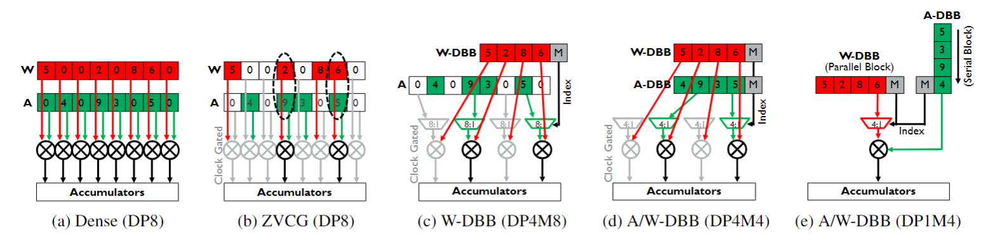

- https://arxiv.org/pdf/2107.07983v1.pdf
id:: f650b7f8-3066-4850-9145-d24bfd23df70
	 - Prior sparse CNN accelerators largely exploit un-structured sparsity and achieve significant speedups. Due to the unbounded, largely unpredictable sparsity patterns, how-ever, exploiting unstructured sparsity requires complicated hardware design with significant energy and area overhead {{1  dRqJW-si1}} ))
	 - The simplest way to exploit sparsity in hardware is Zero Value Clock Gating (ZVCG). Fig. 6b shows how ZVCG sim-ply detects zero operands (weights and activations) and clock-gates the operand and/or result registers to reduce powerdissipation.  While ZVCG gives a significant reduction indatapath power [6, 30], it does not increase throughput, nor does it reduce the SRAM bandwidth (as the zeros are still stored and read in sequence {{2  _3A202XwT}} ))
	 - Basically, removing MACs with zero operands breaks the regular compute pattern and requires complex on-chipbuffering and data re-ordering to maximize the hardwareutilization.  {{2  5vrEWJfgz}} ))
	 - For a fixed number of index pairs, the number of matches varies wildly depending on the position and the input data, which gives rise to an unpredictable number of MACs in any single cycle, leading to variable, unbalanced PE utilization at run time {{3  -lJnpXsyO}} ))
	 - In this approach,however, the MAC operations being executed in parallel cor-respond to different, typically non-contiguous elements in the output feature map {{3  JzkvMFCwU}} ))
	 - each accumulator requires a read-modify-write operation to accumulate the par-tial sum in the correct place. The area and power overhead of this large accumulator buffer is, again, significant for INT8inference accelerators, {{3  ipWRs07OK}} ))
	 - First, processing DBB block sin order ameliorates the load imbalance problem and removes the distributed accumulator problem encountered with un-structured sparsity,  avoiding the energy- and area-hungrybuffers.  {{4  rVqZ03Cbo}} ))
	 - This com-pact and efficient hardware architecture is possible becauseDBB results are naturally generated in sequential blocks; no data reordering or result index calculation is required {{4  Jo3ZcRZJG}} ))
	 - he key advantage of weight DBB is that the load imbal-ance problem is greatly relaxed,  as we have bounded the maximum number of non-zero elements per block and can provision hardware based on this {{5  qpEsHUZiw}} ))
	 - We apply magnitude based DBB-aware weight pruning, which is similar to random magnitude pruning [41], but pruning independently within each DBBblock.  This typically runs for 20-50 epochs, progressively pruning small-magnitude weights within each DBB block,until the desired DBB sparsity constraint is met. {{8  D7jyoJ5SK}} ))
	 - Dynamic Activation Pruning (DAP)is lossy and requires fine-tuning to minimize accuracy impact.We incorporate DAP into DNN fine-tuning by adding DAP in front of convolution operations, mimicking how it is use dat inference. To back propagate through the DAP layer, we calculate the gradient of DAP with respect to the activation a {{8  u4Zq8typS}} ))
-
- Notes:
	 - sparse engine
		 - 
	 - sparse matrix storage:
		 - CSR/CSC
		 - bitmap
-
- Reference notes:
	 - [[sparse matrix]] [[designs of sparse engine]]