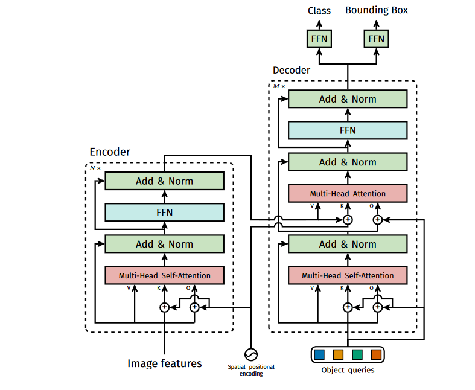
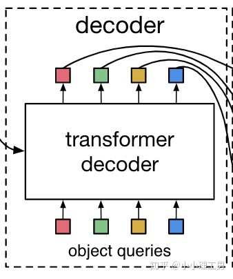
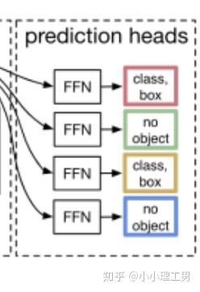
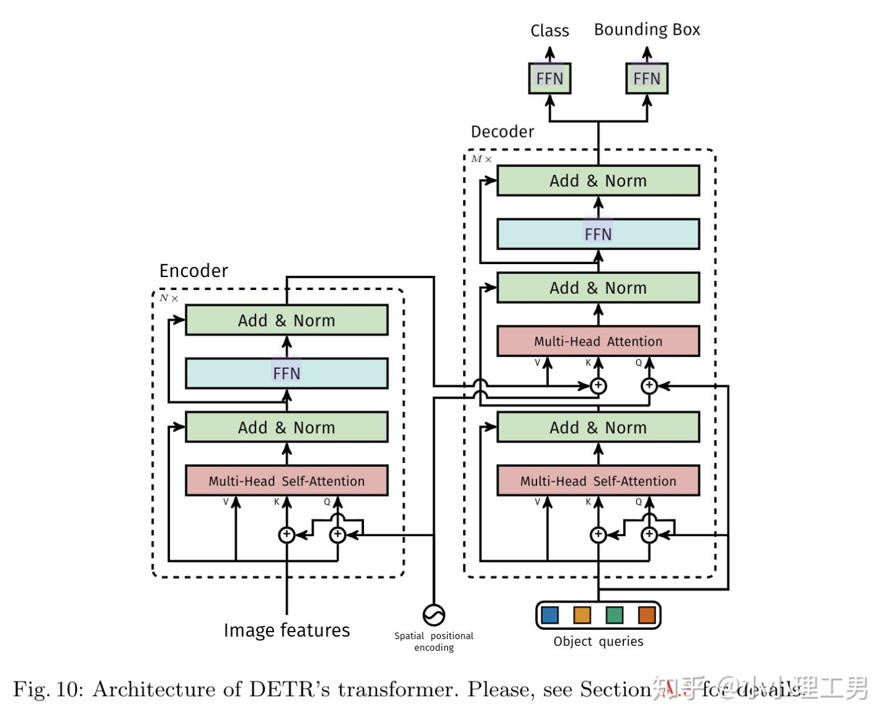

- Sources
	- [Object Detection with Transformers | by Jacob Briones | The Startup | Medium](https://medium.com/swlh/object-detection-with-transformers-437217a3d62e)
	- [用Transformer做object detection：DETR - 知乎](https://zhuanlan.zhihu.com/p/267156624)
	- [Comparison of Faster-RCNN and Detection Transformer (DETR) | by Subrata Goswami | Medium](https://whatdhack.medium.com/comparison-of-faster-rcnn-and-detection-transformer-detr-f67c2f5a2a04)
	- [https://arxiv.org/pdf/2005.12872v3.pdf](https://arxiv.org/pdf/2005.12872v3.pdf)
- Recall Questions
	- What is the structure of DETR?  #ques1 #card
	  card-last-interval:: 4
	  card-repeats:: 1
	  card-ease-factor:: 2.6
	  card-next-schedule:: 2023-02-01T15:11:41.090Z
	  card-last-reviewed:: 2023-01-28T15:11:41.090Z
	  card-last-score:: 5
		- 
	- Transformer的模型为什么是顺序无关的？ #ques1 #card
	  id:: 9117b16d-95fb-4272-888f-609813fdd43f
	  card-last-interval:: 4
	  card-repeats:: 1
	  card-ease-factor:: 2.6
	  card-next-schedule:: 2023-02-01T15:13:05.714Z
	  card-last-reviewed:: 2023-01-28T15:13:05.714Z
	  card-last-score:: 5
		- 因为你变换input feature的顺序，self-attention模型训练的时候还是会去和所有的位置的参数进行运算。
		- 以分类问题为例，如果没有positional sequence，那么在attention 模块，对于class token
			- And $$Class_{N*1} * Q_{1*N}$$
			- 在向量点乘之后，内积中没有position信息
		- 如果有的话
			- And $$Class_{N*1} * (Q_{1*N} + PositionEmbedding)$$
	- What is the transformer structure in DETR? Difference with original transformer?  #ques1 #card
	  card-last-interval:: 4
	  card-repeats:: 1
	  card-ease-factor:: 2.6
	  card-next-schedule:: 2023-02-01T15:10:55.546Z
	  card-last-reviewed:: 2023-01-28T15:10:55.547Z
	  card-last-score:: 5
		- 
- Notes
	- Detr is short for DEtection TRansformer (DETR)
	- 事实上，文章所做的工作，就是将transformers运用到了object detection领域，取代了现在的模型需要手工设计的工作（例如 [非极大值抑制](https://zhuanlan.zhihu.com/p/37489043) 和 anchor generation），并且取得了不错的结果。
	- Transfomer encoder
		- 如下图所示，在DETR中，首先用CNN backbone处理$$3*H_0*W_0$$ 维的图像，得到$$3*H*W$$维的feature map（一般$$C=2048, H = H_0/32, W = W_0/32$$）。然后将backbone输出的feature map和position encoding相加，输入Transformer Encoder中处理，得到用于输入到Transformer Decoder的image embedding。
			- 
		- Transformer Encoder的结构和Transformer原始论文中的结构相同，主要是cnn输出的feature map到sequence的过程：
			- 1. 维度压缩，将$$C*H*W$$的feature map先经过一个1x1的convolution进行特征的压缩。压缩到$$d$$的大小。新的featuremap 大小为 $$d*H*W$$。
			- 2. reshape为2d的sequence array，变成$$d*HW$$。
			- 3. 加上postional encoding
	- Transformer decoder
		- Tranformer decoder 主要有两个输入
			- 1. image embedding (transformer encoder 输出)
				- 
			- 2. object queries
				- 有N个，输入transformer decoder之后得到了N个decoder output embedding，经过FFN得到N个预测的boxes和boxes的类别
				- > 在训练过程中，因为需要生成不同的boxes，object queries会被迫使变得不同来反映位置信息，所以也可以称为leant positional encoding （注意和encoder中讲的position encoding区分，不是一个东西）。
				- DETR同时计算所有的predictions，而不像transformer中是从左到右一个词一个词输出。
				- > 后来仔细看论文和代码，才发现它的输出是定长的：100个检测框和类别。某自动化所的学长说，这种操作可能跟COCO评测的时候取top 100的框有关，我认为他说的有道理。
				  从这种角度看，DETR可以被认为具有100个adaptive anchor，其中Encoder和Object Query分别对特征和Anchor进行编码，最后用Decoder+FFN得到检测框和类别。
	- FFN
		- 
		- 
	- Data flow
		- The data flows through DERT’s network as follows. The bracketed notation indicates shape of tensors. The various tensors are named accordingly : pos for position embedding , feature for features from the backbone, . The input to the backbone is a batch of RGB images.
		- Backbone Input/Input image — [4, 3, 1216, 704] # batch,channel,w,h
		- Backbone output — feature [4, 2048, 38, 22], pos [4, 256, 38, 22]
		- Transformer input — projected_feature [4, 256, 38,22 ], mask [4, 38, 22], query [100, 256] , pos [4, 256, 38, 22]
		- Encoder input — src [836, 4, 256], mask [4, 836], pos [836, 4, 256]. src is derived from projected_feature , and the rectangular feature is flattened into a line ( e.g. 38*22 = 836) .
		- Encoder output — memory [836, 4, 256]
		- Decoder input — tgt [100, 4, 256], memory [836, 4, 256] , mask [4, 836], pos [836, 4, 256], query_embed [100, 4, 256]
		- Decoder output — hs [6, 100, 4, 256]
		- The q,k, and v to the encoder self-attention layer are simply src+pos, src+pos , and src respectively. In the above, src is derived from projected_feature .
		- The q,k and v to the decoder self-attention layer are tgt+pos, tgt+pos, and tgt respectively. Tgt tensor is set to all 0s during every iteration.
		- The q,k and v to the decoder multihead cross-attention are tgt-norm1+query_pos, memory+pos, and memory respectively. query_pos is entirely derived from query_embed. query_embed is a learned positional embedding, it gets updated every iteration during training. tgt-norm1 is the output from the norm layer of self-attention.
		- The output from the decoder is taken through a linear and a MLP layer respectively to generate the class and bounding box output.
	- Code
		- ```python
		  class DETR(nn.Module):
		      """ This is the DETR module that performs object detection """
		      def __init__(self, backbone, transformer, num_classes, num_queries, aux_loss=False):
		     """ Initializes the model.
		     Parameters:
		         backbone: torch module of the backbone to be used. See backbone.py
		         transformer: torch module of the transformer architecture. See transformer.py
		         num_classes: number of object classes
		         num_queries: number of object queries, ie detection slot. This is the maximal number of objects
		                      DETR can detect in a single image. For COCO, we recommend 100 queries.
		         aux_loss: True if auxiliary decoding losses (loss at each decoder layer) are to be used.
		     """
		     super().__init__()
		     self.num_queries = num_queries
		     self.transformer = transformer
		     hidden_dim = transformer.d_model
		     self.class_embed = nn.Linear(hidden_dim, num_classes + 1)
		     self.bbox_embed = MLP(hidden_dim, hidden_dim, 4, 3)
		     self.query_embed = nn.Embedding(num_queries, hidden_dim)
		     self.input_proj = nn.Conv2d(backbone.num_channels, hidden_dim, kernel_size=1)
		     self.backbone = backbone
		     self.aux_loss = aux_loss
		  
		      def forward(self, samples: NestedTensor):
		     """ The forward expects a NestedTensor, which consists of:
		            - samples.tensor: batched images, of shape [batch_size x 3 x H x W]
		            - samples.mask: a binary mask of shape [batch_size x H x W], containing 1 on padded pixels
		         It returns a dict with the following elements:
		            - "pred_logits": the classification logits (including no-object) for all queries.
		                             Shape= [batch_size x num_queries x (num_classes + 1)]
		            - "pred_boxes": The normalized boxes coordinates for all queries, represented as
		                            (center_x, center_y, height, width). These values are normalized in [0, 1],
		                            relative to the size of each individual image (disregarding possible padding).
		                            See PostProcess for information on how to retrieve the unnormalized bounding box.
		            - "aux_outputs": Optional, only returned when auxilary losses are activated. It is a list of
		                             dictionnaries containing the two above keys for each decoder layer.
		     """
		     if isinstance(samples, (list, torch.Tensor)):
		         samples = nested_tensor_from_tensor_list(samples)
		     features, pos = self.backbone(samples)
		  
		     src, mask = features[-1].decompose()
		     assert mask is not None
		     hs = self.transformer(self.input_proj(src), mask, self.query_embed.weight, pos[-1])[0]
		  
		     outputs_class = self.class_embed(hs)
		     outputs_coord = self.bbox_embed(hs).sigmoid()
		     out = {'pred_logits': outputs_class[-1], 'pred_boxes': outputs_coord[-1]}
		     if self.aux_loss:
		         out['aux_outputs'] = self._set_aux_loss(outputs_class, outputs_coord)
		     return out
		  
		  ```
	- Experiment results
		- Similar performance against Faster-RCNN
- Summary
	- #towrite