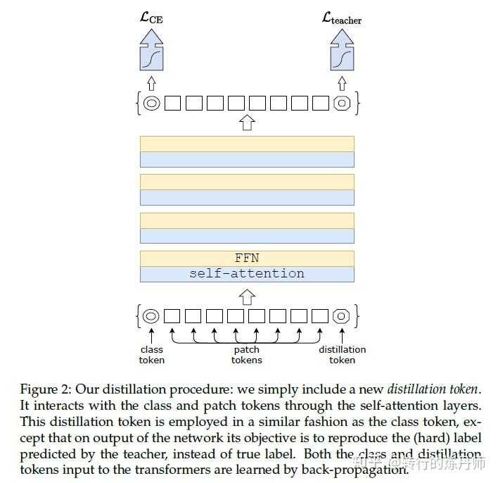
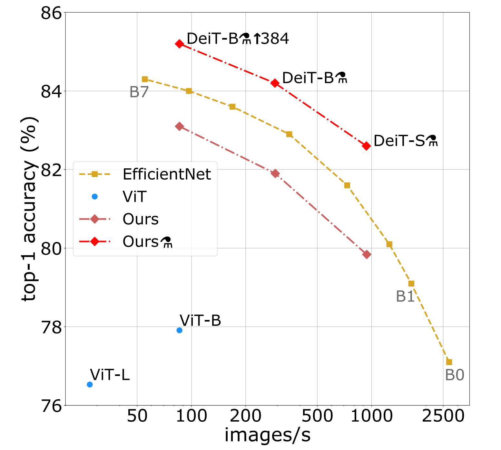
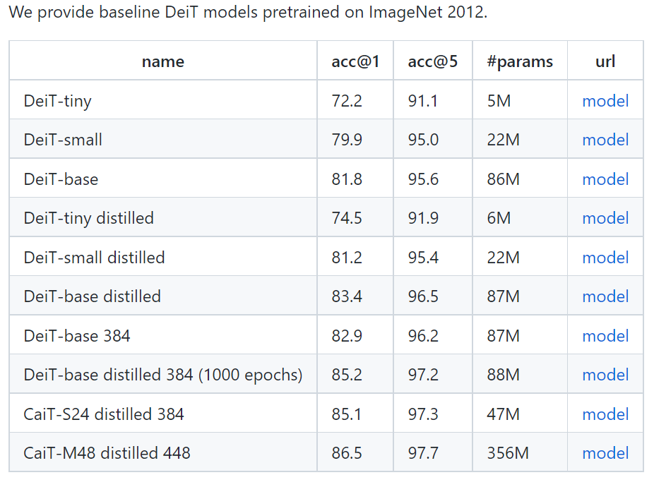

- Recall Questions
	- What is the training and inference difference in predicted class label in VIT?  #ques1 #card
	  card-last-interval:: 4
	  card-repeats:: 1
	  card-ease-factor:: 2.6
	  card-next-schedule:: 2023-02-01T15:12:07.850Z
	  card-last-reviewed:: 2023-01-28T15:12:07.851Z
	  card-last-score:: 5
		- ```python
		     if self.training:
		         return x, x_dist
		     else:
		         # during inference, return the average of both classifier predictions
		         return (x + x_dist) / 2
		  ```
	- What is the difference between DeiT and VIT? #ques1 #card
	  card-last-interval:: 4
	  card-repeats:: 1
	  card-ease-factor:: 2.6
	  card-next-schedule:: 2023-02-01T15:13:34.159Z
	  card-last-reviewed:: 2023-01-28T15:13:34.159Z
	  card-last-score:: 5
		- {{embed  ((4d5da1ee-7d22-41f8-bc1e-14fd2b4ab278))}}
- Notes
	-
- Summary
	- In general
		- Deit是基于VIT的训练方法上的改进，网络结构基本上一致
		  id:: 4d5da1ee-7d22-41f8-bc1e-14fd2b4ab278
			- 
		- 添加了用SOTA来做distillation的token
			- 使用的是hard distillation
			- 训练的时候除了class token的ce_loss，加上了distillation_token的distill_loss。
			- 推理的时候，取两个token的预测的均值
	- Experiment results
		- 
		- 
	- Talk is cheap
		- [pytorch-image-models/vision_transformer.py at master · rwightman/pytorch-image-models](https://github.com/rwightman/pytorch-image-models/blob/master/timm/models/vision_transformer.py)
		- ```python
		  class DistilledVisionTransformer(VisionTransformer):
		      """ Vision Transformer with distillation token.
		      Paper: `Training data-efficient image transformers & distillation through attention` -
		     https://arxiv.org/abs/2012.12877
		      This impl of distilled ViT is taken from https://github.com/facebookresearch/deit
		      """
		      def __init__(self, *args, **kwargs):
		     super().__init__(*args, **kwargs)
		     # distillation token
		     self.dist_token = nn.Parameter(torch.zeros(1, 1, self.embed_dim))
		     num_patches = self.patch_embed.num_patches
		     self.pos_embed = nn.Parameter(torch.zeros(1, num_patches + 2, self.embed_dim))
		     self.head_dist = nn.Linear(self.embed_dim, self.num_classes) if self.num_classes > 0 else nn.Identity()
		  
		     trunc_normal_(self.dist_token, std=.02)
		     trunc_normal_(self.pos_embed, std=.02)
		     self.head_dist.apply(self._init_weights)
		  
		      def forward_features(self, x):
		     B = x.shape[0]
		     x = self.patch_embed(x)
		  
		     cls_tokens = self.cls_token.expand(B, -1, -1)  # stole cls_tokens impl from Phil Wang, thanks
		     dist_token = self.dist_token.expand(B, -1, -1)
		     # 实现的时候两个token是连续放的，不像上图中一前一后
		     x = torch.cat((cls_tokens, dist_token, x), dim=1)
		  
		     x = x + self.pos_embed
		     x = self.pos_drop(x)
		     
		     # transformer encoder部分
		     for blk in self.blocks:
		         x = blk(x)
		  
		     x = self.norm(x)
		     # 返回两个token embedding后的结果
		     return x[:, 0], x[:, 1]
		  
		      def forward(self, x):
		     x, x_dist = self.forward_features(x)
		     x = self.head(x)
		     x_dist = self.head_dist(x_dist)
		     if self.training:
		         return x, x_dist
		     else:
		         # during inference, return the average of both classifier predictions
		         return (x + x_dist) / 2
		  ```