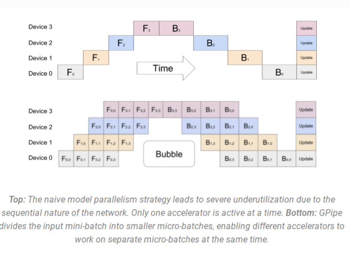
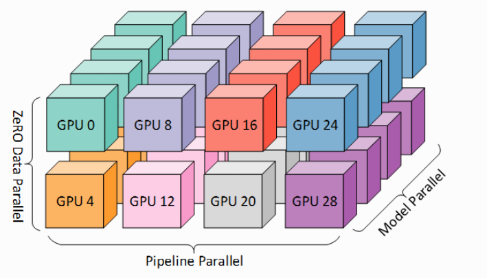

- https://huggingface.co/transformers/v4.9.2/parallelism.html#parallelism-overview
- [[Data parallelism]]
	- 从batch上进行切分，分配到多个GPU的device，每个device计算local的数据的forward和backward，并且更新optimizer
	- 优点是并行度高，通信需求低，缺点是每个GPU都需要duplicate的parameter，所以无法训练大模型。
	- {:height 521, :width 407}
- [[Model parallelism and  pipeline parallelism]]
	- ### Model parallelism
		- Summary:
			- 把一个大模型切分成多个部分给多个GPU，每个GPU负责一个部分的前向和后向。缺点是通信和计算必须串行，并且通信成本很高。
			- 
		- Details:
			- ```
			  ===================  ===================
			  |  0 | 1 | 2 | 3  |  |  4 | 5 | 6 | 7  |
			  ===================  ===================
			          gpu0                 gpu1
			  ```
			- 如果有两个GPU，要运行8层的网络的training。vertically 切分这个网络，前面四层到第一个GPU，后面四层到后一个GPU。
			- 现在，当数据从第 0 层传输到第 1 层、第 1 层到第 2 层和第 2 层到第 3 层时，这只是正常模型。但是，当数据需要从第 3 层传递到第 4 层时，它需要从 GPU0 传输到 GPU1，这会带来通信开销。如果参与的 GPU 位于同一计算节点（例如同一台机器）上，则此复制速度非常快，但如果 GPU 位于不同的计算节点（例如多台计算机）上，则通信开销可能会大得多。
		- Drawbacks:
			- 永远只有一个GPU在工作，4x6GB的卡能够达到的效果跟一台24GB的卡效果类似，没有充分利用运算资源。但是因为有通信开销，所以通常会更慢。
			- 如果两部分的网络有shared的embedding，会有额外的通信开销。
	- ### Tensor parallelism
		- {{embed ((65994b36-c00f-4021-9295-e99c7d2c620b))}}
	- ### pipeline Parallelism
		- Summary:
			- 
		- Details:
			- GPipe:
				- 上面的图是naive model parallelism，下面的图是用了Gpipe之后的图，通过batch的切分，让所有的device都能参与运算。
				- 
			- [[MegatronLM by Nvidia]]
- [[model parallelism from hugging face]]
	- ## 2D pipeline:
		- DP + PP:
			- 
			- Here it's important to see how DP rank 0 doesn’t see GPU2 and DP rank 1 doesn’t see GPU3. To DP there is just GPUs 0 and 1 where it feeds data as if there were just 2 GPUs. GPU0 “secretly” offloads some of its load to GPU2 using PP. And GPU1 does the same by enlisting GPU3 to its aid.
		- DP+PP+TP:
			- https://www.microsoft.com/en-us/research/blog/deepspeed-extreme-scale-model-training-for-everyone/
			- **Optimizing for intra- and inter-node communication bandwidth**: Model parallelism has the largest communication overhead of the three strategies, and so we prioritize placing model parallel groups within a node to utilize the larger intra-node bandwidth. Here we apply NVIDIA Megatron-LM for tensor-slicing style of model parallelism. Pipeline parallel groups are placed within a node when model parallelism does not span all the workers in a node.  Otherwise, they are placed across nodes.  Data parallelism has the lowest communication volume, and so we can schedule pipeline stages across nodes without being limited by the communication bandwidth.
			- 
			- Figure 1: Example 3D parallelism with 32 workers. Layers of the neural network are divided among four pipeline stages. Layers within each pipeline stage are further partitioned among four model parallel workers. Lastly, each pipeline is replicated across two data parallel instances, and ZeRO partitions the optimizer states across the data parallel replicas.
			- {:height 413, :width 709}
			- Figure 2: Mapping of workers in Figure 1 to GPUs on a system with eight nodes, each with four GPUs. Coloring denotes GPUs on the same node.
		- ZeroDP + PP + TP
			- When combined with PP and TP, Zero-DP only enable Zero stage1
			- potential communication cost for stage2 and stage3,这个是因为用了micro batch，naive的zeroDP会在每次算完当前node的batch的时候同步传输gradient。但是micro batch时，需要每个micro batch算完就同步，这样增加了通信的开销。
	- ## Which Strategy To Use When [](https://huggingface.co/transformers/v4.9.2/parallelism.html#which-strategy-to-use-when)
	- Here is a very rough outlook at which parallelism strategy to use when. The first on the list is typically faster.
	- **⇨ Single GPU**
		- Model fits onto a single GPU:
			- Normal use
		- Model doesn't fit onto a single GPU:
			- ZeRO + Offload CPU and optionally NVMe
	- **⇨ Single Node / Multi-GPU**
		- collapsed:: true
		  
		  Model fits onto a single GPU:
			- DDP - Distributed DP
			- ZeRO - may or may not be faster depending on the situation and configuration used
		- Model doesn't fit onto a single GPU:
		  collapsed:: true
			- PP
			- ZeRO
			- TP
		- With very fast intra-node connectivity of NVLINK or NVSwitch all three should be mostly on par, without these PP will be faster than TP and ZeRO. The degree of TP may also make a difference. Best to experiment to find the winner on your particular setup.
	- **⇨ Multi-Node / Multi-GPU**
		- When you have fast inter-node connectivity:
			- ZeRO - as it requires close to no modifications to the model
			- PP+TP+DP - less communications, but requires massive changes to the model
		- when you have slow inter-node connectivity and still low on GPU memory:
			- DP+PP+TP+ZeRO-1
-