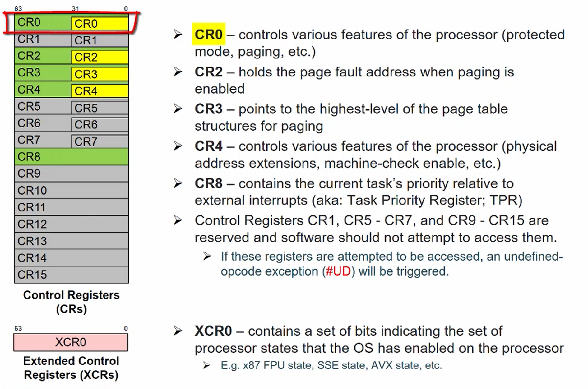

- 
	 - 16-bit
		 - SP, BP
			 - 16-bit pointer registers that have special roles, SP (stack pointer) points to the "top" of the [stack](https://en.wikipedia.org/wiki/Stack_%28data_structure%29), and BP (base pointer) is often used to point at some other place in the stack, typically above the local variables (see [frame pointer](https://en.wikipedia.org/wiki/Frame_pointer))
		 - AX, BX, CX, DX
			 - 16-bit general purpose registers
		 - CS, DS, SS, ES
			 - 16-bit register to form a memory address
		 - SI, DI, BX, BP
			 - The registers SI, DI, BX and BP are [address registers](https://en.wikipedia.org/wiki/Address_register), and may also be used for array indexing
		 - FLAGS
			 - The [FLAGS register](https://en.wikipedia.org/wiki/FLAGS_register_%28computing%29) contains [flags](https://en.wikipedia.org/wiki/Flag_%28computing%29) such as [carry flag](https://en.wikipedia.org/wiki/Carry_flag), [overflow flag](https://en.wikipedia.org/wiki/Overflow_flag) and [zero flag](https://en.wikipedia.org/wiki/Zero_flag).
		 - Instruction pointer (IP)
			 - Points to the next instruction that will be fetched from memory and then executed; this register cannot be directly accessed (read or written) by a program.
	 - 32-bit
		 - With the introduce of 32-bit processer, the 16-bit registers are broaden to 32-bit except segment registers with a E prefix.
	 - 64-bit
		 - Similarly, expanded to 64-bit with a R prefix.
	 - 128-bit
		 - XMM0-XMM15
	 - 256-bit
		 - YMM0-YMM15
	 - 512-bit
		 - ZMM0-ZMM31
- Mindshare: Intro to x86 Register Set
	 - Reference:
		 - [[Mindshare x86]]
	 - Questions:
	 -
	 - X86 register set
		 - 
	 - General purpose registers
		 - 
			 - General purpose registers (AX, BX, CX, DX, SI, DI, BP, SP) have implicit usage for some instructions
				 - SI DI implicitly stands for the source location and dest location for MOV
				 - SP is the implicit location for stack address
			 - R8D R8W R8B: dword, word, byte
		 - 
	 - Flags register
		 - 
			 - the flags register is going to be updated with the general purpose instructions
			 - ZF will be used in dec instructions
			 - TF is the single debug mode flag
			 - IF is the interrupt flag. Indicating if we serve interrupts or not
	 - x87 registers (floating point registers)
		 - 32 bit floating point
			 - 
			 - 1 bit sign, 8bit exponent, 23 significant
		 - 64 bit floating point
			 - 
			 - 1 bit sign, 11 bit exponent, 52 bit significant
		 - 80 bit width (x87)
			 - 1 bit sign, 16 exponent, 64 mantissa
	 - MMX registers
		 - 
			 - MMX are using the same physical registers as the x87 registers
			 - should not mix these two codes
			 - Fist simd instruction, use the lower 64 bit of the same as x87 registers
	 - MMX examples
		 - 
			 - calculate 8 byte-level addition
			 - might overflow since the addition result is also byte-level
				 - Carry Flag only valid for integer operations
		 - 
			 - Saturate at 0xFF
	 - 
		 - compare if two values match, if match 0xFFFF
	 - XMM registers
		 - 
			 - MMX registers only allowed to perform integer operations
			 - SSE support simd on floating point values (4 fp32 in 128 bit)
			 - SSE2 support 2 fp64 in 128 bit, support integer operations (byte word doubleword quadword)
		 - 
			 - Add scalar vs add packed. add one operand or add 4 operand
	 - YMM registers
		 - 
			 - AVX support a three-operand syntax
			 - AVX ported most two-operand SSE instructions into three-operand AVX instructions
		 - 
			 - FMA is introduced in AVX
		 - 
			 - AVX instructions starts with a V
			 - specify XMM in avx instruction would only do operation on the lower 128-bit operands
		 -
	 - AVX2 enhancements
		 - 
			 - support integer data type support for YMM registers, much like SSE2 support for XMM registers
			 - more instructions
	 - ZMM registers
		 - 
			 - YMM is a subset of ZMM
			 - extends functionality of AVX and AVX2
			 - new instructions
	 - Six segment registers
		 - 
			 - more to come
	 - CS: IP (where to fetch the instructions from)
		 - 
	 - Control registers
		 - 
			 - Control the behavior of the CPU
			 - CR2 and CR3 related to paging
			 - CR8 related to interrupts
	 - Debug registers
		 - 
	 - Model specific registers (MSR)
		 - 
			 - architecturally MSR: guaranteed to be there for all x86 architectures (IA32_XXX)
	 - MSR scope
		 - 
			 - all the other registers are per-thread, meaning these registers are unique for each thread
	 - MSRs examples
		 - 
			 - To access a MSR register, first put an address in ECX. Read the low half to EAX and higher half to EDX.
			 - Some instructions mix use AX and DX for a 64-bit read. That is because the instruction is before RAX or RDX.
		 - 
			 - Write is the same as the upper read