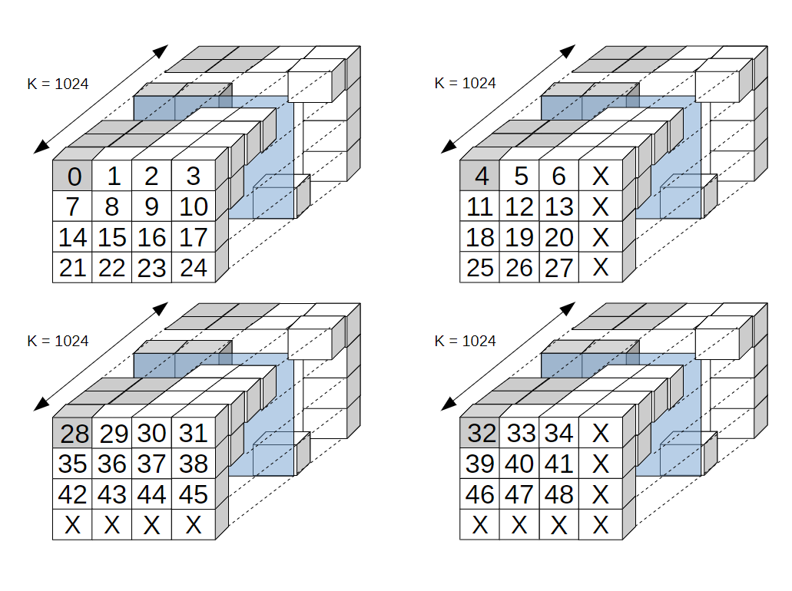
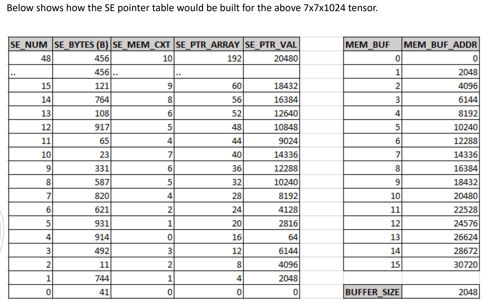
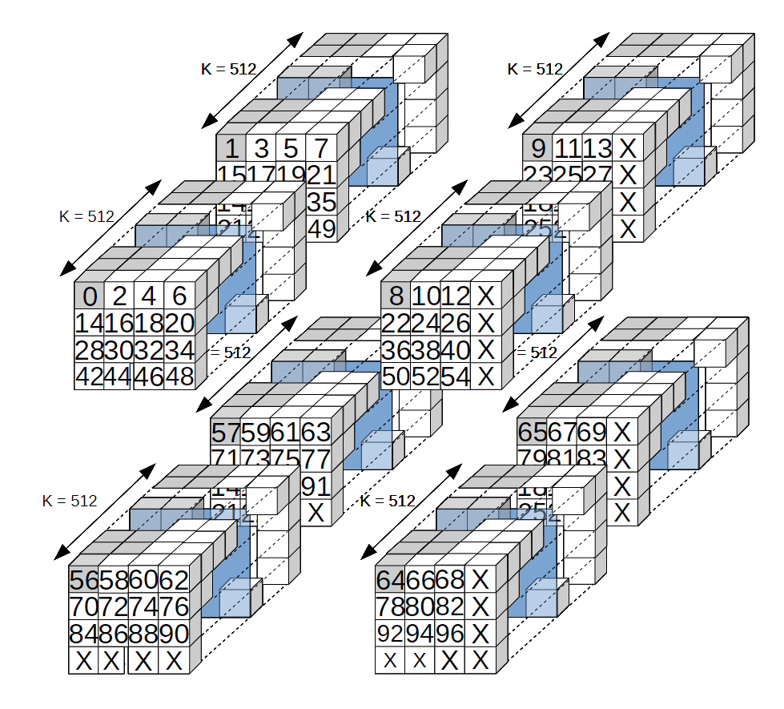

- _1646275860602_0.pdf)
- ((625cb665-a700-4e65-b861-42b19b5dc214))
	- #SE-pointer
- Example: 7x7x1024 with a SE of 1x1x1024 with an MPE configuration 4x4 with ZXY Storage element order.
	- {:height 556, :width 697}
- {:height 633, :width 821}
- Example: 7x7x1024 with a SE of 1x1x512 with an MPE configuration 4x4 with ZXY Storage element order.
	- {:height 706, :width 786}