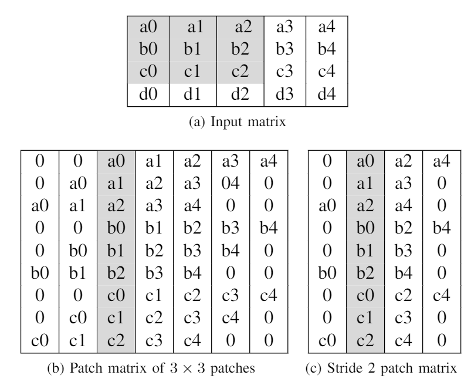

- 
  id:: 653d5b13-a64d-4e70-9577-2b75e0c929a0
	- https://arxiv.org/pdf/1709.03395.pdf
	- ((6222013a-0d43-4a1f-be01-551cee01ac77))
	- A = [a11, a12, a13; a21, a22, a23]
	- |Address Row Major|Row-major order|Column-major order|
	  |--|--|--|
	  |0|a11|a11|
	  |1|a12|a21|
	  |2|a13|a12|
	  |3|a21|a22|
	  |4|a22|a13|
	  |5|a23|a23|
	- ((62220157-35af-4960-a652-bebeba17be32))
	- ((6222016a-fccc-461e-a2f3-724613e475aa))
- Notes
	- KKC major
		- 
			- Building the gemm using KKC-major format require the copy of the input kk times
			- Great memory locality
	- HW major
		- 
			- Poor memory locality because b0 on the next row is no where near the current row a0.
			- ??
	- kn2row or kn2col
		- kn2row, separate the computation of 3x3 convolution to 9 1x1 convolutions and the 9 convolution each produces MxHxW outputs. We can add these together with a bias with respect to the location of the 1x1 kernel in 3x3 kernel.
		- kn2col, similar
		- drawback
			- require kxk increase in output memory