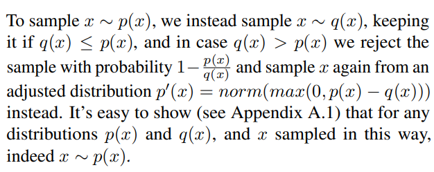
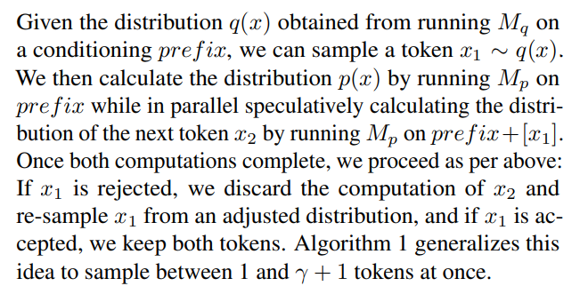
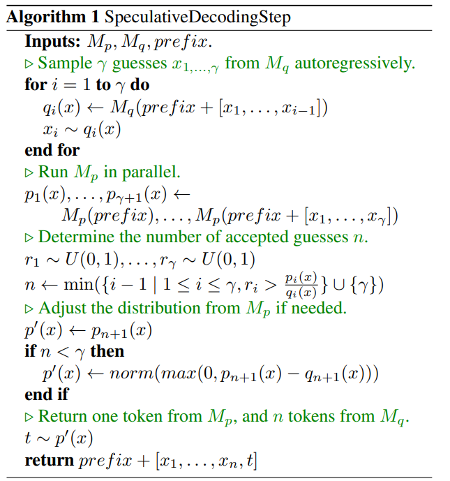

- 有用的reference
	- https://zhuanlan.zhihu.com/p/671432448
- ## Algorithm detail
	- 
	- {:height 326, :width 625}
	- 注意：
		- 小模型进行预测的时候，也是autoregressive manner。也就是从1开始到γ，预测γ个token。
			- 
		- 然后，在运行大模型的时候，是直接把小模型的γ个case输入给大模型。然后计算小模型得到的token在大模型预测中的概率。
			- 
		- 在投机解码中，**qi(x)** 是草稿模型（Draft Model）对下一个Token **x** 的预测概率，而 **pi(x)** 是主干模型对同一Token **x** 的预测概率。通过比较 **ri > pi(x)/qi(x)**，实现了以下目的：
		  collapsed:: true
			- collapsed:: true
			  
			  **确保符合目标分布**：
				- **pi(x)/qi(x)** 表示主干模型与草稿模型在该Token上的概率比率。如果 **qi(x)** 较高且 **pi(x)** 也较高，表示草稿模型的预测与主干模型一致，接受该Token的概率较大。
				- 反之，如果 **qi(x)** 高而 **pi(x)** 低，表示草稿模型对该Token的预测过于自信，不符合主干模型的分布，接受该Token的概率较小。
			- collapsed:: true
			  
			  **引入随机性以避免偏差**：
				- 通过引入随机数 **ri ~ U(0,1)**，实现了概率性的接受机制，确保了接受的Token在统计意义上符合 **pi(x)** 的分布。
				- 这种方式避免了草稿模型生成的低质量Token被频繁接受，从而保持了生成结果的质量。
			- collapsed:: true
			  
			  **动态调整接受数量**：
				- 一旦 **ri > pi(x)/qi(x)**，即遇到第一个不符合要求的Token，停止当前步骤的接受过程。这意味着在一个解码步骤中，可以接受的连续的高质量Token的数量是动态确定的，而不是固定的。
				- 这种机制避免了在某个点之后继续接受不可靠的Token，同时减少了需要验证的步骤数量，提高了解码效率。
			- 流程图：
			  collapsed:: true
				- ```
				  +-----------------------+
				  |       输入序列         |
				  +----------+------------+
				             |
				             v
				  +----------+------------+
				  |   草稿模型 (Mq)        |
				  |  生成多个候选Token     |
				  |  x1, x2, ..., xγ         |
				  +----------+------------+
				             |
				             v
				  +----------+------------+
				  | 主干模型 (Mp)          |
				  |  计算每个候选Token的pi(x) |
				  +----------+------------+
				             |
				             v
				  +----------+------------+
				  |  确定接受数量 n        |
				  |  对比 ri > pi(x)/qi(x) |
				  +----------+------------+
				             |
				             v
				  +-----------------------+
				  |   接受前n个Token并     |
				  |   更新生成序列         |
				  +-----------------------+
				  ```
			- 让我用具体的例子解释:
			  collapsed:: true
				- 假设在生成一个句子 "The cat is ___" 时:
				- 草稿模型(Mq)预测下一个词的概率分布:
					- ```
					  sleeping: 0.7
					  eating: 0.2
					  running: 0.1
					  ```
				- 主干模型(Mp)对同样位置计算自己的概率分布:
					- ```
					  sleeping: 0.4
					  eating: 0.4
					  running: 0.2
					  ```
				- 计算比值 pi(x)/qi(x):
					- ```
					  sleeping: 0.4/0.7 ≈ 0.57
					  eating: 0.4/0.2 = 2.0
					  running: 0.2/0.1 = 2.0
					  ```
				- 生成随机数 r = 0.6
					- 因为 0.6 > 0.57, 所以拒绝这个预测
					  这里可以看到:
						- 没有对任何概率进行调整
						- 主干模型只是用自己的概率分布来验证草稿模型的预测
						- 通过比值和随机数来决定接受或拒绝
		- 重新采样的过程：
			- 好的,让我用具体数字解释这个调整后重新采样的过程:
			  collapsed:: true
				- 在拒绝预测后:
				- 原始的概率分布:
					- ```
					  主干模型p(x):
					  sleeping: 0.4
					  eating: 0.4
					  running: 0.2
					  
					  草稿模型q(x):
					  sleeping: 0.7
					  eating: 0.2
					  running: 0.1
					  ```
				- 计算 p(x) - q(x):
					- ```
					  sleeping: 0.4 - 0.7 = -0.3
					  eating: 0.4 - 0.2 = 0.2
					  running: 0.2 - 0.1 = 0.1
					  ```
				- 取max(0, p(x) - q(x)):
					- ```
					  sleeping: max(0, -0.3) = 0
					  eating: max(0, 0.2) = 0.2
					  running: max(0, 0.1) = 0.1
					  ```
			- 归一化(norm)操作:
			  collapsed:: true
				- 总和 = 0 + 0.2 + 0.1 = 0.3
				- ```
				  新的分布p'(x):
				  sleeping: 0/0.3 = 0
				  eating: 0.2/0.3 ≈ 0.67
				  running: 0.1/0.3 ≈ 0.33
				  ```
			- 这样调整后:
				- sleeping的概率变为0(因为草稿模型过高估计了它)
				- eating和running的相对概率增加
				- 下一次会从这个新分布中采样,更可能选到eating或running
				- 这个调整确保了:
					- 被草稿模型高估的选项(sleeping)在重新采样时被排除
					- 被草稿模型低估的选项(eating,running)获得更高的采样概率
			- 
			- 
		- 有趣的点，保留的是n个小模型的预测token和一个大模型的预测token。
	- 
- ##   Choice of Draft Model
	- 至此我们已经清楚Speculative Decoding的计算流程，但这里的小模型可不是随意选取的
	- **小模型输出分布能够近似大模型，才能生成高accept rate的采样，推理才能更快**
	- 小模型通常由大模型进行量化(int8/int4)或者蒸馏(knowledge Distillation)得来
	  
	  > Since sampling performance is heavily coupled with the model size in memory, quantisation to** int8 or even int4 (Dettmers et al., 2022; Yao et al., 2022) and distillation **...
	  Using sequence level **distillation** (Kim and Rush, 2016) to generate a second model which predicts tokens in parallel. This strategy was employed by Ge et al. (2022).