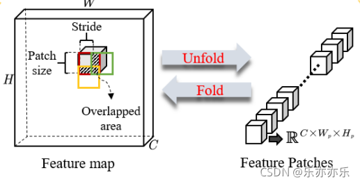
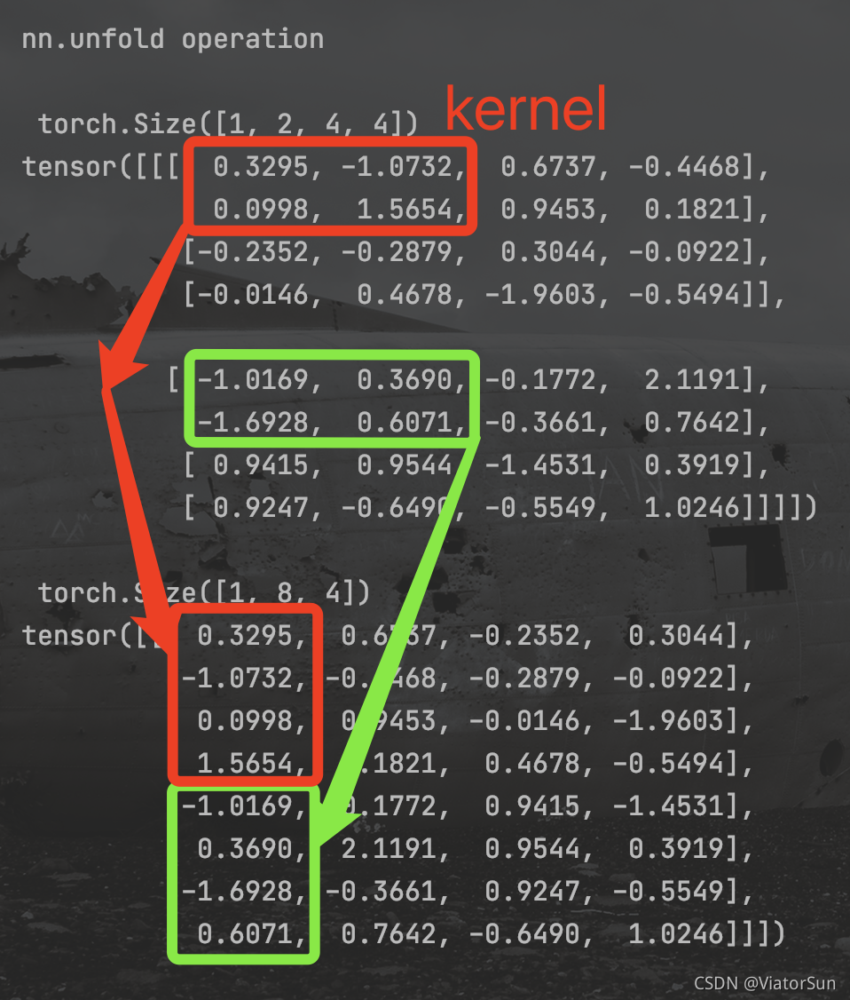
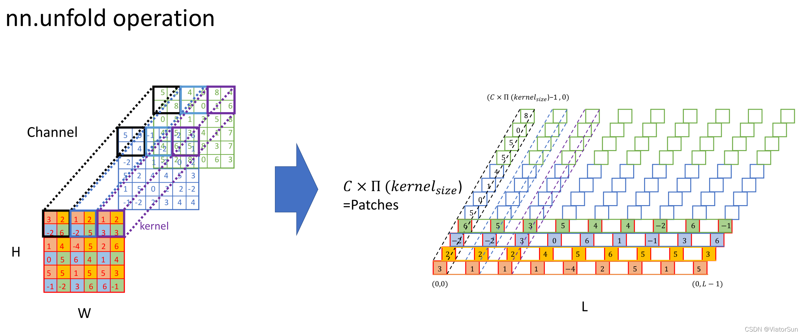
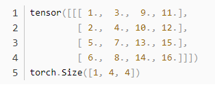
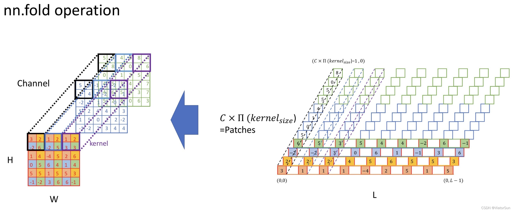

title:: torch fold and unfold
- 
- unfold:
	- 从一个batch的样本中，提取出滑动的局部区域块，也就是卷积操作中的提取kernel filter对应的滑动窗口
		- torch.nn.Unfold的参数跟nn.Conv2d的参数很相似，即，kernel_size(卷积核的尺寸)，dilation(空洞大小)，padding(填充大小)和stride(步长)
	- {:height 560, :width 482}
	- 
- Overlap的区域怎么做？
	- >  fold做的其实就是利用h × w 的核进行滑动窗口操作，然后将每次滑动得到的结果展平成一个列向量，逐个填充至结果中。那么unfold的话，做的工作就是处理fold得到的列向量。具体而言，unfold每次读取一个列向量，然后将其reshape回一个h × w 的块，再填回结果中。这时候就涉及一个问题，如果stride较小的话，reshape得到的块再填回结果时是会有overlapping的，因此只有在无overlapping(对于本例，需要stride=2)的情况下unfold与fold才可逆。
- fold example:
	- input:
		- 
	- 
	- 
	- 
	- 
	- 
	- 
- 