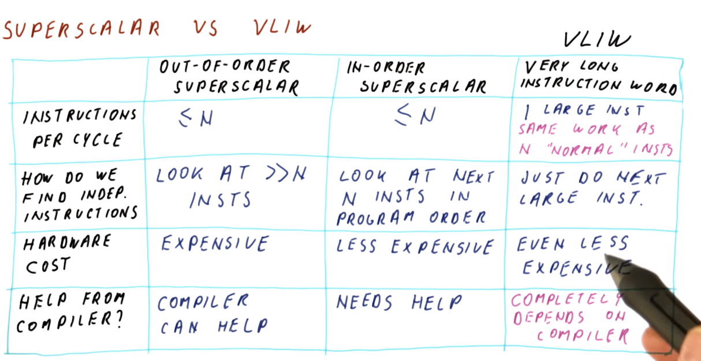
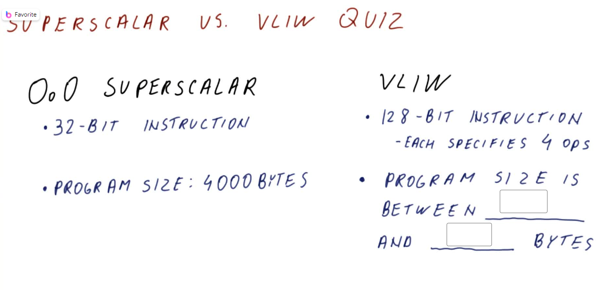
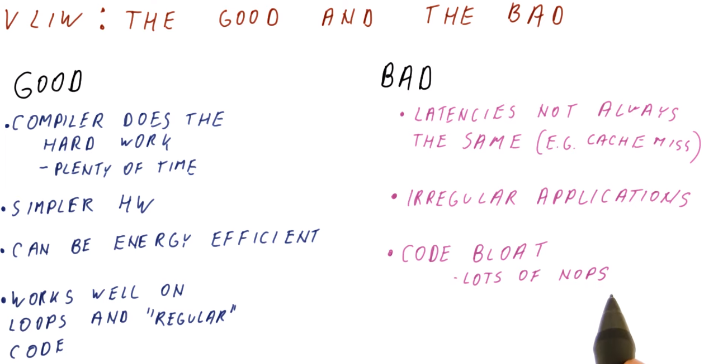
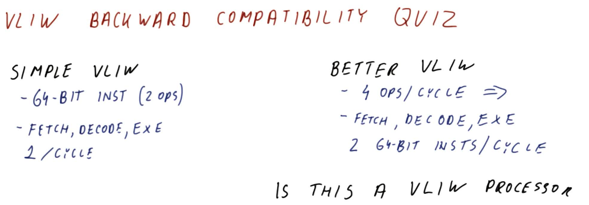
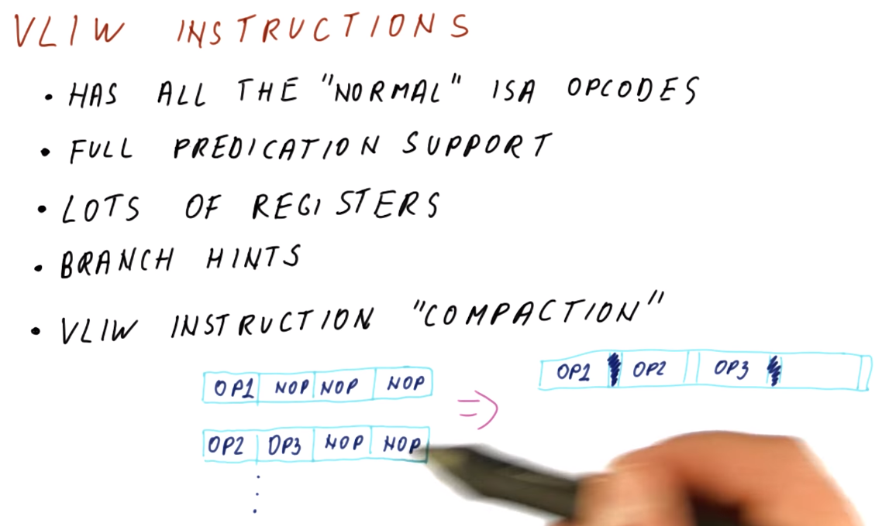
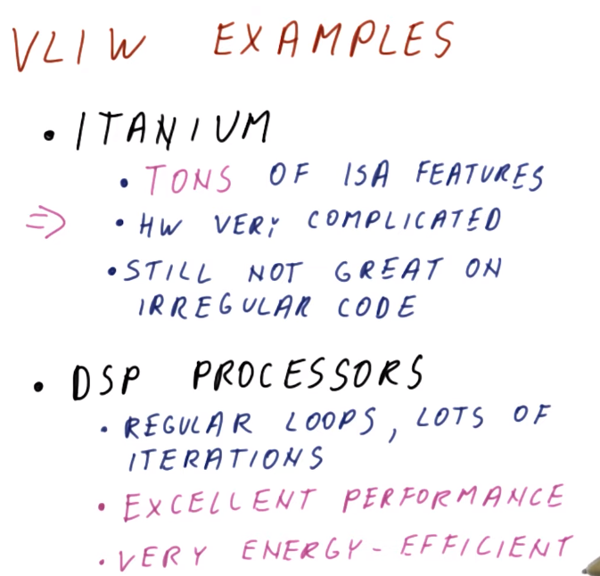
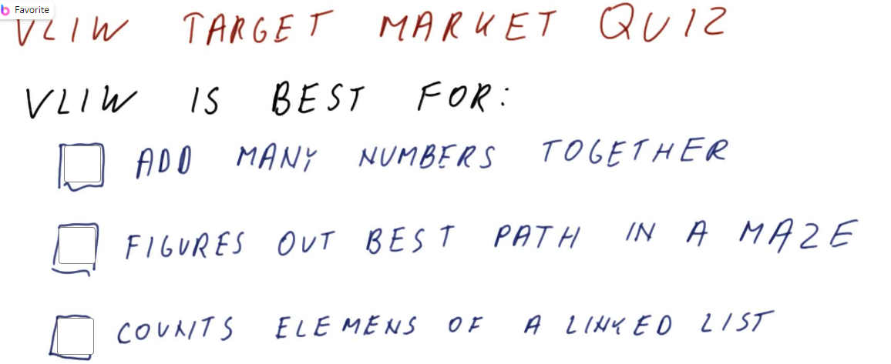

- Superscalar vs VLIW
	- {:height 523, :width 982}
- Superscalar vs VLIW quiz #card
  {:height 452, :width 881}
	- 4000-16000
	- The optimal case, we can always find 4 independent instructions to pack it up.
	- The worst case, all instructions are sequential.
- The good and the bad
	- {:height 462, :width 870}
- VLIW Backward Compatibility Quiz
	- {:height 316, :width 870}
		- No
- VLIW instructions
	- {:height 437, :width 710}
	- Why can't we do similar things about DPU descriptor? Compact instructions.
- VLIW examples
	- {:height 413, :width 422}
- VLIW Target Market Quiz
	- {:height 332, :width 813}
		- {:height 210, :width 736}
-