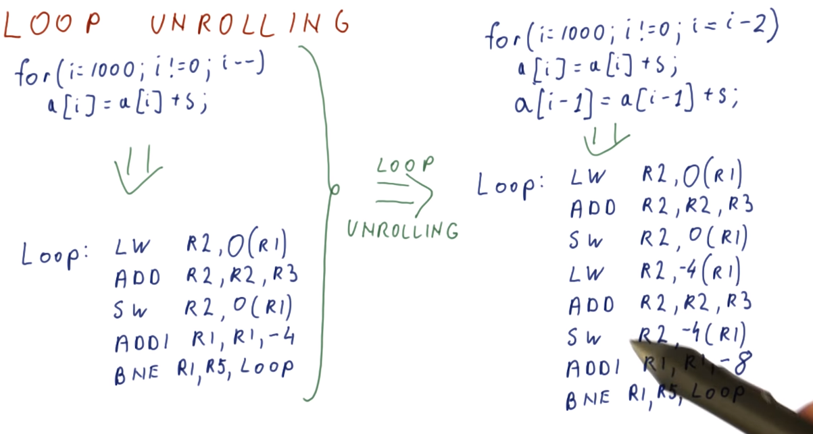

- Can Compilers Help Improve IPC
	- Limited window size would constrain the out of order execution of independent instructions
	- Compiler can help such cases
	- {:height 410, :width 892}
- Tree Height Reduction
	- doesn't work on NPU, we have full hardware resources when executing one instruction fairly easy
	- {:height 392, :width 845}
- Tree height reduction quiz #card
  {:height 421, :width 713}
	- {:height 415, :width 740}
- Make Independent Instructions Easier to Find
	- {:height 235, :width 797}
- Instruction Scheduling
	- Before scheduling:
		- {:height 438, :width 812}
	- After scheduling:
		- {:height 462, :width 815}
	- Instruction scheduling quiz #card
	  {:height 381, :width 842}
		- {:height 220, :width 586}
		- {:height 237, :width 299}
- Scheduling and if conversion
	- Predication can help the compiler to make optimizations since we can mix up instructions with the predicated instructions of different branches
		- {:height 445, :width 772}
		  id:: 6628972c-a0a8-479d-88ef-10b881bae240
- If Convert a loop
	- Assuming every instruction takes two cycles
	- Still one stall remaining after instruction scheduling within the loop
		- {:height 448, :width 840}
		- But notice that if we have the next loop instructions attached this loop, we will have chances for further reducing the stalls.
- Loop unrolling
	- ==unroll once== and do two operations in one iteration
	- {:height 450, :width 823}
- Loop Unrolling Benefits CPI
	- with instruction scheduling:
	  collapsed:: true
		- {:height 443, :width 762}
	- unrolling: reduced instructions
	- unrolling + instruction scheduling => less CPI and less instructions
	  collapsed:: true
		- {:height 458, :width 899}
	- loop unrolling quiz #card
	  {:height 378, :width 833}
		- {:height 272, :width 562}
		- Before scheduling there are three stall cycles.
		- After Scheduling: 5000 cycles / 1000 iterations
		- After scheduling there is one stall cycle per iteration (ADD must wait for one cycle so LW can complete) and the instruction order is:
		- Loop:
			- ```
			  LW R1, 0(R2)
			  ADDI R2,R2,4
			  ADD R3,R3,R1
			  BNE R2,R4,Loop
			  ```
		- After unrolling once and scheduling: 3500 cycles / 1000 original iterations
		- After unrolling and scheduling the instruction order is:
		- Loop:
			- ```
			  LW R1,0(R2)
			  LW R8,4(R2)
			  ADDI R2,R2,8
			  ADD R3,R3,R1
			  ADD R3,R3,R8
			  BNE R2,R4,Loop
			  ```
		- The loop after scheduling looks like this, with six instructions per (new) iteration. Note that the first ADD stalls for one cycle waiting for the first load, so it takes seven cycles to execute these six instructions. Our unrolling saved 1000 cycles by removing instructions (we execute only 3000 instructions instead of 4000) and 500 cycles by allowing better scheduling that reduces the total number of stall cycles from 1000 (one stall in each original iteration) to 500 (one stall in each new iteration that does the work of two original iterations).
- Unrolling downside
	- code size increase proportionally
	- exit in the middle of the unrolled instructions. For example, for a seven times loop, we unrolled that once, we need to exit in the middle at the last loop.
	- {:height 414, :width 669}
- Function call inlining
	- inline instructions to the place where it is called
	- eliminates call/ret overheads
	- similar to unroll for prefetching... in nbperf
	- {:height 481, :width 819}
	- downside:
		- replicated code --> increased code size
		- only small functions
	- inlining quiz #card
	  {:height 409, :width 820}
		- Before inlining:
			- {:height 242, :width 913}
		- After inlining:
			- {:height 447, :width 917}
- Other IPC enhancing computer stuff
	- {:height 481, :width 898}