- Previously in Tomasulo algorithm, we are doing the load and store in order. Can we do that out of order?
- Memory access ordering
	- Load and store instructions also have dependencies. If we have RAW for the same address in memory, we still need to wait till the store finishes before we can launch the load instruction.
	- 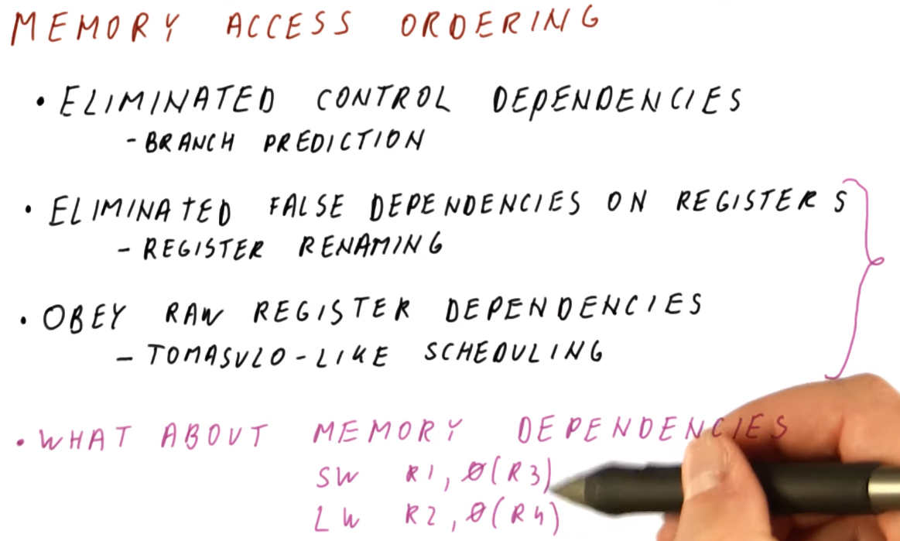{:height 564, :width 867}
- When does memory write happen
	- At commit, but how?
- Load store queue (LSQ)
  id:: 6627b6b4-04aa-4d3b-b03a-cd6cffe236f6
  collapsed:: true
	- load need to be done as soon as possible and store happens at commit
	- If we see same address for load after store in the LSQ, we do store to load forwarding instead of going to mem for the value
		- 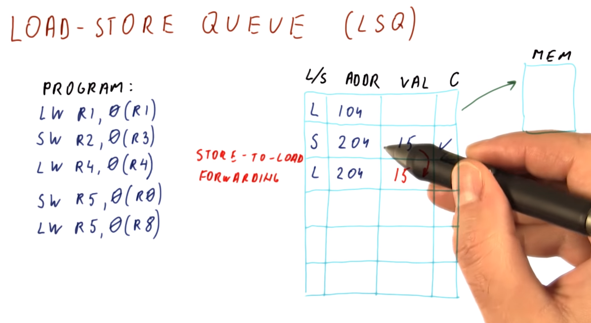{:height 460, :width 880}
	- some of the address might not be resolved yet, go anyway and recover if there is an Load after Store
		- 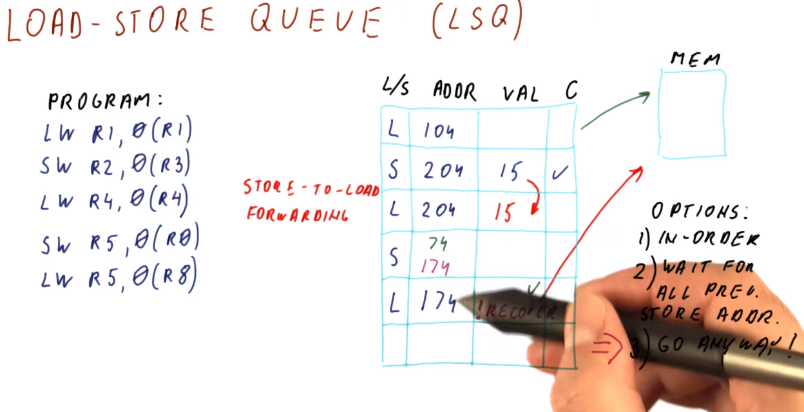{:height 435, :width 876}
- Out of Order Load Store Execution
	- Case where the load happens before the store get the address to written to
	- if the address is the same, we have a stale problem
		- 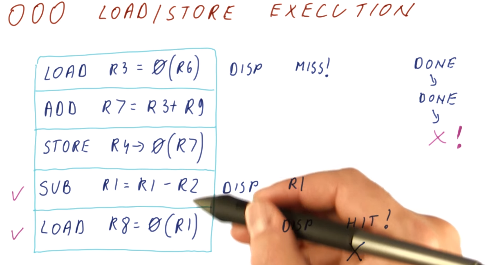{:height 479, :width 866}
	- Switch to in order load store execution
		- execute other instructions out of order and do in order for load and store
		- Slow but correct, might have cases where all successor instructions all waiting for the load to finish
	- memory ordering quiz #card
	  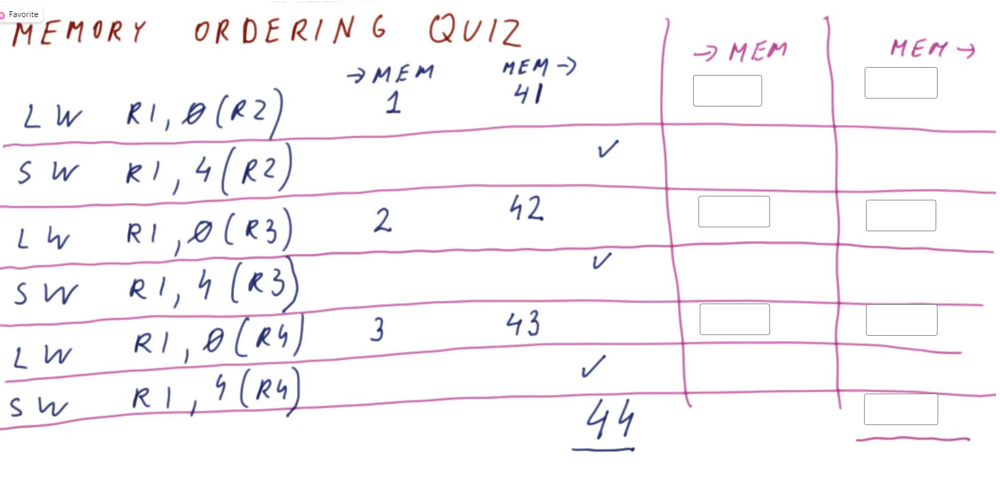{:height 448, :width 872}
		- 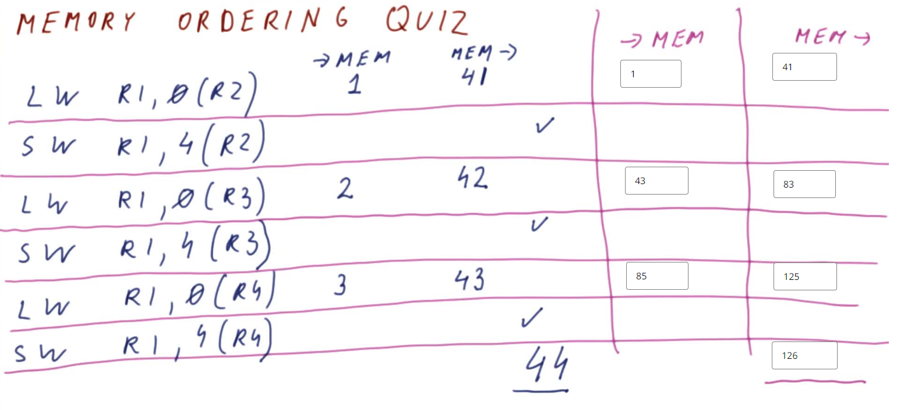{:height 412, :width 899}
- Store to Load Forwarding
	- 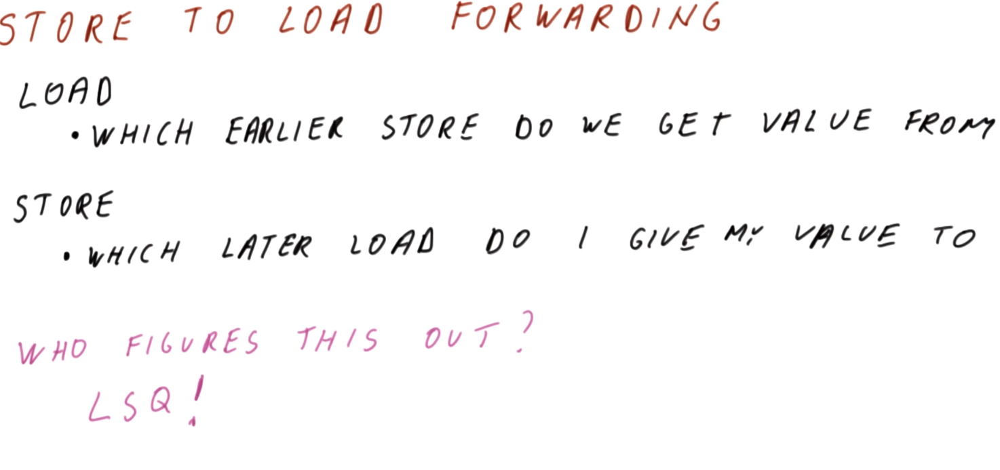{:height 406, :width 889}
	- LSQ Example
		- 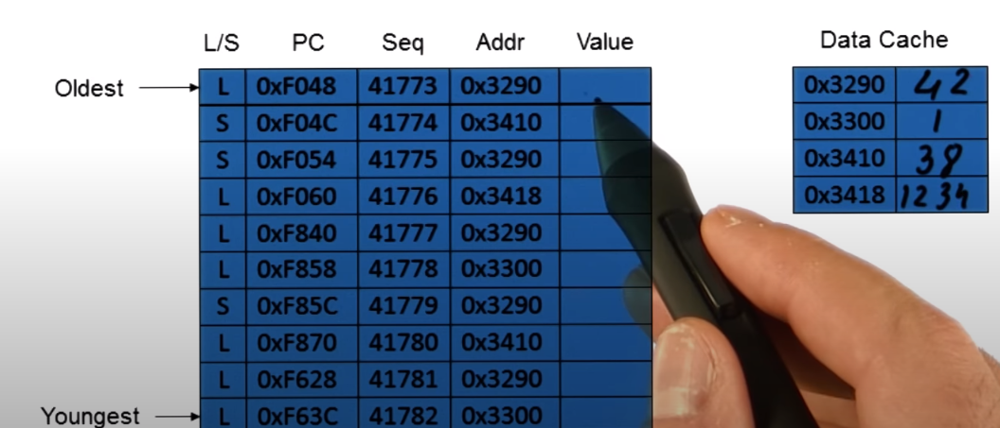{:height 298, :width 662}
		- The load will commit and write the data to the corresponding load register
		- The store will commit and write the data to data cache. Note that the store instruction might executed earlier but not yet write to data cache.
		- This is because if we have an exception before the store execution, the data cache would be exactly the way it supposed to be at the commit point.
		- After execution, before commit:
			- 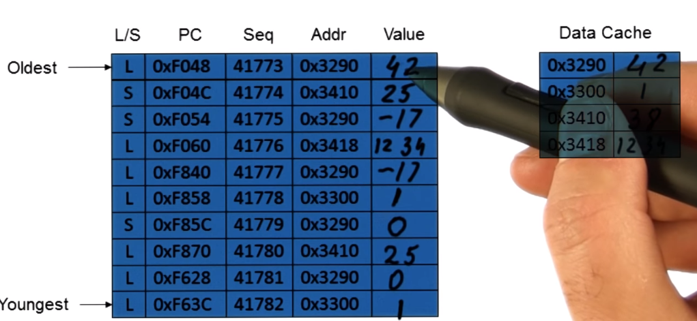{:height 340, :width 636}
		- After commit:
			- 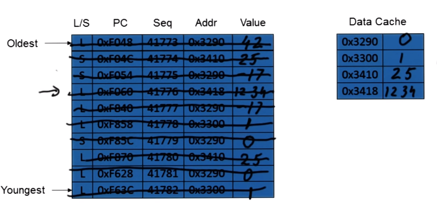{:height 312, :width 639}
- LSQ, ROB and RS
	- 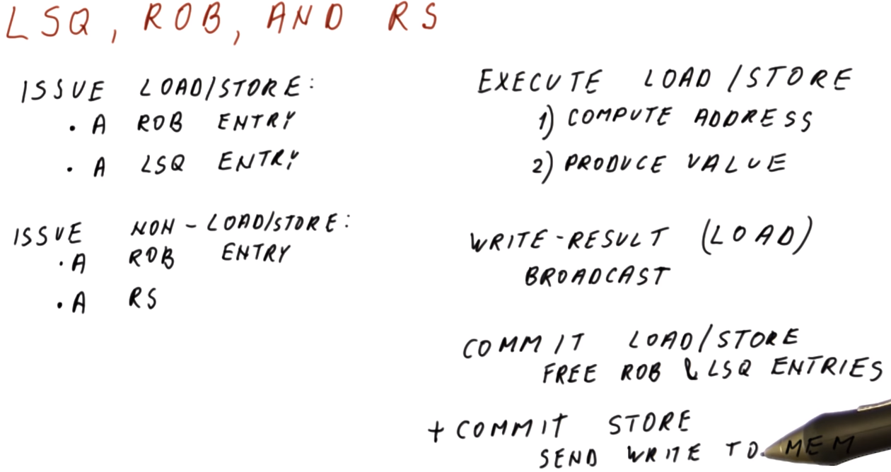{:height 487, :width 865}
- Memory quiz #card
  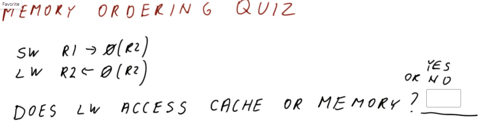{:height 234, :width 859}
	- No
- Memory Ordering Quiz 2 #card
  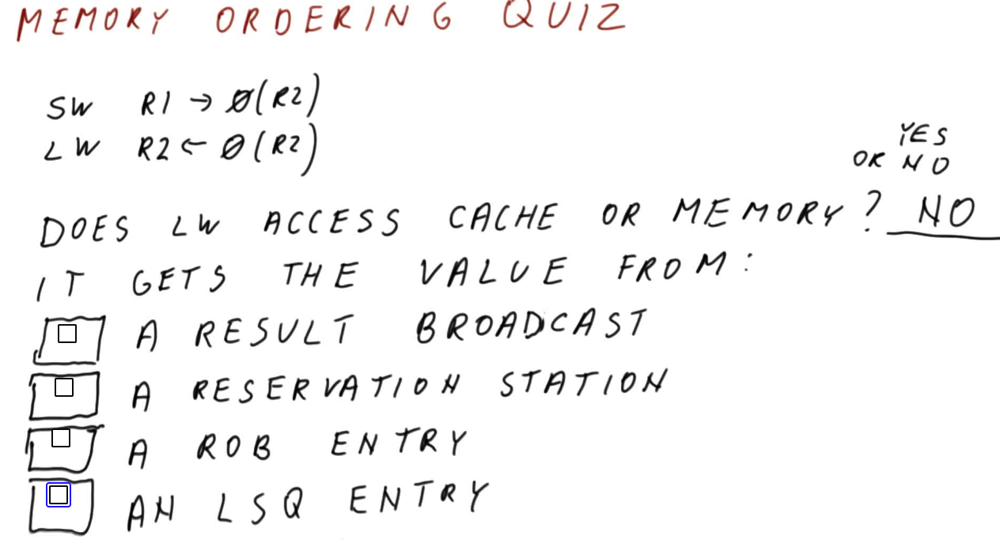{:height 354, :width 630}
	- D
- What is the hardware components look like in hardware?
	- LSQ+RS+ROB