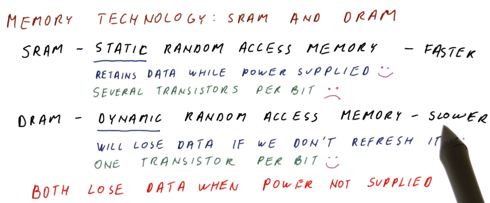
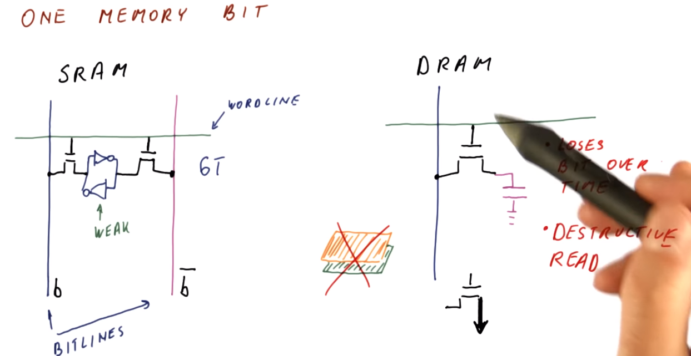
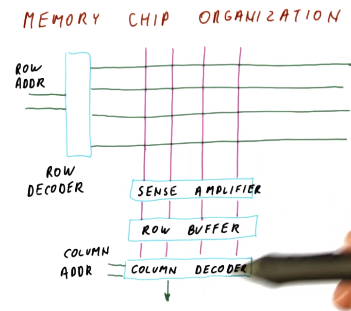
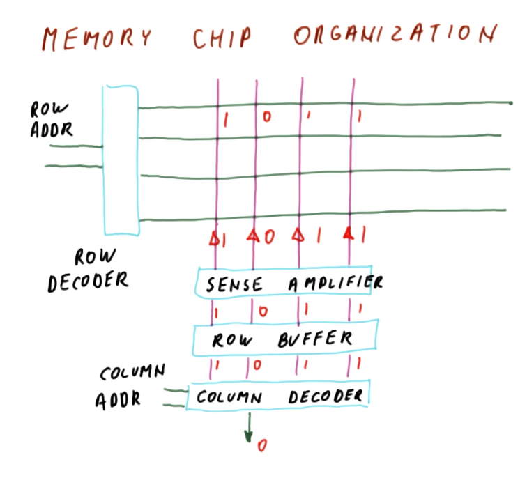
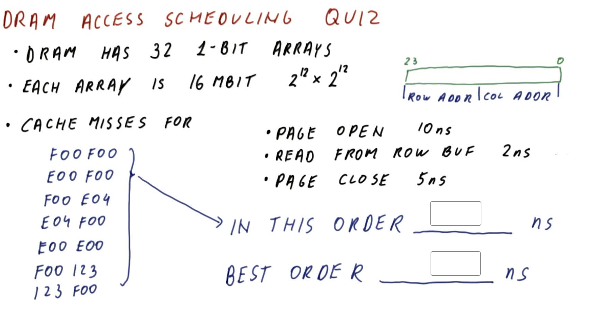
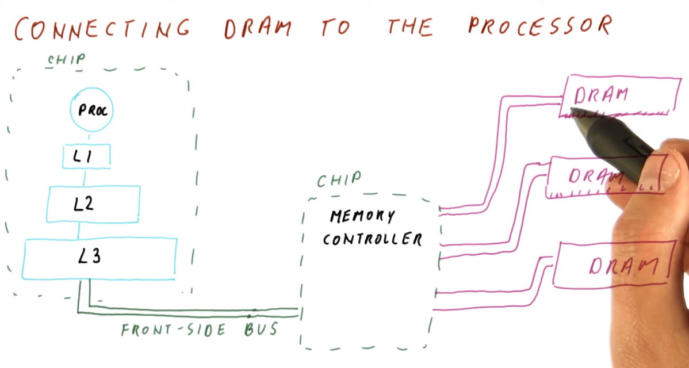
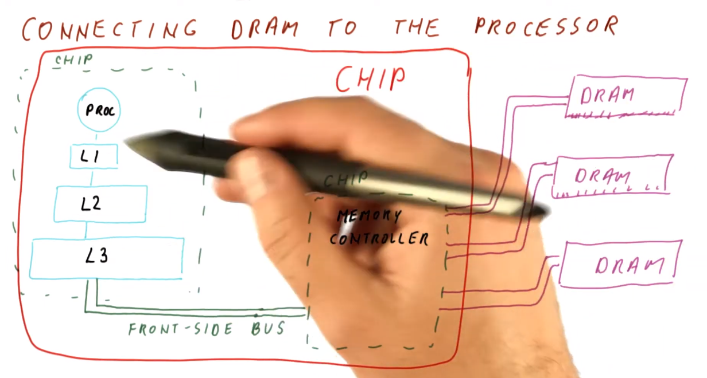

-
- How memory works?
	- {:height 286, :width 772}
- Memory Technology SRAM and DRAM
	- Random access: 对应了另外一个概念，就是sequential access，比如磁带，或者光盘，就必须顺序地读取直到给定的地址
	- {:height 347, :width 803}
- One memory bit SRAM
	- SRAM use two inverters to store the 1 and 0 in it. And since we use inverters to store that, the voltage leaking is not an issue here.
	- And to get the storage quicker, we have two bitlines with opposite values, when reading, we compare the two bitlines to get the value quicker.
	- DRAM on the other hand uses a capacitor to store the electrons, which would leak overtime. So we need to refresh once a while to keep the value the same, this is where the Dynamic in DRAM come from. Another thing is that in DRAM, read is destructive, so we need to write after every read.
	- Also, DRAM use trench cell which is basically one transistor with a capacitor underneath instead of a separate big capacitor.
	- {:height 415, :width 760}
	- DRAM quiz #card
	  card-last-interval:: 4.75
	  card-repeats:: 1
	  card-ease-factor:: 2.36
	  card-next-schedule:: 2025-01-16T23:22:03.366Z
	  card-last-reviewed:: 2025-01-12T05:22:03.367Z
	  card-last-score:: 3
	  {:height 373, :width 899}
		- C
- Memory chip organization
  id:: 66277b26-e445-4d08-92bb-e6143ce176d7
	- Read one bit from the memory:
		- {:height 429, :width 464}
	- Refresh the memory
		- Destructive read
			- Read and then write
		- Refresh
			- refresh row counter
		- {:height 433, :width 467}
	- Write to memory
		- Write is also read and then write
		- {:height 457, :width 474}
- Fast page mode
	- keep what we have in the row buffer, the intuition behind this is that we might have many read/writes between open and close a page
	- {:height 426, :width 784}
	- This can be used to understand this [[PIM]]:
		- 
		- ((662782b8-f201-44d3-a08b-56703d175731))
		- The parallelism is among multiple channels and banks of the memory
		- The locality is explored by fast page mode
- DRAM Access Scheduling Quiz #card
  {:height 455, :width 869}
	- {:height 147, :width 548}
- Connecting DRAM to the processor
	- {:height 383, :width 723}
	- Move memory controller inside CPU to reduce front side bus transfer time
		- {:height 384, :width 703}