- Exceptions in out of order execution -- Major drawback for Tomasulo algorithm
	- For example, if we have a divide by zero, which would trigger exceptions handler, but that might be triggered in a later cycle of the execution. At that time, the registers used for the instruction might get overwritten by later WAR instructions.
	- another case might be for LD instructions where there is a page error.
	- {:height 282, :width 820}
- Branch misprediction -- another drawback for Tomasulo algorithm
	- If a branch mispredict, then the following instructions will get executed in a Tomasulo algorithm and overwrite the value of some registers that might get used in the right branch.
	- 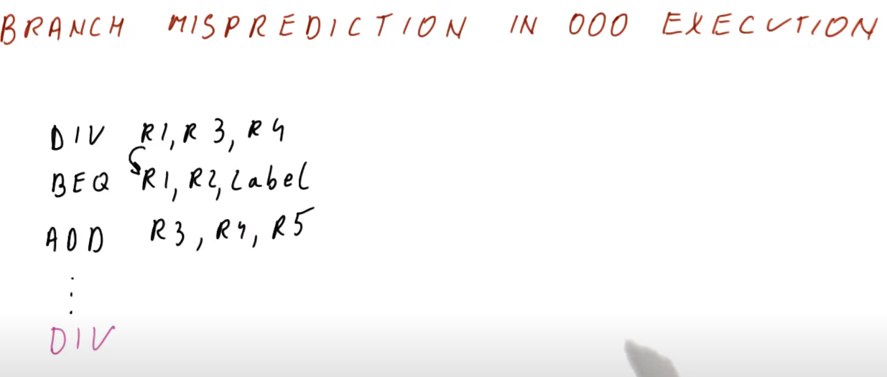{:height 381, :width 835}
- Correct OOO execution -- use of reorder buffer
	- 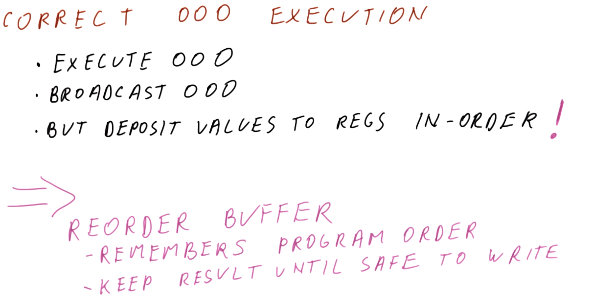{:height 425, :width 833}
- Reorder buffer
	- Main difference is that we add a ROB for storing the registers the physical register points to
	- The process difference is like the pink words:
		- originally we don't get ROB entry which is the first one after issue when issue an instruction
		- originally we don't point RAT to ROB entry, we would point to the reservation stations
		- and after dispatch, we would not free RS since that serves to keep program notified which RAT entry to update the physical register. but now we point RAT to ROB, so we don't need the RS to keep that dispatched instructions
			- {:height 469, :width 843}
		- when broadcast, we broadcast the result back to RS and... which is the same. But we don't update registers and RAT so that the later instructions using the same register are going to use the value in the register. Instead, we just write to ROB and mark the done bit.
		- There is an extra commit phase where we write the next entry in ROB to register. Write to register and update RAT and release ROB entry
			- 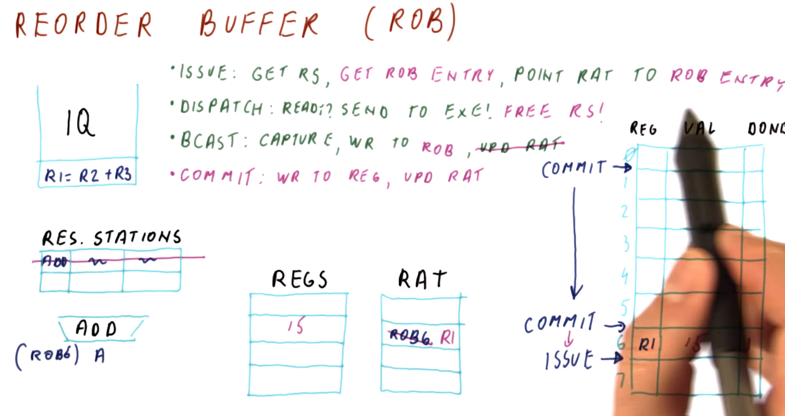{:height 470, :width 843}
			-
- free reservation station quiz #card
  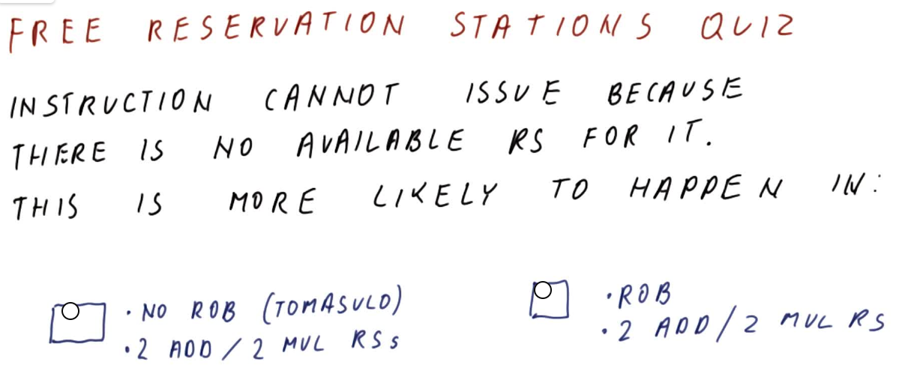{:height 346, :width 841}
	- first one. This is because in Tomasulo algorithm without ROB. We can't free the RS until that target value get broadcasted to the RS, which is after dispatch and exec and broadcast, while with ROB, we can free RS immediately after dispatch, which is way earlier for cases where the instruction took many cycles like DIV or so.
- Hardware Organization with ROB
	- Check the difference of without ROB and with ROB
	- The main difference in hardware is that we added a component for ROB and point RAT to ROB instead of RS
	- {:height 363, :width 537} 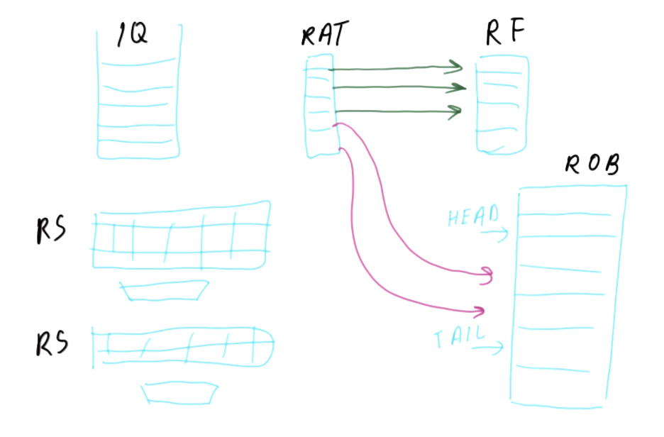{:height 483, :width 523}
- ROB Quiz #card
  {:height 368, :width 650}
	- 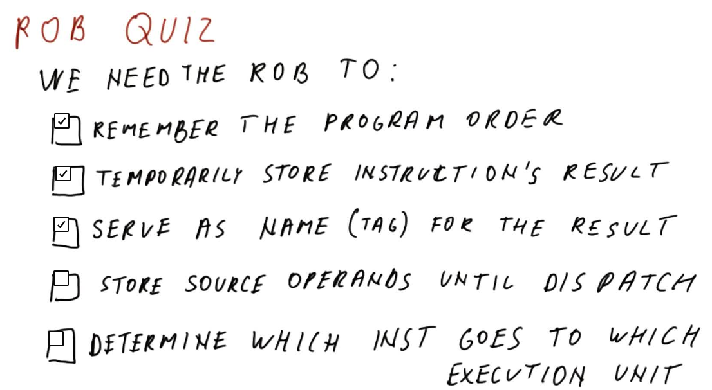{:height 391, :width 692}
	- **The issue and commit are all done in program order, so this is the only hardware component to preserve the program order**
- Branch misprediction recovery
	- 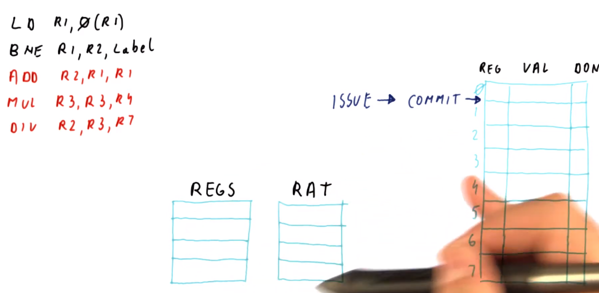{:height 255, :width 493}{:height 513, :width 507}
	- {:height 243, :width 498} 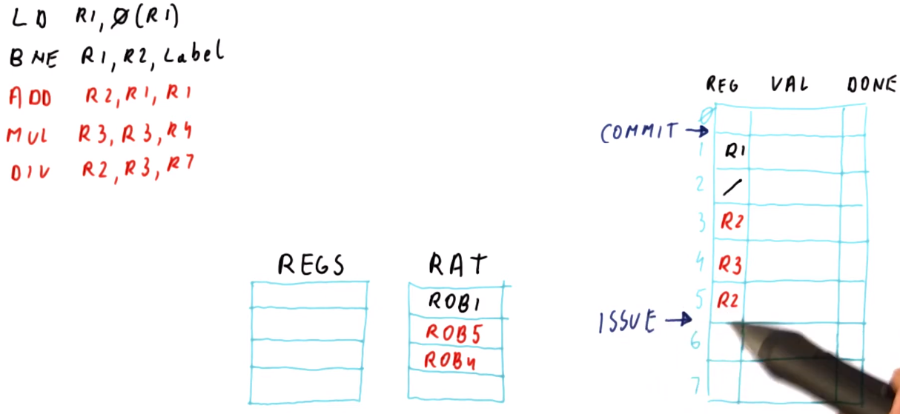{:height 507, :width 508}
	- If the load takes quite some time to finish, (cache miss), the instructions with the dependency (add and div) would not execute. But the Mul will get executed. But notice that if we finish Mul and then Div, the registers remain untouched. The values are still stored in ROB.
		- 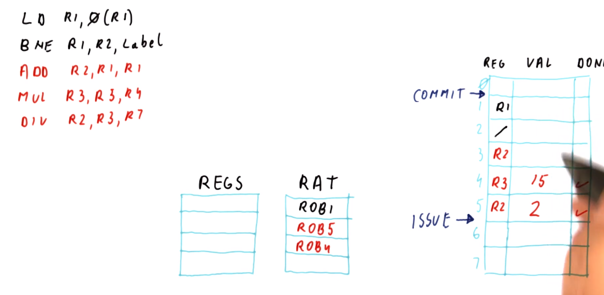{:height 339, :width 685}
	- When we finally load the value for R1, which is 700. We mark the done bit for R1 in ROB and commit that.
		- 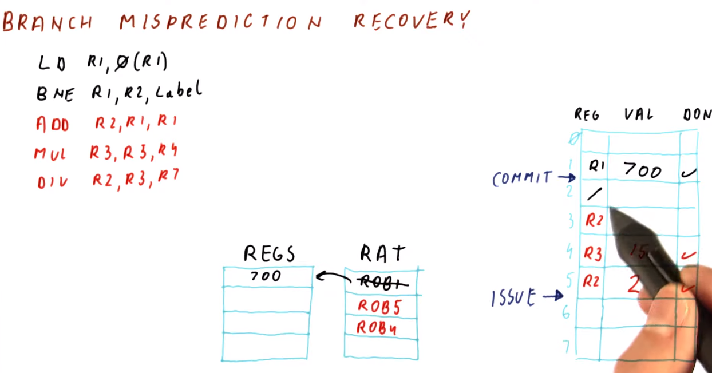{:height 379, :width 689}
	- Make the ROB empty after load the value and find out there is a misprediction.
		- This is done by pointing the issue to the commit and issue instructions from there and empty RAT
		- 
		- 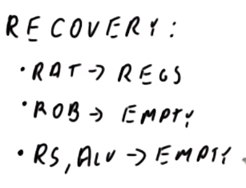{:height 175, :width 220}
- ROB and Exceptions
	- Exception like Page fault or division by zero is going to mark as exception in ROB
	- Treat the exception as as normal result and delay actual handling of the exception until it commits.
- Outside View of Executed
	- The commit view is actually the same as what programmer sees.
	- The branch misprediction or out of order is not visible to outside programmer and from commit view
	- {:height 355, :width 720}
- Exceptions with ROB Quiz #card
  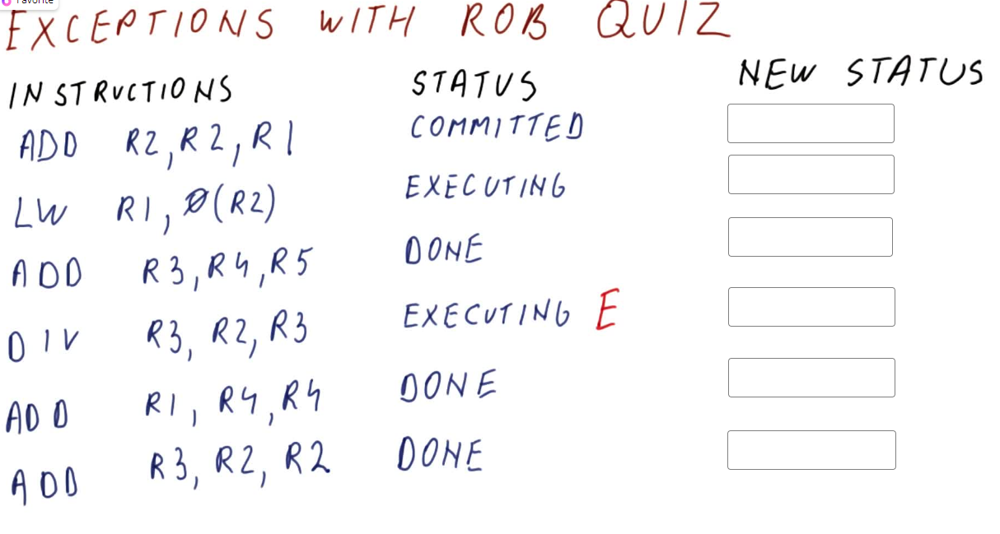{:height 418, :width 751}
	- 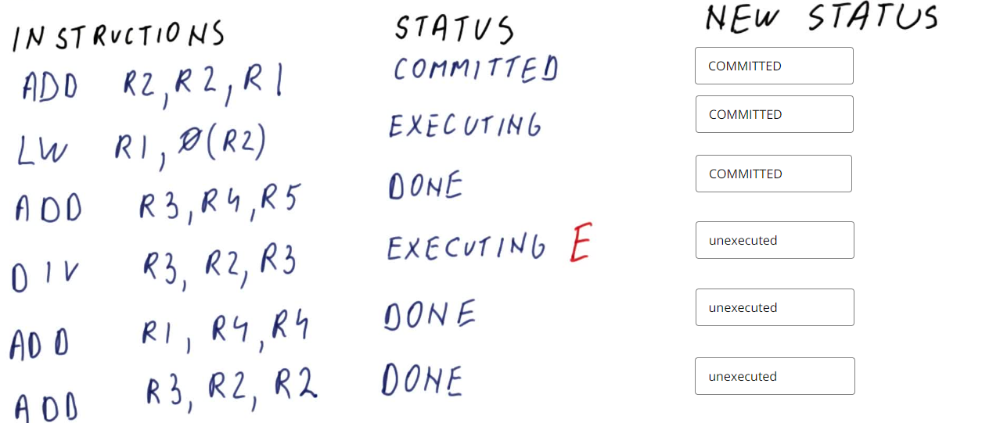{:height 359, :width 801}
- RAT Updates on Commit
	- initial states:
		- 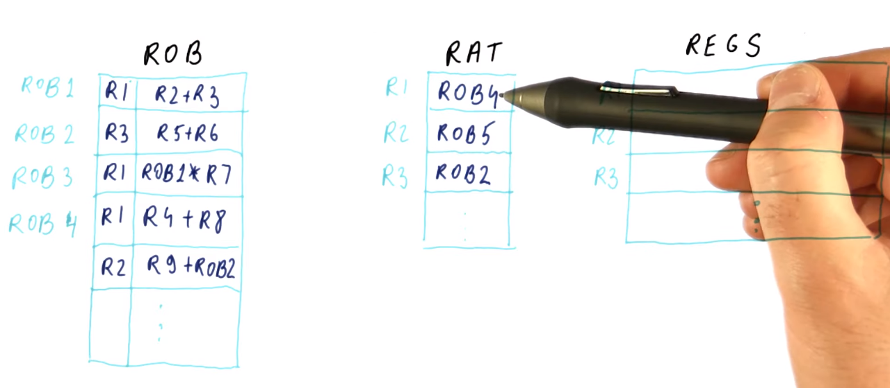{:height 368, :width 779}
	- deposite the value to the registers what ever RAT says
		- Finish calculating of ROB1 and feed the result to registers. But don't update RAT since that is not the last instruction that overwrites R1.
		- {:height 350, :width 780}
	- If is the last value, update RAT to point back to registers
		- 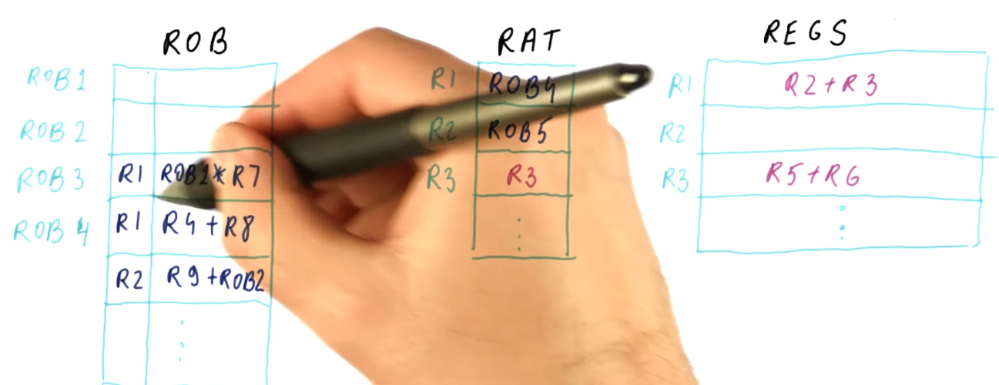{:height 323, :width 792}
	- Next step
		- 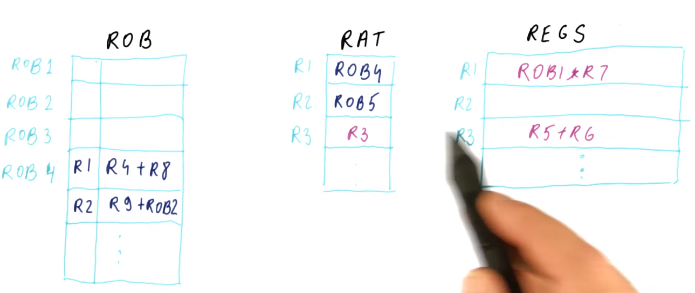{:height 339, :width 787}
	- Notice that R1 gets overwritten twice in the registers. Why are we doing this even though the values gets overwritten.
		- For cases where there are exception, we can remove the instructions in the ROB and empty RAT. But the registers would be up to date since that is updated for every committed ROB instruction.
		- RAT is updated on commit only when that is pointing to the latest value it is going to written
- ROB examples:
	- https://learn.udacity.com/courses/ud007/lessons/6cdba062-da9a-4a2a-8df3-2dc6929a3fb0/concepts/4e654a99-339c-409d-9912-13ad08f4d8a6
- ROB timing example:
	- {:height 451, :width 728}
- ROB time quiz #card
  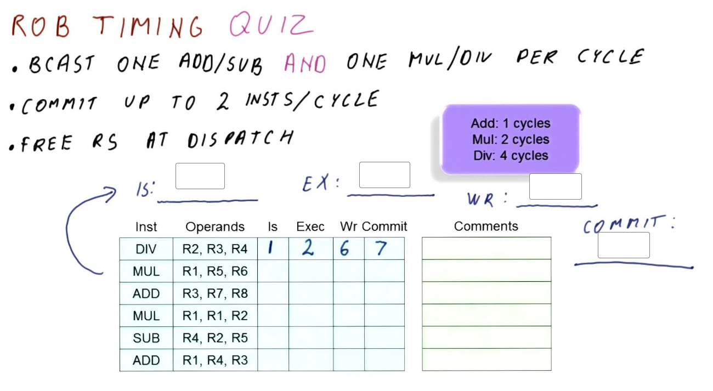{:height 449, :width 819}
	- 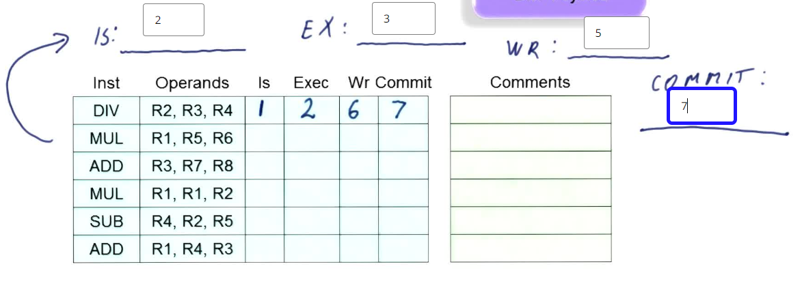{:height 294, :width 790}
- ROB time quiz 2 #card
  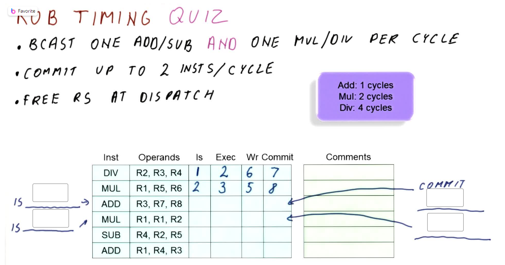{:height 465, :width 826}
	- {:height 254, :width 893}
- ROB time quiz3 #card
  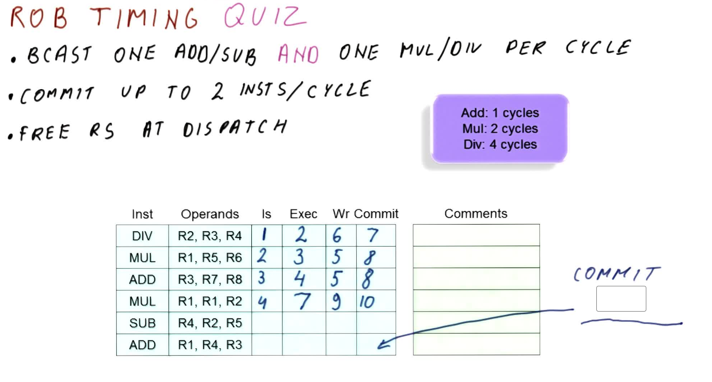{:height 494, :width 925}
	- 11
- Unified reservation station
	- 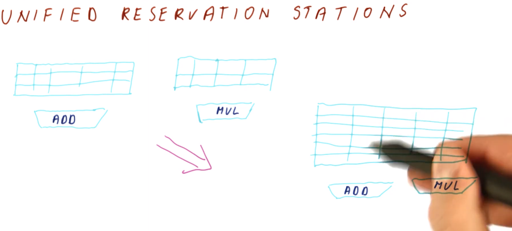{:height 413, :width 890}
- SuperScalar
	- Kind of like a pipe, we need all components to work on more instructions per cycle to get a good overall perf
	- 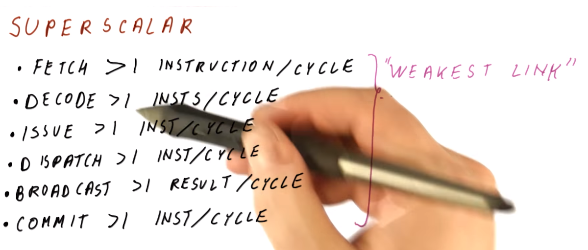{:height 374, :width 903}
- Terminology
	- {:height 364, :width 799}
- What is really Out of order?
	- 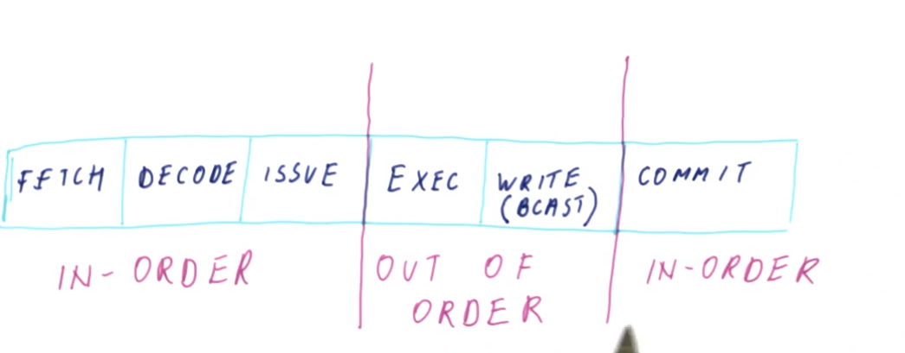{:height 286, :width 744}
- In order vs out of order quiz #card
  {:height 392, :width 596}
	- 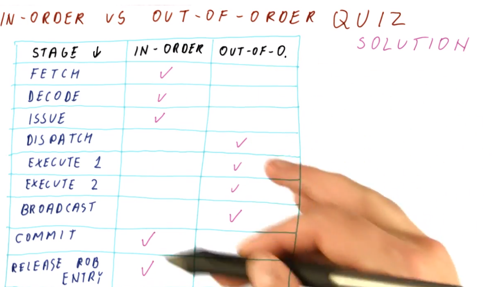{:height 453, :width 752}