- #TLB
- #MMU
- Why virtual memory?
	- Each program have separate memory space from programmer's view and those doesn't have impact on one another
	- {:height 508, :width 882}
	- Virtual memory Quiz #card
	  {:height 428, :width 769}
		- all
- Processor's view of memory
	- {:height 316, :width 772}
- Program's View of Memory
	- 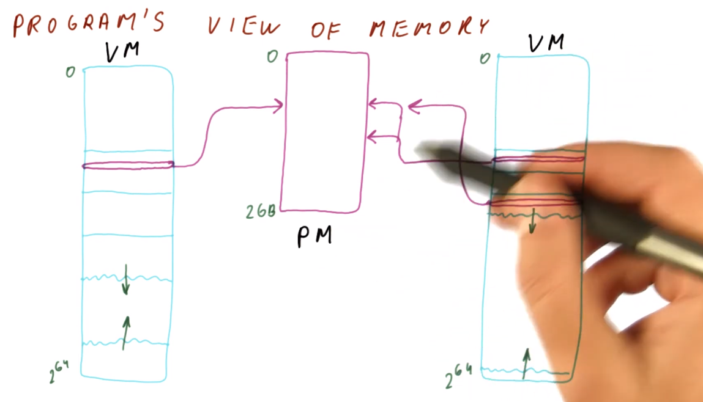{:height 466, :width 755}
- Mapping virtual physical memory
	- {:height 460, :width 758}
	- Page table quiz #card
	  {:height 355, :width 770}
		- answer is $$2^{19}$$ and $$2^{20}$$
- Where is the missing memory?
	- {:height 463, :width 692}
- Virtual to physical translation
	- Similar to cache look up, use the virtual page number which is the first few bits from the virtual address to look up the page table.
	- {:height 453, :width 775}
	- address translation quiz #card
	  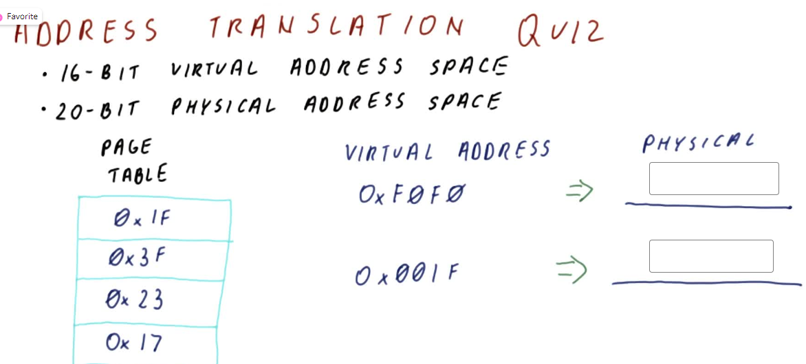{:height 362, :width 796}
		- {:height 216, :width 257}
- Size of Flat Page Table
	- 1 entry per page for every program
	- entry contains frame number + a few bits that tell us if the page is accessible
	- 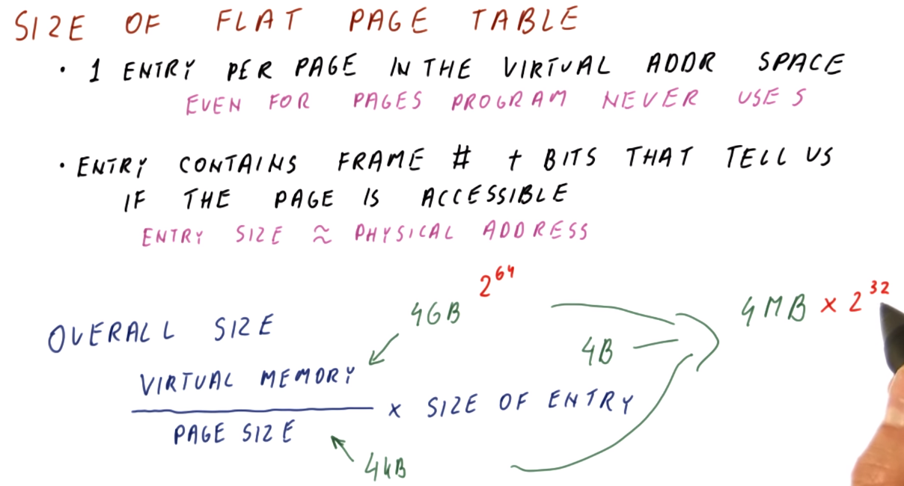{:height 424, :width 766}
	- flat page table quiz #card
	  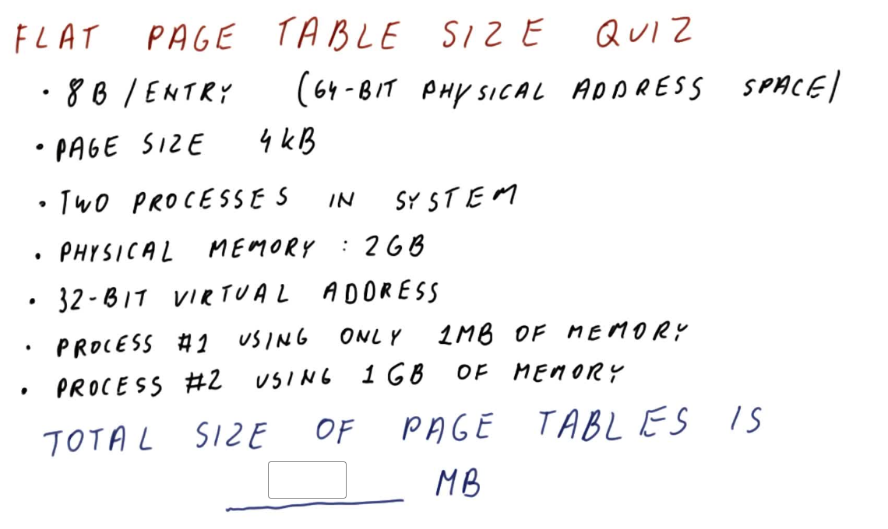{:height 497, :width 769}
		- 16 = number of entries * 8kB = 4GB/4KB * 8kB = 8MB
- Multi level page tables
	- Motivation:
		- {:height 421, :width 780}
	- Structure:
		- Use a two level page table, first few bits of page number used to index into the outer page table. And check the inner page table address. Then use inner page index to locate the page frame in the inner page table.
		- Note that in this structure, the total number of entries is the same as before with added outer page table. So where is the savings?
		- 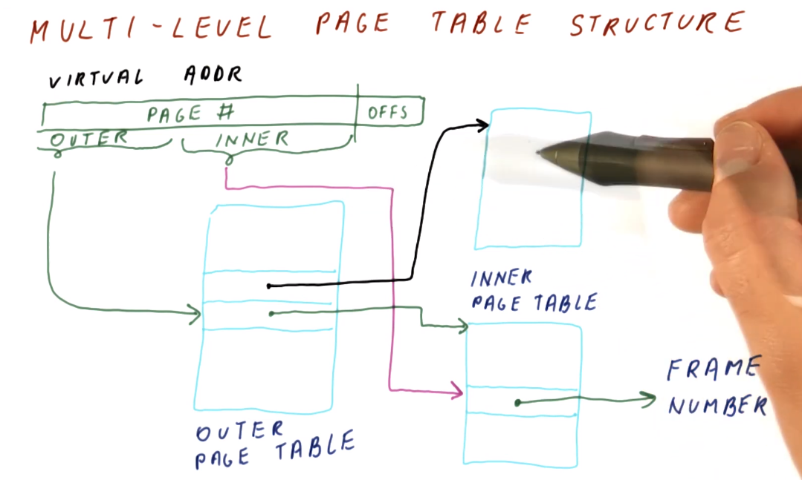{:height 479, :width 777}
	- Example:
		- For inner page tables that doesn't actually consumed by the program, which would be a lot of the cases. We can simply eliminate that from the outer page table and save space. The only thing we need to keep in memory is the outer page table.
		- 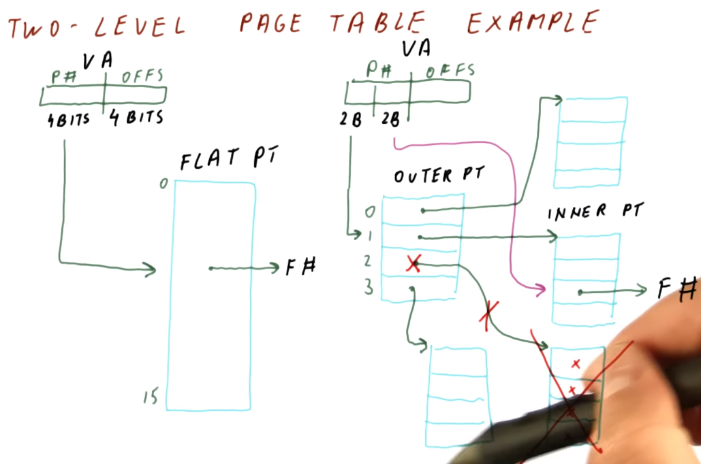{:height 513, :width 760}
	- Two-level page table size
		- 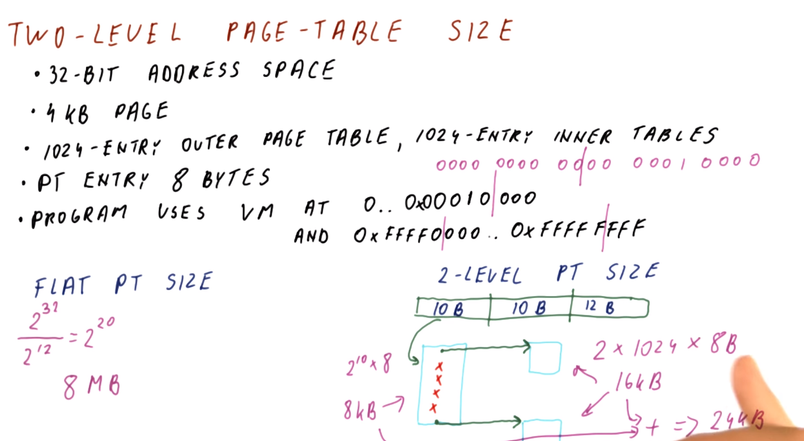{:height 428, :width 770}
	- 4 level PT quiz #card
	  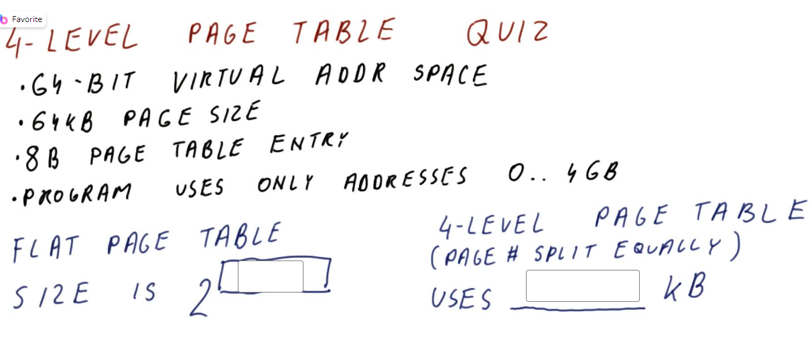
		- 51, 608
- Choosing the page size
	- 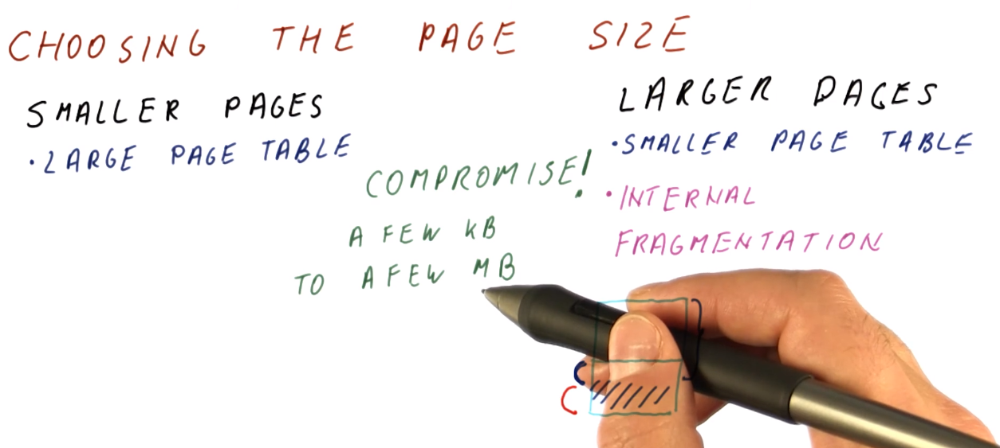{:height 403, :width 905}
- Memory Access Time With V-P Translation
	- For load store instructions, most time consuming phase is the read page table entry and access cache part. Both might involve accessing the memory
	- {:height 453, :width 901}
	- V->P Translation quiz #card
	  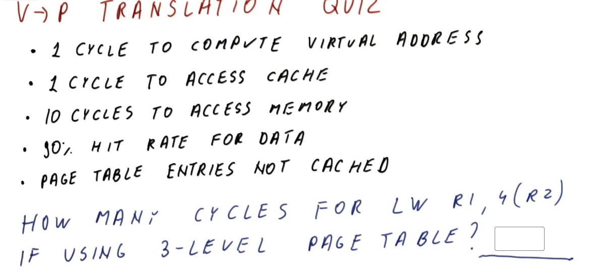{:height 366, :width 788}
		- 33
	- V->P Translation quiz 2 #card
	  {:height 401, :width 790}
		- 9
- TLB (translation look aside buffer)
	- cache for V->P translations
	- {:height 331, :width 754}
	- {:height 139, :width 756}
	- TLB size quiz #card
	  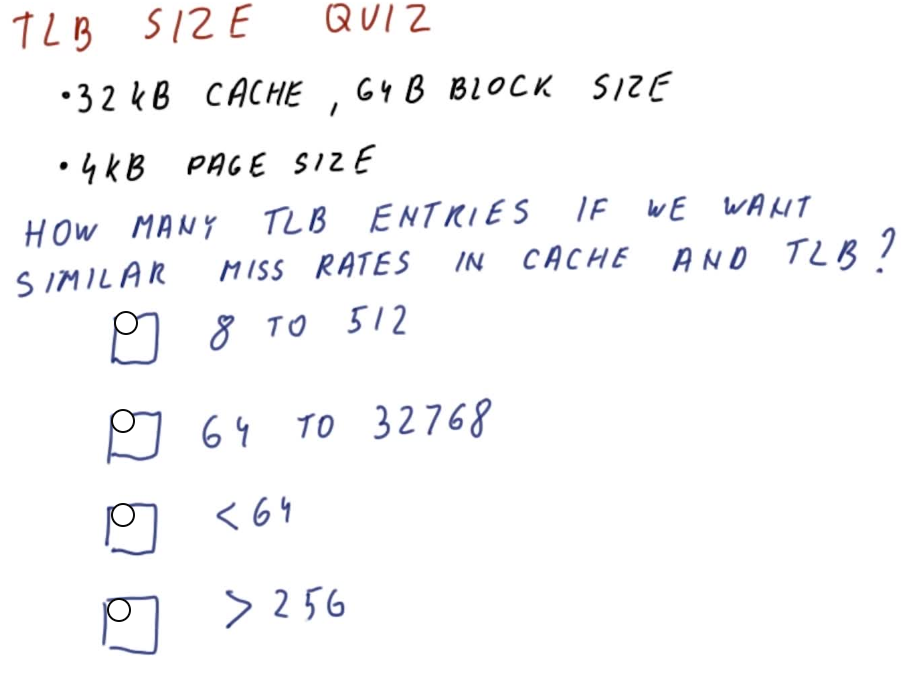{:height 394, :width 521}
		- A
		- The cache size is only 32KB, so if we are lucky, we would have all 32KB cache in 8 pages (8x4KB).
		- But if we are unlucky, we need 512 pages for each entry in the cache (32KB/64B)
		- So the answer is 8 to 512
- TLB organization
	- {:height 274, :width 727}
- TLB performance quiz #card
  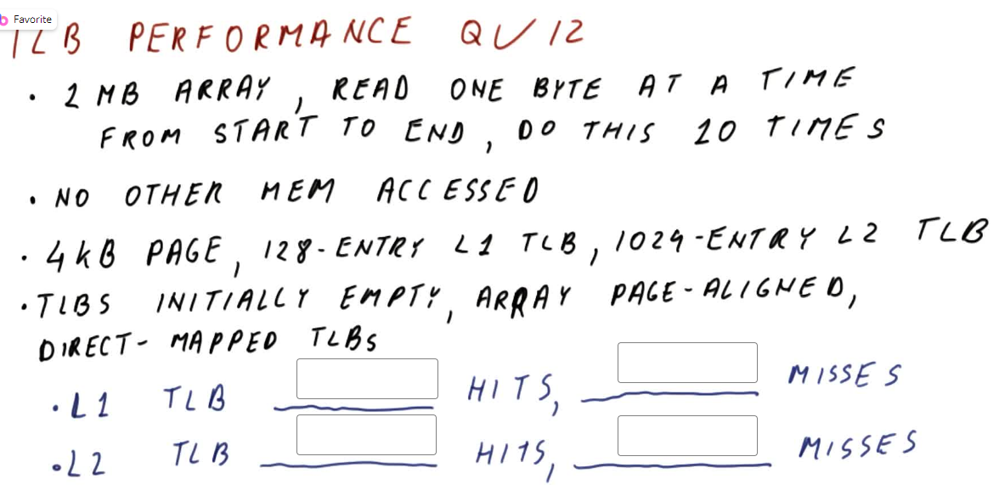{:height 387, :width 774}
	- If we have a TLB miss, we would put that in both L1 and L2 TLB. And if we miss in L1, we will then check L2.
	- For every round of reading the 1MB, we would miss 256 times for L1 (1MB/4KB), and others get hit.
	- After the first round of reading 1MB, all 256 entries are recorded in L2 and all misses from L1 get hit in L2.
	- 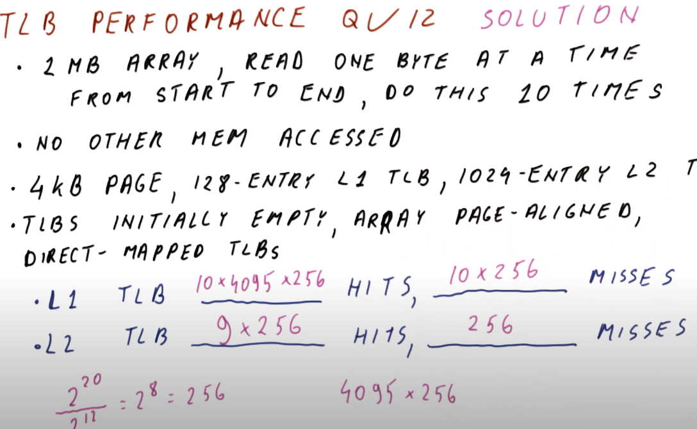{:height 437, :width 667}