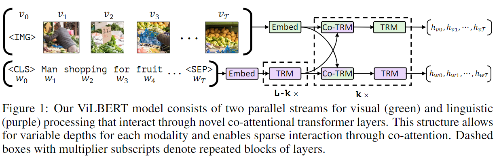
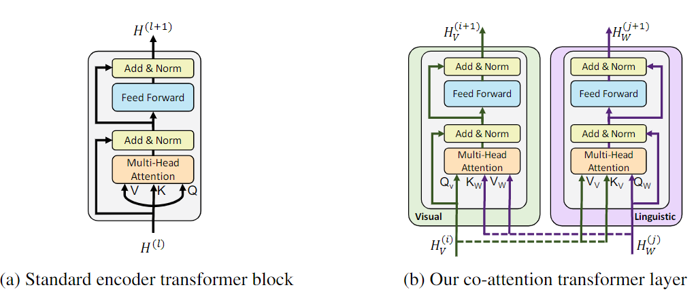
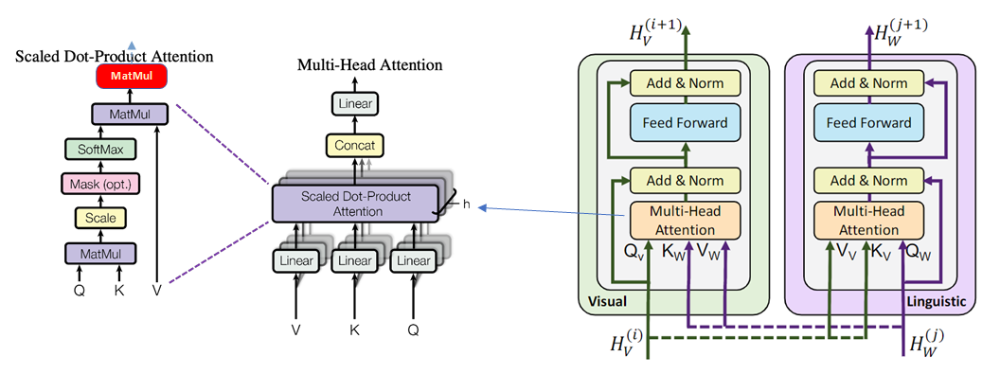

- 
- ## Introduction
	- ### Description:
		- This is aimed for video understanding
		- vibert: a joint model for learning task-agnostic visual grounding from paired Visio linguistic data which we call Vision & Language BERT (ViLBERT for short).
	- ### Key technical innovation:
		- Introducing separate streams for vision and language processing that communicate through co-attentional transformer layers.
	- ### Dataset:
		- Conceptual Captions on two proxy tasks:  predicting the semantics of masked words and image regions given the unmasked inputs, and predicting whether an image and text segment correspond.
	- ### Downstream Tasks:
		- We apply our pretrained model as a base for four established vision-and-language tasks
		- Achieve SOTA on
			- visual question answering
				- VQA
				- 一个VQA系统以一张图片和一个关于这张图片形式自由、开放式的自然语言问题作为输入，以生成一条自然语言答案作为输出。简单来说，VQA就是给定的图片进行问答。
			- visual commonsense reasoning
				- VCR 视觉推理
				- 使用模型发掘出图片中深层的人物关系，并对隐藏着复杂场景关系的问题选择出正确回答。
			- referring expressions
				- visual grounding
				- 输入是图片（image）和对应的物体描述（sentence/caption/description），输出是描述物体的box。
			- caption-based image retrieval
				- 基于图片名的图片检索
- ## Approach:
	- ### Structure
		- {:height 269, :width 830}
		- TRM: Transformer block
		- Co-TRM: co-attentional transformer layers
	- Co-attention transformer vs Standard encoder transformer block
		- {:height 384, :width 879}
			- ((6267e69f-f662-40ff-a0fb-3d1ccf6e31c1))
			- 其实这个结构很简单，就是在做attention的时候，做一些改动；
				- 在上面这个图片流，我的Q矩阵来自图片信息，但是我的K和V矩阵来自文本信息；
				- 在下面这个文本流，我的Q矩阵来自文本信息，但是我的K和V矩阵来自图片信息；
			- 简单说，就是做了一个在文本条件下的图片的attention和在图片条件下的文本的attention, 也就是在文本和图片之间做了一个信息的交互；
			- 这里需要注意的是，在交互之后，各自走自己独立的TRM结构，而并没有拼接在一起走TRM结构；
		- 
- ## Code
	- ```python
	          sequence_output_t, sequence_output_v, pooled_output_t, pooled_output_v, all_attention_mask = self.bert(
	              input_ids, # (1,30)
	              image_feat, # (500, 100, 2048)
	              image_loc, # (500, 100, 5)
	              token_type_ids, # (1,30)
	              attention_mask, # (1,30)
	              image_attention_mask, # (500, 100)
	              output_all_encoded_layers=False,
	              output_all_attention_masks=output_all_attention_masks # False
	          )
	  ```
	- Bert:
		- ```python
		          embedding_output = self.embeddings(input_txt, token_type_ids) # (1, 30, 768)
		          v_embedding_output = self.v_embeddings(input_imgs, image_loc) # (500, 100, 1024)
		  
		  ```
		- ```python
		          encoded_layers_t, encoded_layers_v, all_attention_mask = self.encoder(
		              embedding_output,  # (1, 30, 768)
		              v_embedding_output, # (500, 100, 1024)
		              extended_attention_mask, # (1, 1, 1, 30)
		              extended_image_attention_mask, # (500, 1, 1, 100)
		              extended_co_attention_mask, # (1, 1, 100, 30)
		              output_all_encoded_layers=output_all_encoded_layers, # False
		              output_all_attention_masks=output_all_attention_masks, # False
		          )
		  ```