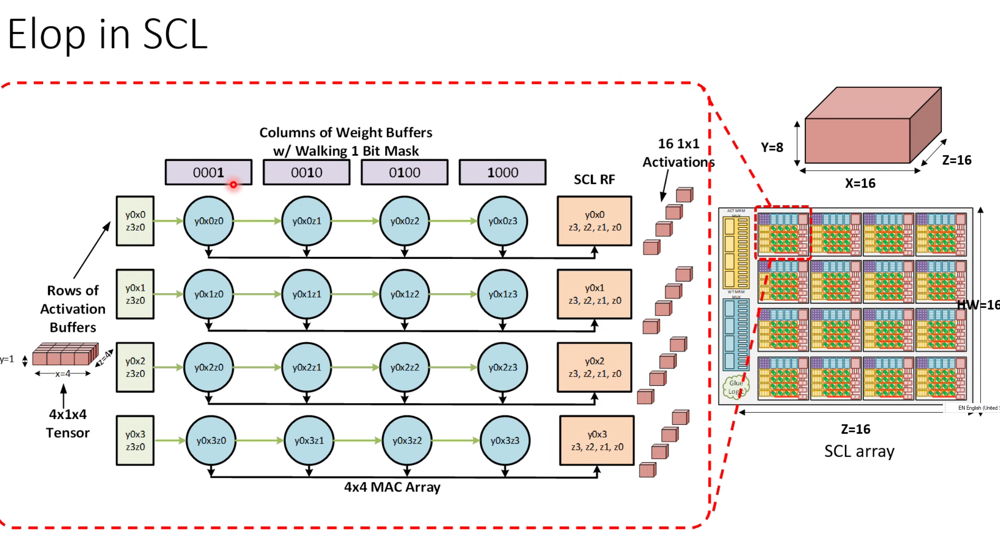
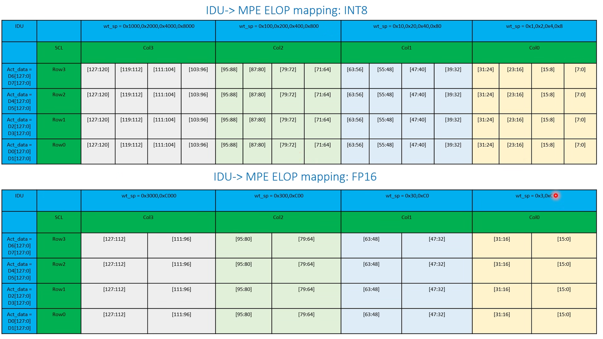
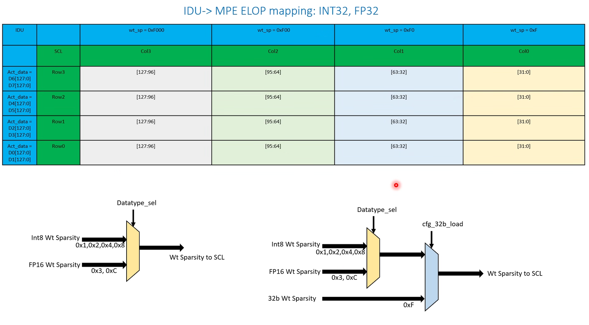
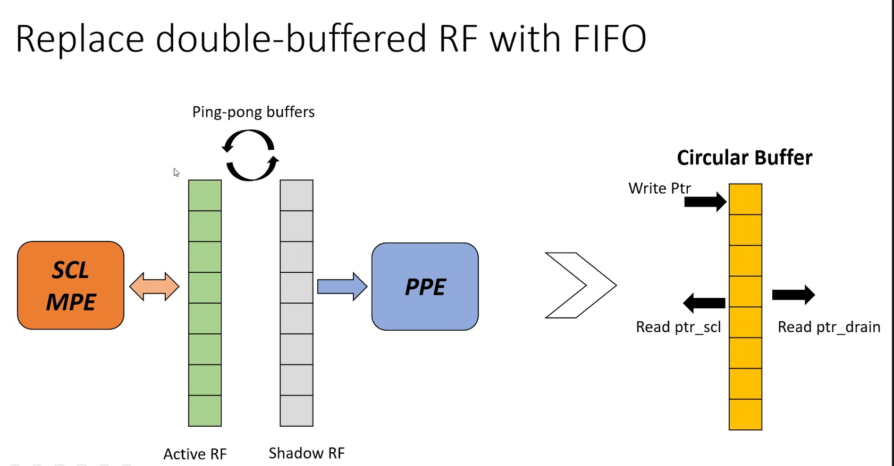

- Pipeline bw DPU/SHAVE
	- workload level barrier
	- Loop inchannel first, write out NTHW contexts to CMX
	- Then use Shave on that data, pipeline with the previous DPU
- Elementwise operations
	- Increase the utilization of element wise ops
	- How we previously do this?
		- 
	- IDU for different dtypes
		- {:height 618, :width 1084}
		- 
	- Replace double-buffered RF with FIFO
		- 
-