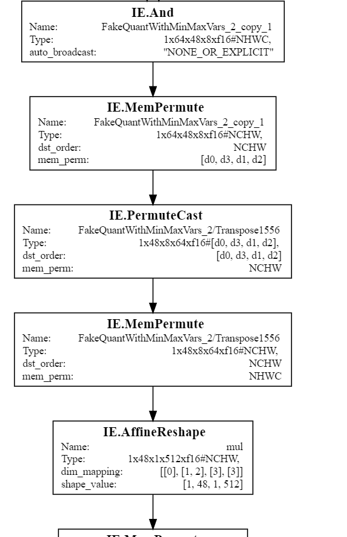

title:: vpuxcompiler: mempermute
- 
	- `MemPermute`的参数解析：
		- `Type`: 输出的dimension的大小，`NxCxHxWxdtype#DataLayout`
		- `dst_order`: 输出对应的layout
		- `mem_perm`: 假设实际输入的layout是`[d0, d1, d2, d3]`，根据`mem_perm`对应的数值进行transpose
	- 每一个`Permute`操作都可以单独看
		- 对于第一个`MemPermute`，输入是上一级的`Type`，也就是`1x64x48x8`
			- 计算实际layout
				- 输入数据是`1x64x48x8` (`NCHW`)，所以在`memory`中，实际的`layout`是`NHWC->(1x48x8x64)`
			- 进行mem_permute
				- 根据`mem_perm`，`[d0, d1, d2, d3]`的`(1x48x8x64)`变成`[d0, d3, d1, d2]`，也就是`(1x64x48x8)`
			- 指定新的layout
				- 根据`dst_order`，指定为`NCHW`
- Construct a `MemPermute` operator
	- ```C++
	      SmallVector<uint32_t> perm(4, 0);
	      perm[0] = 0;
	      perm[1] = 1;
	      perm[2] = 2;
	      perm[3] = 3;
	      auto memPermAttr = mlir::AffineMapAttr::get(mlir::AffineMap::getPermutationMap(perm, origOp->getContext()));
	      auto dstOrder = mlir::AffineMapAttr::get(DimsOrder::NHWC.toAffineMap(origOp.getContext()));
	      auto newMemPermute = rewriter.replaceOpWithNewOp<IE::MemPermuteOp>(origOp, origOp.input(), dstOrder, memPermAttr);
	  ```