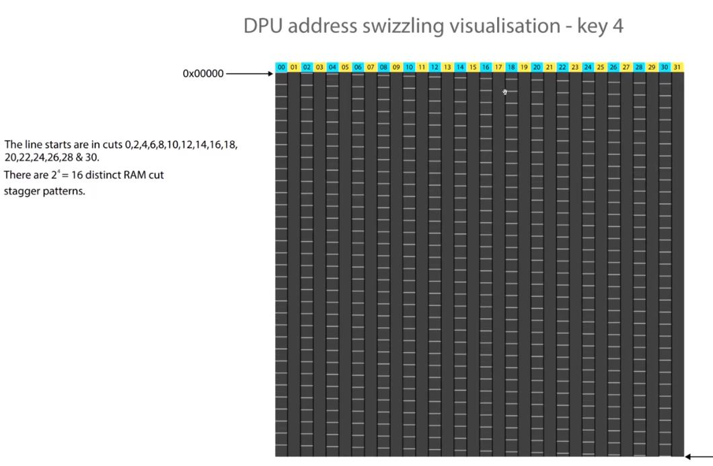

- https://intel.sharepoint.com/sites/VPUIPArchitecture/_layouts/15/stream.aspx?id=%2Fsites%2FVPUIPArchitecture%2FShared%20Documents%2FNCE%20Software%20Architecture%2FNNARCH%20%2D%20TechTalks%20%26%20Trainings%2FTech%20Talk%20%2D%20Swizzling%2Emp4&referrer=StreamWebApp%2EWeb&referrerScenario=AddressBarCopied%2Eview
- Cases in MTL and LNL where activations can and can't swizzle
	- 
- https://docs.intel.com/documents/MovidiusExternal/vpu27/MTL/SW/VPU27SAS.html#weight-and-activation-swizzling
	- There are 5 swizzling patterns that determines how much striping is done. Higher swizzling value has been shown to deliver higher performance but has the downside that it has a larger alignment /padding size for each allocation.
		- key 1: 1kB alignment, 16 RC stagger (256B)
		- key 2: 2kB alignment, 8 RC stagger (128B)
		- key 3: 4kB alignment, 4 RC stagger (64B)
		- key 4: 8kB alignment, 2 RC stagger (32B)
		- key 5: 16kB alignment, 1 RC stagger (16B)
- There are also 12 DMA ports connected to this CMX. 12 ports connected to each port.
	- {:height 462, :width 860}
		- Read BW: 8 * 16B = 128 B/c (4 weight reader and 4 activation reader)
		- Write BW: 4 * 16B = 64 B/c
	- We can read/write a RC once per hardware clock. And one transaction is 128 bits (16B) width.
	- 2M CMX is partitioned into 32 RMA cuts. Each with 64KB of data.
		- 
- CMX address ranges:
	- {:height 400, :width 858}
-
- The animation of the visiting for CMX of addresses in sequential:
	- 
- Each ram cut store 4K unique address as shown in the bottom right of the following figure.
	- So essentially, multiple addresses are mapped to the same ram cut.
	- If the addresses in the ram cut are continuous, we are bound to face bank conflict issue since the consecutive addresses are in the same bank.
	- Common practice is to interleave memory in different ranks as in:
		- {{embed ((6627a08d-7711-4c37-b124-d43f3c8f46aa))}}
	- Similarly, in CMX, we have
		- \|                               |          RRow              |  n-cut    | RCol|
		- 0010, 1110, 000|==0, 0000, 0000, 000==|==0, 0000==|==0000==
		- {:height 656, :width 1141}
	- To get the maximum bandwidth, we want different ports accessing different ram cuts.
		- 
	- And try avoiding visiting the same ram cut for all ports:
		- 
		  id:: 6627af4a-61c2-469d-b463-65539914dcd2
- How DPU access CMX:
	- one port dedicated for each act reader, same for weight
		- 
	- Problem with reading activation directly.
		- Different activation readers might be reading data from the same ram cut. First 4 lines belong to first line of activation (16x128/32/16). So the problem is that four activation readers are reading from the same ram cut.
		- 
	- Stagger the data to make the activation reader read from different ram cuts.
		- 
	- Swizzling address transformation:
		- 
		- Up to five keys because the number of ram-cuts are 32, which is 2 to the 5. If we have more than 5, that doesn't make much sense since 5 is enough to cover the 32 ram cuts.
		- Adding one bit to the ram cut meaning we are swizzling the ram cut number for different ports. If different activation readers are reading from same ram cut, meaning 4-8 bits are same. They are reading from different rows, so we can make them read different ram cuts by adding some transformation of the row information to the ram cut number.
		- 
		- 
	- Swizzling key 1:
		- 
	- Swizzling key 2:
		- 
	- Swizzling key 3:
		- 
	- Swizzling key 4:
		- 
	- Swizzling key 5:
		- 
-