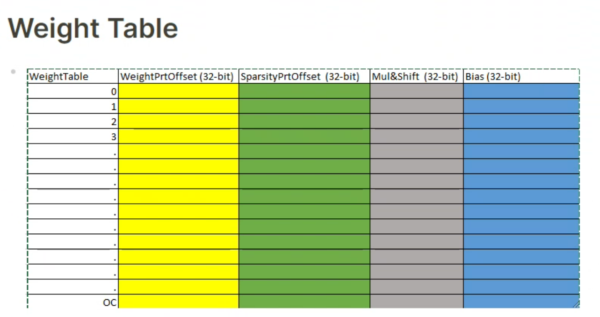
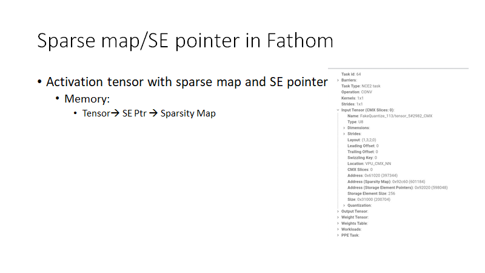

- {:height 472, :width 857}
- DONE Add weight table support in Nbperf
  :LOGBOOK:
  CLOCK: [2022-10-19 Wed 14:33:50]--[2023-02-02 Thu 20:04:32] =>  2549:30:42
  :END:
- Weight table
	- Add Weight Table in Task manager as a separate tensor
	- Size: INT32 * Output Channel Size
	- Shape: Allocate as a 1D tensor
- Fathom weight table & weight descriptor
  :LOGBOOK:
  CLOCK: [2022-10-19 Wed 16:11:05]--[2022-10-20 Thu 14:41:12] =>  22:30:07
  :END:
	- 
- Fathom tensor:
	- ```python
	  @property
	      def cluster_size(self):
	          if not self.broadcast and len(self.subtensors) > 0:
	              return max([t.size for t in self.subtensors])
	          else:
	              return self.size
	  ```
- Broadcast in Fathom
	- for activations
		- ```
		  self.wl_list = wl_list
		  self.subtensors = [__gen_tile(wl, idx, allow_dense_se_pointers=allow_dense_se_pointers)
		          for idx, wl in enumerate(wl_list)]
		  self.broadcast = True if (not (split_over_h or split_over_kh)) or multicast else False
		  ```
	- for weights:
		- ```
		  self.broadcast = True if split_over_h else False
		  ```
- VPUX weight table:
	- ```c++
	  std::vector<int32_t> vpux::VPU::NCESparsity::getWeightsTable(mlir::Type inElemType, mlir::Type outElemType,
	                                                               Optional<int32_t> weightPtr, int32_t weightPtrStep,
	                                                               Optional<int32_t> sparsityPtr, VPU::ArchKind arch,
	                                                               int64_t OC, mlir::Type weightsElemType,
	                                                               Const::ContentAttr bias, VPU::PPETaskAttr ppe) {
	      VPUX_THROW_WHEN(inElemType == nullptr || outElemType == nullptr,
	                      "Can't create weights table without operation input/output types");
	  
	      auto getMultShift = getMultShiftFunc(inElemType, outElemType, weightsElemType, ppe, arch, checked_cast<size_t>(OC));
	      auto getBiasFP = getBiasFunc(inElemType, outElemType, weightsElemType, bias, arch, checked_cast<size_t>(OC));
	  
	      auto weightPtrOffset = weightPtr.hasValue() ? weightPtr.getValue() : 0;
	      std::vector<std::int32_t> weightsTableVals(OC * VPU::NCEInvariant::WEIGHT_TABLE_NUM_ELEMENTS_PER_OC, 0);
	  
	      // In case of dense operation use sparsityPtrOffset beyond CMX memory range to satisfy HW requirements
	      auto sparsityPtrOffset = sparsityPtr.hasValue() ? sparsityPtr.getValue() : SPARSITY_PTR_WHEN_NO_SPARSITY;
	  
	      const auto weightsElementTypeBitSize =
	              weightsElemType ? static_cast<Bit>(getElemTypeSize(weightsElemType)).count() : 0;
	  
	      for (auto oc : irange(checked_cast<size_t>(OC))) {
	          const auto wtInd = oc * static_cast<size_t>(VPU::NCEInvariant::WEIGHT_TABLE_NUM_ELEMENTS_PER_OC);
	  
	          if (weightsElemType) {
	              const auto alignment = (ALIGNMENT_REQUIREMENT_IN_ELEMENTS * weightsElementTypeBitSize) / CHAR_BIT;
	              VPUX_THROW_UNLESS(weightPtrOffset % alignment == 0,
	                                "weightsPtrOffset must be multiple of {0}, got {1} on oc {2}", alignment, weightPtr, oc);
	          }
	  
	          weightsTableVals[wtInd + 0] = weightPtrOffset;
	          weightsTableVals[wtInd + 1] = sparsityPtrOffset;
	          weightsTableVals[wtInd + 2] = getMultShift(oc);
	          weightsTableVals[wtInd + 3] = getBiasFP(oc);
	  
	          weightPtrOffset += weightPtrStep;
	      }
	  
	      return weightsTableVals;
	  }
	  ```