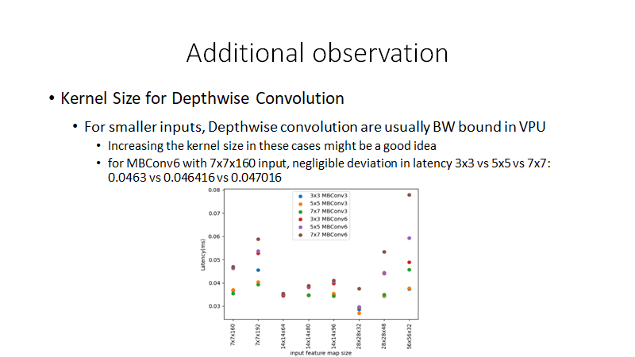
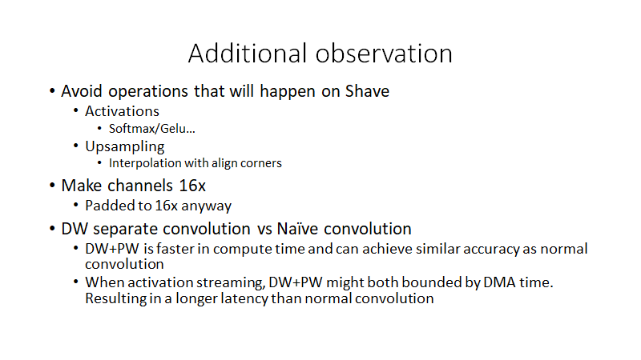

- Topic:
	- ==how to optimize your model for VPU - model architecture==
- Position:
	- src/VPU/vpu27/whitePapers/VPU2.7Performance.md
	- https://github.com/intel-restricted/frameworks.documentation.promark.vpu.ip.mvds-ip-vpu/blob/develop/src/VPU/vpu27/whitePapers/VPU2.7Performance.md
- Contexts:
  collapsed:: true
	- as we are starting to engage with customers/partners, there are a few white papers that I think we need:
	- ==how to optimize your model for VPU - model architecture== (Roy,Shivaji,Ambati,Murali,Li,VictorY,Xiaofan,Xu,Puglia,Lucaand team)
	- how to optimize your model for the VPU - training and post training tools (Puglia,Luca,Xiaofan,Xu,Dorrepaal,Ronan)
	- tools to debug performance (Jain,KarishmaR)
	- I would suggest that we start these documents as HLD documents in promark and they would all be targeted for MTL to start with. Let me know if this makes sense and if we can get started with these. I know item number 2 has already made a lot of progress but would just need to be moved to promark.
- Related links:
	- Visualizer
		- [http://rtools.ir.intel.com/visualizer/](http://rtools.ir.intel.com/visualizer/)
	- Profiling
		- [KMB profiling 101.pptx](https://intel-my.sharepoint.com/:p:/r/personal/xu_qian_intel_com/Documents/Desktop/KMB%20profiling%20101.pptx?d=w60096e7148c647ea9c1fd1818054e3e6&csf=1&web=1&e=Usrgxw)
	- operator mapping
		- https://docs.intel.com/documents/MovidiusInternal/vpu27/common/SW/HLD/internal/02_04_NN_LayerMappingHLD.html#operatorlayer-mapping
- 
- 
- Draft:
- ## How to Optimize Model for VPU - Model Architecture
- ### Use VPU friendly operators
	- #### Activation function happen on PPE
		- Leaky ReLU with per-layer slope
		- ReLU
		- ReLUX
	- #### Upsampling
		- ....
		-
	- add operator mapping information
	- case study
- ### Small channel size lead to low compute utilization
	- ** For compute bound layers
	- pad to 16x for channel
	- pad to 4x for H and W
	- case study: fsrcnn
- ### Optimize Convolution layers for VPU
	- #### DW separate convolution vs Naïve convolution
	- #### Kernel size for DW convolution
		-
- ### Profiling tool for performance analysis
	- OpenVINO benchmark app for per-layer performance
-