- [WorkLoad Management overview and update](https://intel.sharepoint.com/sites/VPUIPArchitecture/_layouts/15/stream.aspx?id=%2Fsites%2FVPUIPArchitecture%2FShared%20Documents%2FVPU%20Client%20AI%20Arch%20Presentation%2FFirmware%2FWorkLoad%20Management%20overview%20and%20update%2FWorkLoad%20Management%20overview%20and%20update%2Emp4&referrer=StreamWebApp%2EWeb&referrerScenario=AddressBarCopied%2Eview)
	- [slides](https://intel.sharepoint.com/:p:/r/sites/VPUIPArchitecture/Shared%20Documents/VPU%20Client%20AI%20Arch%20Presentation/Firmware/WorkLoad%20Management%20overview%20and%20update/workload_management_48.2023.pptx?d=w0505990c89fe45d3b190866e65286b13&csf=1&web=1&e=WHkQVZ)
	- 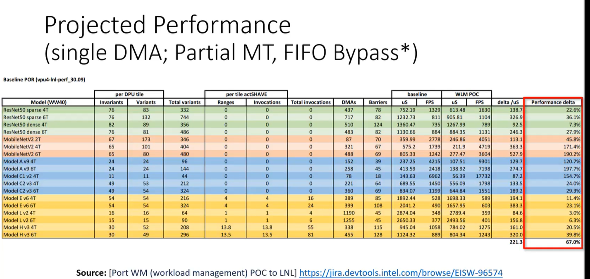{:height 546, :width 1136}
	- management tasks are just DMA tasks that is historically generated by NNRT FW dynamically.
		- 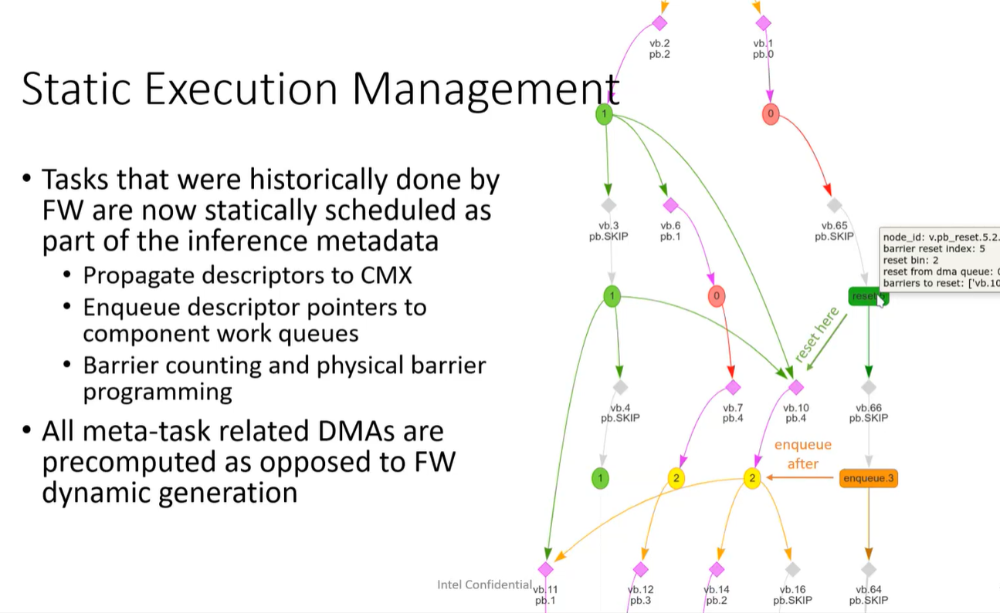
	- management tasks are aimed to do three things:
		- enqueue work item ptr to appropriate FIFO
		- program barrier
		- move wl metadata to CMX
		- 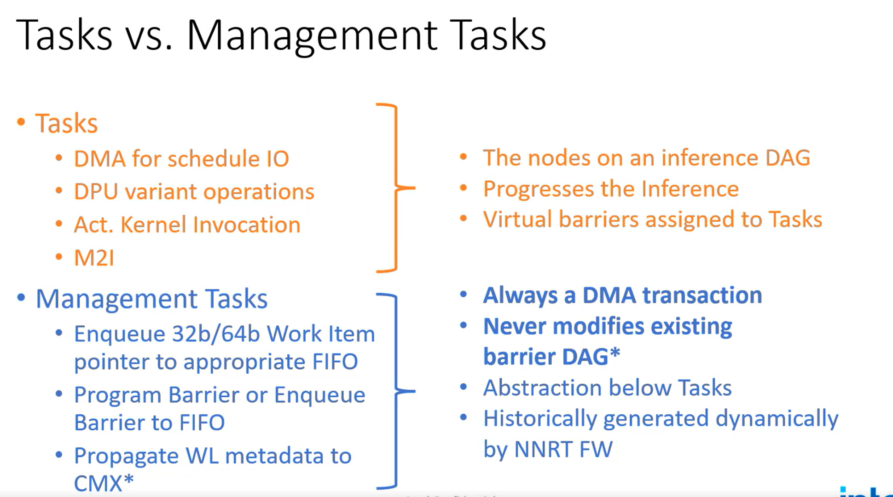{:height 556, :width 982}
	- What is in the [[firmware]] today?
		- 这个方案搬运meta data的DMA是从FW生成的。
		- {{embed ((664df44c-c864-4e05-b364-1e6cf309ffbb))}}
		- 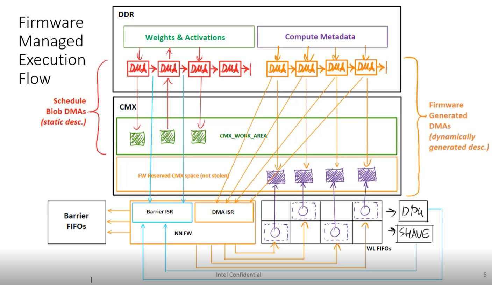{:height 579, :width 984}
		- ISR: interrupt service routine
	- What is the [[firmware]] tommorrow?
		- 区别在于这个方案所有的搬运meta data的DMA都是从compiler生成的，所以能看到这个方案不需要DMA ISR。因为所有的DMA其实都是compute，会触发barrier ISR。
		- 当FW监测到对应的meta data已经在CMX上， 也就是对应的DMA已经完成，那么FW就会enqueue对应的workload pointer到对应的FIFO。并且还要reset barrier。
		- 因为workload pointer的enqueue和reset barrier都是在FW完成，所以这个过程是safe的。
		- 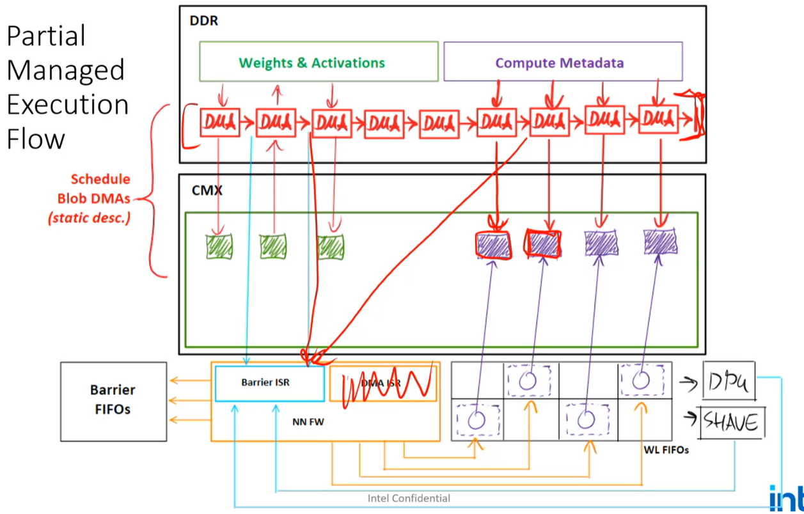{:height 639, :width 982}
	- schedule managed execution flow
		- Full workload management
		- Compiler generate all DMAs
			- Some DMAs writing directly into the workload fifo
			- Some DMAs will directly write into the barrier fifo
		- 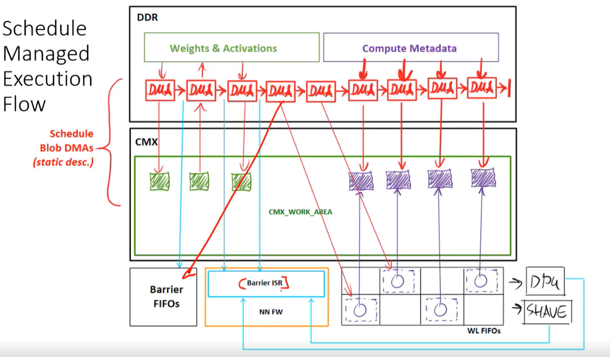{:height 588, :width 980}
	- Partial vs Full management
		- 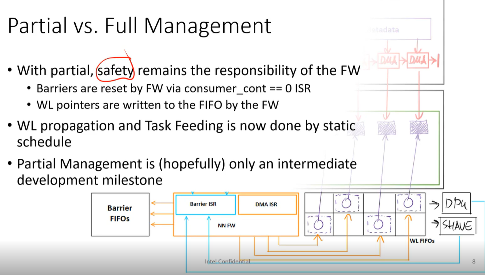
	- What makes it hard?
		- need DMA to program barriers, that is kind of what makes it hard
		- 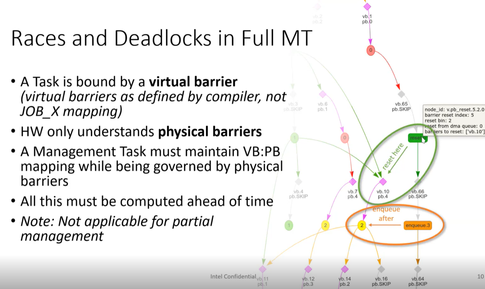
	- Safety
		- Task WL dequeued before barrier reset completes
			- 这个比较容易解决，只要保证barrier reset的DMA发生在WL dequeue的DMA之前
		- Ambiguous producer source
			- 一个reused barrier如果在两个地方被用到，可能会导致其中一个lift的时候，另外一个barrier的consumer也被enqueue
			- 举了一个llm的例子，说有一些开始的节点到网络的中后期还有consumer。但是这个不应该作为edge存在在DAG上吧，因为中间有很多节点，应该能够隐式的表示这种依赖关系。
		- Ambiguous consumer
			- 不同的engine用到了同样的p.barrier，没懂问题在哪里？
			- 可能出现的问题就是会同时lift
		- 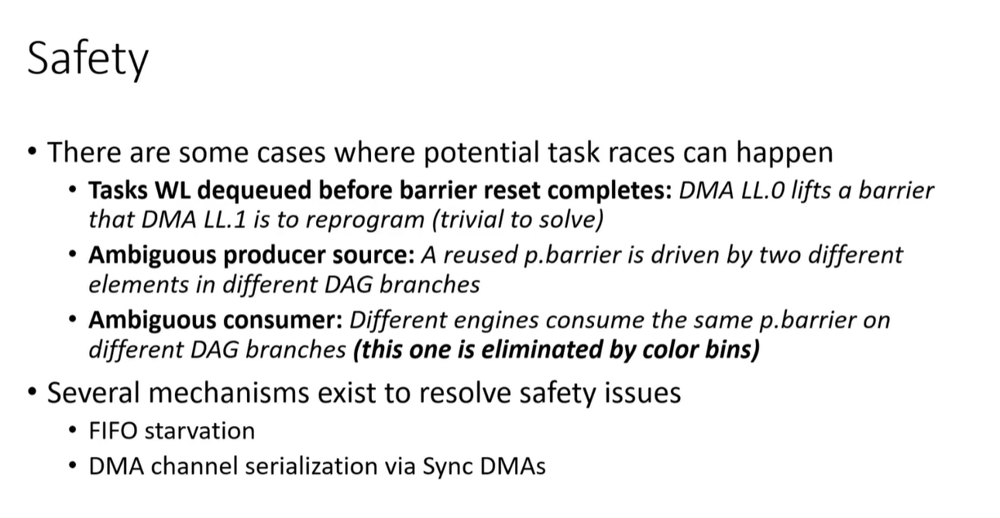
	- Safety verification
		- 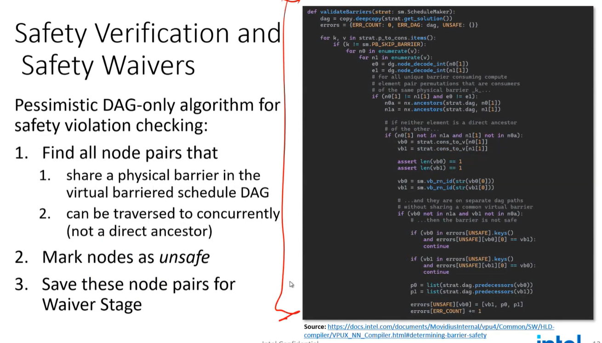{:height 595, :width 1032}
		- 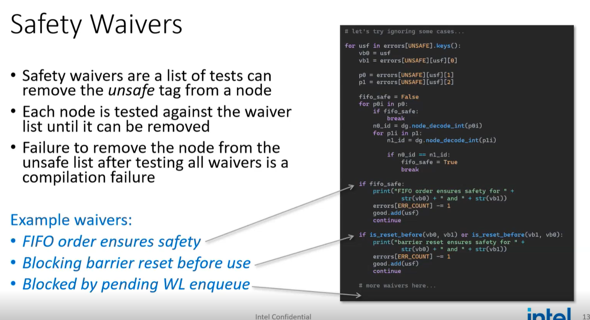
	- WLM formal proof
		- multiple graphs mutates one another
		- 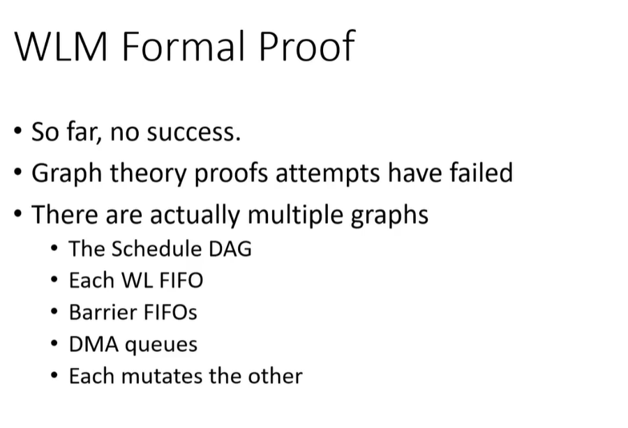{:height 429, :width 628}
	- Implementation
		- A good way is to write the barrier fifo in batch so that we have less smaller DMA transactions
		- Constraint:
			- 如下图左侧，Every computing element is only consuming a single barrier
			- management task的插入是在compiler的最后阶段完成的，基本上就是一堆WT的DMA task在网络的开头，并且这些DMA不produce，也不consume barrier，因为都是DMA task，所以直接enqueue DMA task就行了
			- tail barrier
				- track if the inference is complete，这个是因为FW只能看到barrier events，所以需要一个barrier告诉FW已经结束了。
		- 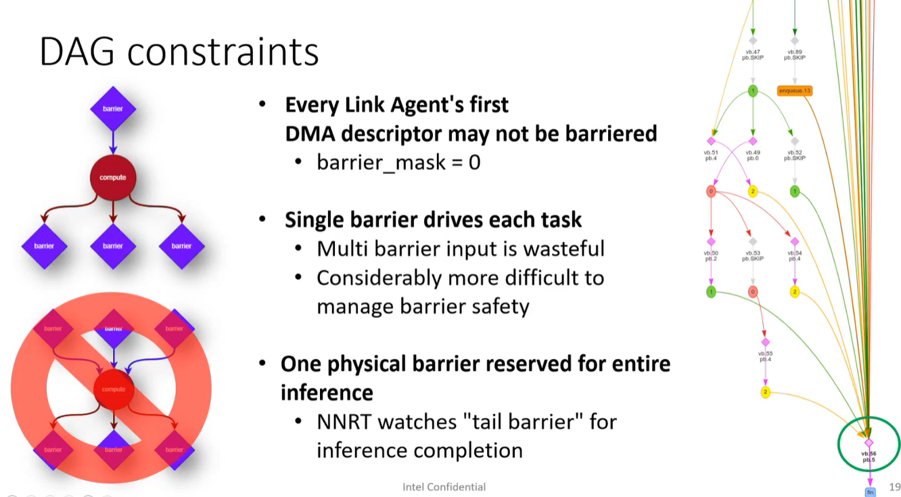{:height 618, :width 1107}
	- Algorithms
		- 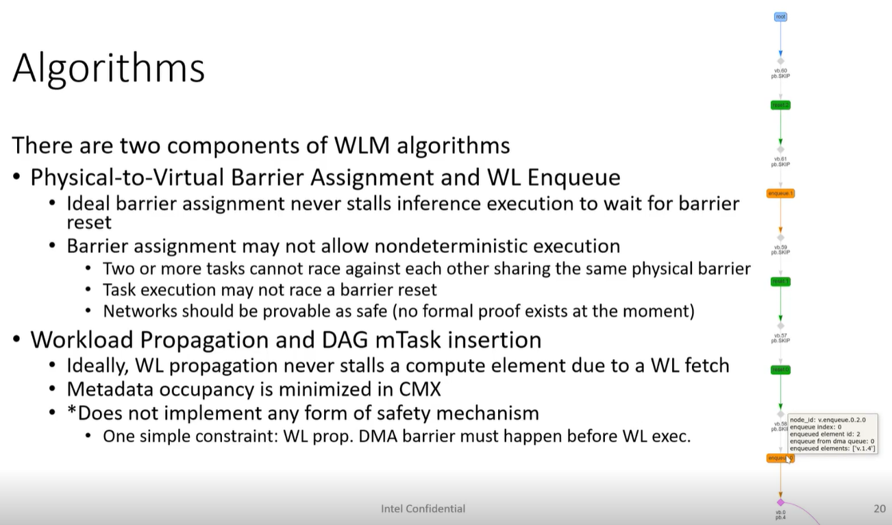
	- WL FIFO starvation is Synchronization
		- Each workload FIFO gets its own barrier
		- 这个地方对于nbperf的design不存在问题，因为shave的执行一定有顺序。。。
		- 这个解决方案是插入一个enqueue DPU，这个是某种stall wl fifo的方式（不需要插入barrier的方式）
		- 
	- workload propagation  and mtask insertion
		- 前面的那一串是workload management tasks
		- 紫色的是physical barrier，灰色是virtual barrier
		- 只能插在DMA task之后吗？
		- 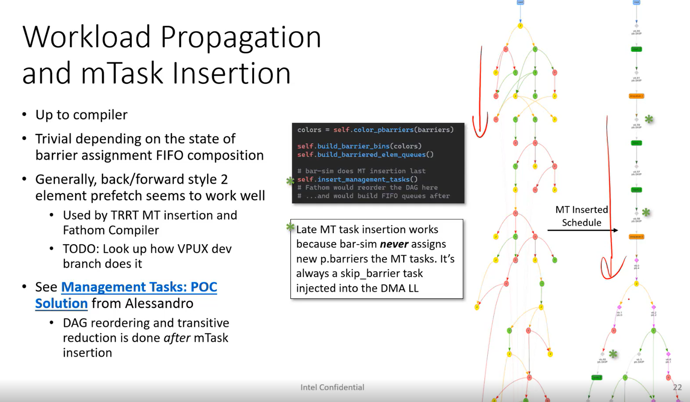{:height 654, :width 1107}
	- Color binning
		- every workload fifo allowed to use own barriers
		- 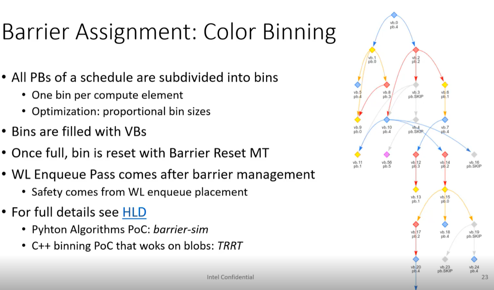
		- 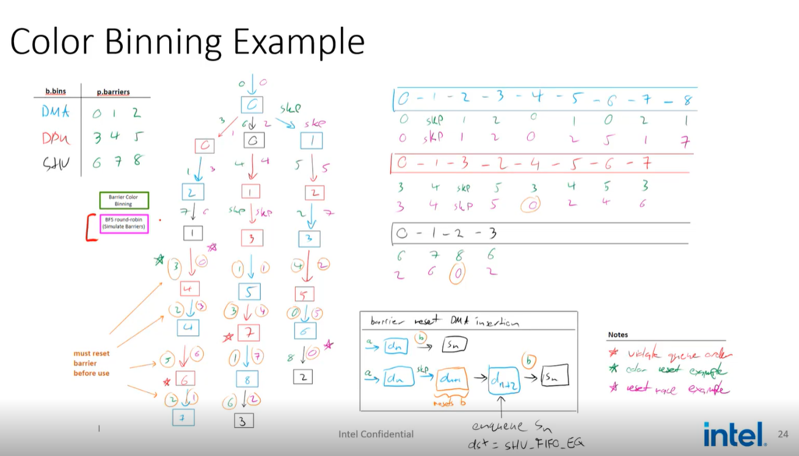
- # Compiler Management Tasks
	- https://docs.intel.com/documents/MovidiusInternal/vpu27/Common/SW/HLD-compiler/VPUX_NN_Compiler.html#required-data-structures
	- ## Virtual Barrier Mapping
		- If a compute consume multiple barrier, it adds significant complexity to the barrier management
		- 但是如果一个op有多个输入怎么办？
	- ## The Management Task Compilation Pass
	- ## Algorithms
		- ...
- Backup resources:
	- [Workload Management Development Sync](https://intel-my.sharepoint.com/personal/martin_meszaros_intel_com/_layouts/15/Doc.aspx?sourcedoc={310f8c21-49b3-439b-aedd-6ba3b7c89398}&action=edit&wd=target%28Workload%20Management%20Sync.one%7C7334e0b9-4451-4666-a200-f6e7730637e4%2FWorkload%20Management%20Development%20Sync%7Cb6d6a698-fffa-49dc-b758-327f6388999b%2F%29&wdorigin=NavigationUrl)