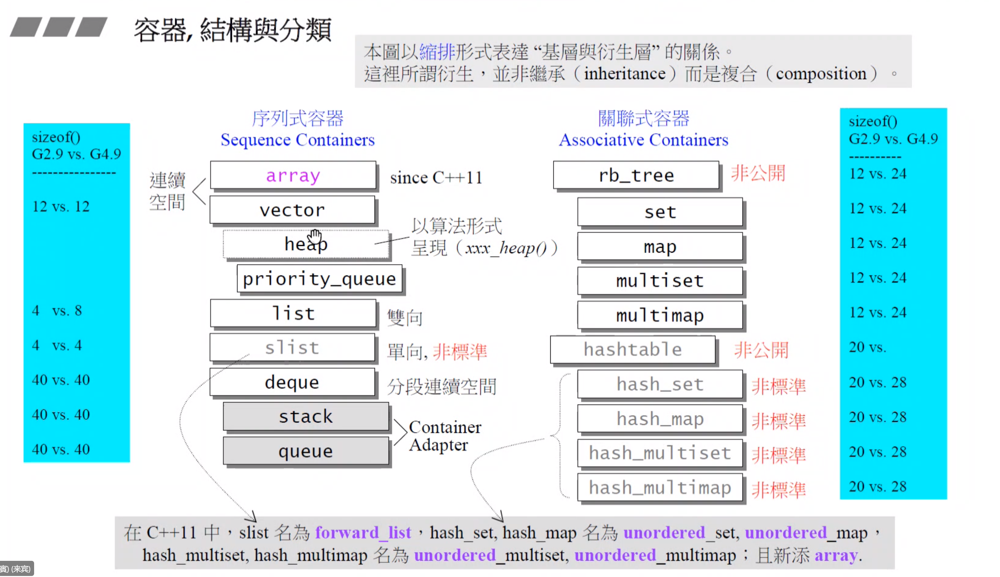
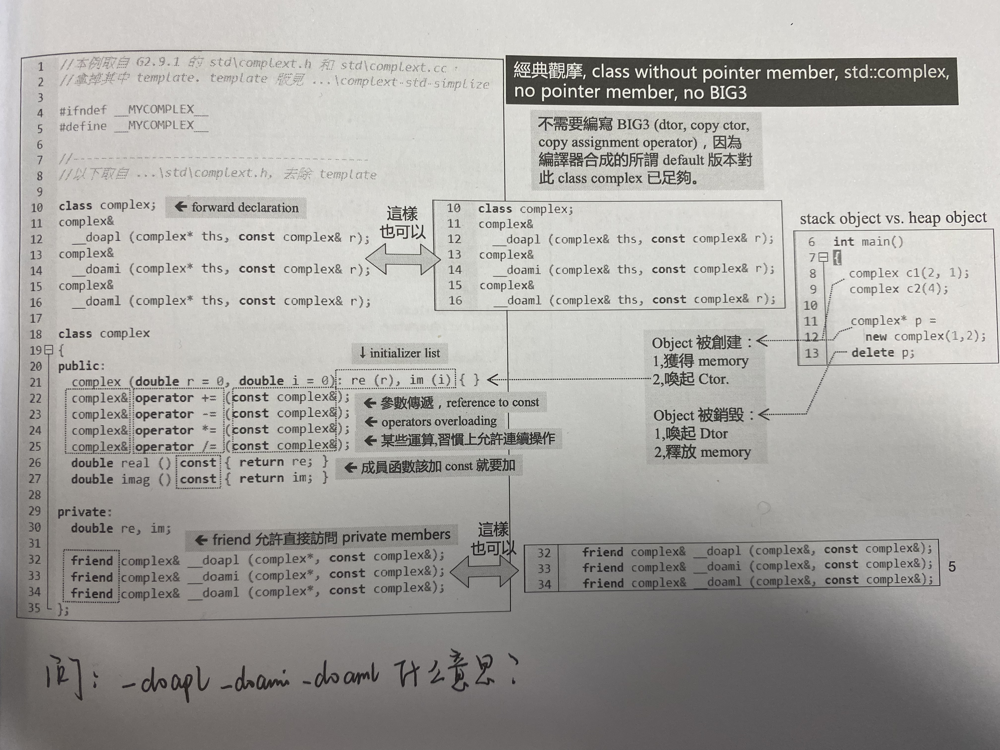
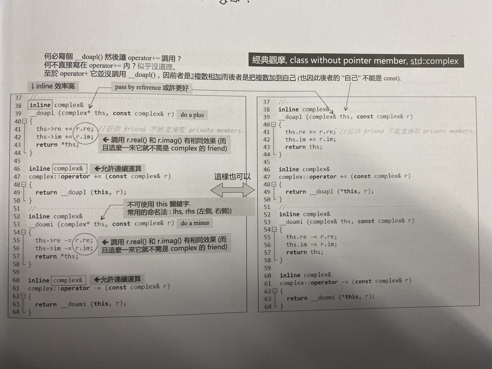

- 
- [[Class without pointers]]
	 - 
		 - BIG3
			 - deconstructor
			 - copy constructor
			 - copy assignment operator
		 - 不需要编写BIG3，(dtor, copy ctor, copy assignment operator), 因为default版本对于class without pointer已经足够。
		 - friend class 允许访问private members
		 - create object in stack vs create object in heap
			 - stack:
				 - `complex c1(2, 1)`
				 - `complex c2(4)`
			 - heap:
				 - 
```c++
complex* p = new complex(1, 2);
delete p;
```
	 - 
		 - operator + and operator += 的函数接口不同，一个是加到自己，一个是两个相加
	 -